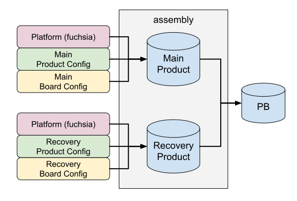

# Software Assembly

**Software Assembly** enables developers to quickly build a product using a
customized operating system. Concretely, Software Assembly is a set of tools
that produce a Product Bundle (PB) from inputs including a set of Fuchsia
packages, a kernel, and config files.

## Product Bundle {:#product-bundle}

A **Product Bundle** is a directory of well-specified artifacts that can be
shipped to any environment and is used to flash, update, or emulate a Fuchsia
target. It's not expected that developers inspect the contents of a Product
Bundle directly, instead they can rely on the tools provided by Fuchsia. For
example, the `ffx` tool is used to flash or emulate a device using a Product
Bundle:

```shell {:.devsite-disable-click-to-copy}
# Flash a hardware target with the product bundle.
$ ffx target flash --product-bundle <PATH/TO/PRODUCT_BUNDLE>

# Start a new emulator instance with the product bundle.
$ ffx emu start <PATH/TO/PRODUCT_BUNDLE>
```

A Product Bundle may contain both a **main** and a **recovery** product, which
are distinct bootable experiences. Oftentimes `main` is used for the real
product experience, and `recovery` is used if `main` is malfunctioning and
cannot boot. `recovery` is generally a lightweight experience that is
capable of addressing issues in the `main` slot using a factory reset or an
Over-The-Air (OTA) update. Typically, an end-user can switch which product to
boot into by holding a physical button down on a device during boot up.

Software Assembly offers build tools for constructing Product Bundles, defines
the format of the inputs (platform, product config, board config), and provides
build rules to construct those inputs.

{: width="600"}

**Figure 1**. A Product Bundle may contain both a main product and a recovery
product.

Note: The terms _product, product image, system_, and _slot_ are often used
interchangeably.

## Platform, product config, and board config {:#platform-product-config-and-board-config}

The three inputs to assembly (**platform**, **product config**, **board
config**) are directories of artifacts. The internal format is subject to
change and shouldn't be depended on. Developers need to use the provided Bazel
or GN build rules to construct and use these inputs.

*   The **platform** is produced by the Fuchsia team. It contains every bit of
    compiled platform code that any Fuchsia product may want to use. The Fuchsia
    team releases the platform to
    [https://chrome-infra-packages.appspot.com/p/fuchsia/assembly/platform][cipd-platform].
    To learn how to add to the platform, see the
    [Codelab: Implementing a platform feature](/docs/development/build/software_assembly/implementing_platform_feature.md).
    For development purposes, you can temporarily override platform configuration values, see
    [Use developer overrides for assembly of a Fuchsia product](/docs/development/build/software_assembly/developer_overrides.md).

*   The **product config** is produced by a developer defining the end-user
    experience. It may contain flags indicating which features of the platform to
    include. For example, the product config can set `platform.fonts.enabled=true`,
    resulting in assembly including the relevant fonts support from the platform.
    See [this reference][platform-flags] for all the available flags. The product
    config can additionally include custom code for building the user experience.
    To learn more, see the
    [Codelab: Defining and building a product bundle](/docs/development/build/software_assembly/product_bundle_codelab.md).

*   The **board config** is produced by a developer supporting a particular
    hardware target. It includes all the necessary drivers to boot on that hardware.
    Additionally, the board config can declare which hardware is available to be
    used by the platform. For example, if the hardware has a Real Time Clock (RTC),
    the board config can indicate that by setting the
    `provided_features=["fuchsia::real_time_clock"]` flag. Assembly reads this
    flag and includes the necessary code from the Platform for using this piece of
    hardware. The Fuchsia team maintains a small set of board configs and releases
    them to
    [https://chrome-infra-packages.appspot.com/p/fuchsia/assembly/boards][cipd-boards].
    To learn more, see the
    [Codelab: Defining a new board configuration](/docs/development/build/software_assembly/board_configuration_codelab.md).

## How Software Assembly is invoked {:#how-software-assembly-is-invoked}

At its core, Fuchsia's software assembly is a rust library used by several
different CLI tools to produce a Product Bundle. The following depics the
most common ways to invoke assembly:

*   **Build system integration (Bazel and GN)**: Build systems like Bazel and GN
    provide simple build targets (e.g., `fuchsia_product_bundle` in Bazel) that
    handle the complexity of generating the correct input files and invoking the
    assembly tools for you. This is the most common and recommended way to
    use software assembly.

    Note: Fuchsia is actively moving to [Bazel][fuchsia-product-bundle], so this
    page does not provide details for the GN environment.

*   **ffx product-bundle create**: The quickest way to produce a one-off product
    bundle for testing is to use `ffx product-bundle create`. This tool is
    especially useful when working with prebuilt platform, product, and board
    configurations as it allows for very fast assembly without a full
    build system integration.

### Bazel

```bazel {:.devsite-disable-click-to-copy}
# A product bundle can contain both 'main' and 'recovery' products (systems/slots).
fuchsia_product_bundle(
    name = "my_product_bundle",
    main = ":main_product",
    recovery = "...",
)

# A product is a single bootable experience that is built by combining
# a platform, product configuration, and board configuration.
fuchsia_product(
    name = "main_product",
    platform = "//platform:x64",
    product = ":my_product",
    board = "//boards:x64",
)

# A product configuration defines the user experience by enabling
# platform features and including custom product code.
fuchsia_product_configuration(
    name = "my_product",
    product_config_json = {
        platform = {
            fonts = {
                enabled = True,
            },
        },
    },

    # The product code is included as packages.
    base_packages = [ ... ],
)
```

For a complete example, see the [`getting-started`][getting-started-repo]
repository.

### Command line interface

```shell {:.devsite-disable-click-to-copy}
ffx product-bundle create --platform 28.20250718.3.1 \
                          --product-config <PATH/TO/MY_PRODUCT_CONFIG> \
                          --board-config cipd://fuchsia/assembly/boards/x64@version:28.20250718.3.1
```

The [`ffx product-bundle create`][ffx-product-bundle-create] command can be run to produce
a new product bundle using already built platform, board, and product artifacts.

## Static analysis tools {:#static-analysis}

Software Assembly provides tools for verifying the quality of a Product Bundle.



Note: If you are a Googler, see more information about size checks at
go/fuchsia-size.



The **size check** tool informs the user whether the Product Bundle fits within
the partition size constraints of the target hardware. A [product size
report][size-check] can be generated using the following Bazel rules:

```bazel {:.devsite-disable-click-to-copy}
fuchsia_product_size_check(
    name = "main_product_size_report",
    product_image = ":main_product",
)

fuchsia_product(
    name = "main_product",
    ...
)
```

The **scrutiny** tool ensures that the Product Bundle meets a set of security
standards. If a developer provides the necessary scrutiny configs,
[scrutiny][scrutiny] runs during the construction of a Product Bundle. See the
following scrutiny configuration example:

```bazel {:.devsite-disable-click-to-copy}
fuchsia_product_bundle(
    name = "my_product_bundle",
    main = ":main_product",
    main_scrutiny_config = ":main_scrutiny_config",
)

fuchsia_scrutiny_config(
    name = "main_scrutiny_config",
    base_packages = [ ... ],    # Allowlist of base packages to expect.
    kernel_cmdline = [ ... ],   # Allowlist of kernel arguments to expect.
    pre_signing_policy = "...", # File containing the policies to check before signing.
)
```

Note: The `ffx product create` command doesn't support running size checks or scrutiny.

## Appendix: Developer overrides {:#developer-overrides}

Developers oftentimes want to locally test something on an existing product
by adding new code or flipping a feature flag. Modifying the product or board
configs is undesirable because it pollutes the git-tree (`fuchsia.git`).
Assembly supports a method of locally modifying an existing product without
polluting the git-tree using [developer overrides][developer-overrides].

<!-- Reference links -->

[cipd-platform]: https://chrome-infra-packages.appspot.com/p/fuchsia/assembly/platform
[platform-flags]: https://fuchsia.dev/reference/assembly/PlatformSettings
[cipd-boards]: https://chrome-infra-packages.appspot.com/p/fuchsia/assembly/boards
[fuchsia-product-bundle]: https://fuchsia.dev/reference/bazel_sdk/fuchsia_product_bundle
[getting-started-repo]: https://fuchsia.googlesource.com/sdk-samples/getting-started
[ffx-product-bundle-create]: https://fuchsia.dev/reference/tools/sdk/ffx#ffx_product-bundle_create
[size-check]: https://fuchsia.dev/reference/bazel_sdk/fuchsia_product_size_check
[scrutiny]: https://fuchsia.dev/reference/bazel_sdk/fuchsia_scrutiny_config
[developer-overrides]: /docs/development/build/software_assembly/developer_overrides.md
