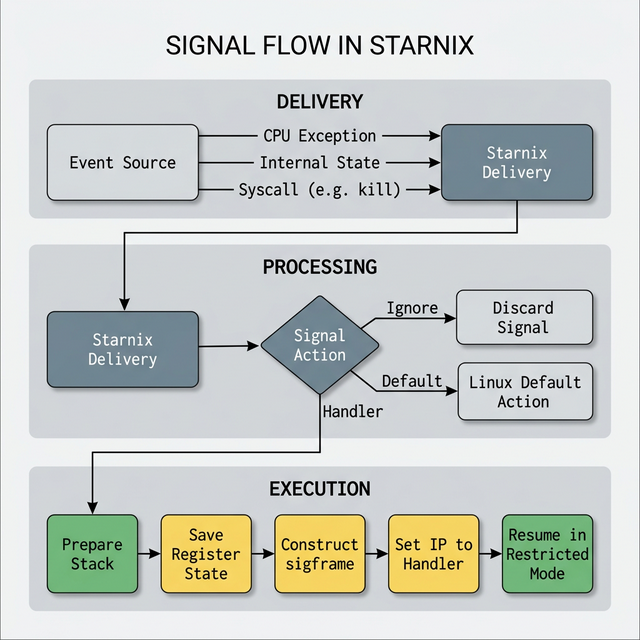

# Signal translation in Starnix

This page describes how [Starnix][starnix-runner] translates Zircon exceptions
and signals into Linux signals for unmodified Linux programs.

## Motivation {:#motivation}

Linux programs rely on signals for asynchronous notifications (for example,
`SIGALRM`, `SIGCHLD`) and error handling (such as `SIGSEGV`, `SIGCHLD`). Because
Starnix runs Linux programs in Zircon processes, it must bridge the gap between
Zircon's event model and Linux's signal model.

For more information on the motivation behind signal translation and the Starnix
design philosophy, see [As she is spoke][as-she-is-spoke].

## Signal Flow {:#signal-flow}

The lifecycle of a signal in Starnix can be grouped into three distinct phases:

1. [**Delivery**][delivery]
2. [**Processing**][processing]
3. [**Execution**][execution]

### Delivery {:#delivery}

Signal delivery in Starnix requires bridging Zircon's exception-handling
mechanisms with Linux signal paradigms. Starnix intercepts events and ensures
they reach the correct destination task as a Linux signal.

Delivery can be triggered from several distinct sources:

- **Zircon Exceptions**: The most complex path involves hardware faults. When a
  Linux thread executing in [restricted mode][restricted-mode] triggers a CPU
  exception (such as a segmentation fault or a division by zero error), Zircon
  traps this violation and routes it back into the Starnix kernel via a
  restricted exit code.
- **Internal State Transitions**: Starnix continuously monitors the execution
  environment. Internal components, such as the timer subsystem or process
  management services, frequently trigger signals autonomously based on state
  changes (for example, a timer expiration triggering a `SIGALRM`, or a child
  process exiting triggering a `SIGCHLD`).
- **Syscalls**: Tasks can explicitly request signal delivery to other processes
  or thread groups by making direct system calls like [`kill(2)`][kill-syscall]
  or `tgkill(2)`.

### Processing {:#processing}

Once a signal is successfully delivered and appended to a task's pending queue,
the kernel must determine what to do with it. This occurs during the processing
phase, where Starnix evaluates the task's registered **Signal Action**.

Tasks define these actions during runtime using [`rt_sigaction(2)`][rt-sigaction-syscall].
Depending on the configuration, Starnix will execute one of three distinct
paths:

- **Ignore**: The signal is safely discarded without interrupting the thread's
  execution flow.
- **Default Action**: If no custom handler is defined, Starnix executes the
  Linux default resolution for that specific signal. This could mean
  silently terminating the process, generating a core dump for debugging,
  pausing execution, or simply continuing.
- **Custom Handler**: If the application has registered a specific function to
  handle the signal, Starnix must prepare the thread's user-space stack to safely
  interrupt the current workload and context-switch into the custom handler
  routine.

### Execution {:#execution}

When a custom handler is required, Starnix does the following things:

1.  **State Preservation**: It first extracts and preserves the thread's
    current, interrupted register state and saves it onto the thread's
    user-space stack.
2.  **Sigframe Construction**: It then constructs a `sigframe` data structure
    around this saved state on the stack. This frame holds all the necessary
    context to resume the thread later.
3.  **Redirection**: With the backup saved, Starnix modifies the thread's
    instruction pointer, redirecting it to the memory address of the
    application's registered signal handler function.
4.  **Resumption**: Finally, Starnix yields control back to the thread, resuming
    execution in restricted mode. The thread "wakes up" inside the handler.

## Related Syscalls {:#related-syscalls}

The following syscalls are the primary interfaces used by tasks to configure and
trigger the signal flow described above:

### `rt_sigaction(2)` {:#rt_sigaction}

Tasks use this syscall to register custom actions for specific signals. Starnix
maintains this mapping within the `Task` structure, evaluating it during the
[**Processing**][processing] phase to determine whether a signal should be
ignored, default-handled, or routed to a user-space execution handler.

### `rt_sigreturn(2)` {:#rt_sigreturn}

When a user-space signal handler finishes executing, it calls
`rt_sigreturn`. Starnix uses this signal to conclude the
[**Execution**][execution] phase. It reads the `sigframe` previously pushed onto
the stack, restores the thread's original interrupted state, and seamlessly
resumes normal operation.

### `kill(2)` {:#kill}

This syscall allows tasks to proactively send signals to other processes.
Starnix validates the necessary permissions and acts as the event source for the
[**Delivery**][delivery] phase, appending the requested signal to the
target process's pending signal queue.

[starnix-runner]: /docs/concepts/starnix/syscalls.md
[restricted-mode]: /docs/concepts/starnix/syscalls.md#running-a-linux-program-in-restricted-mode
[as-she-is-spoke]: /docs/development/starnix/as_she_is_spoke.md
[delivery]: #delivery
[processing]: #processing
[execution]: #execution
[kill-syscall]: #kill
[rt-sigaction-syscall]: #rt_sigaction
