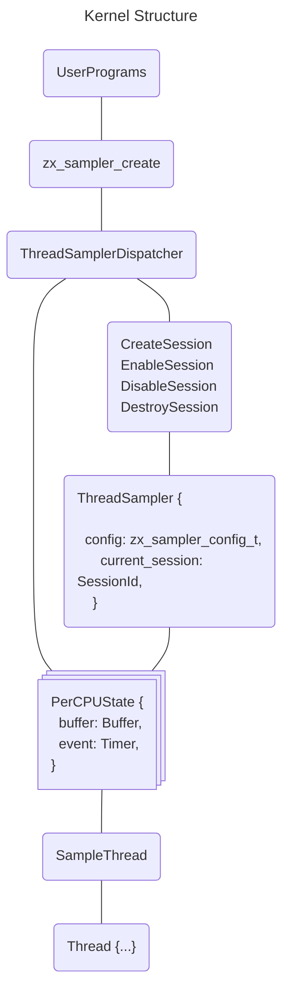
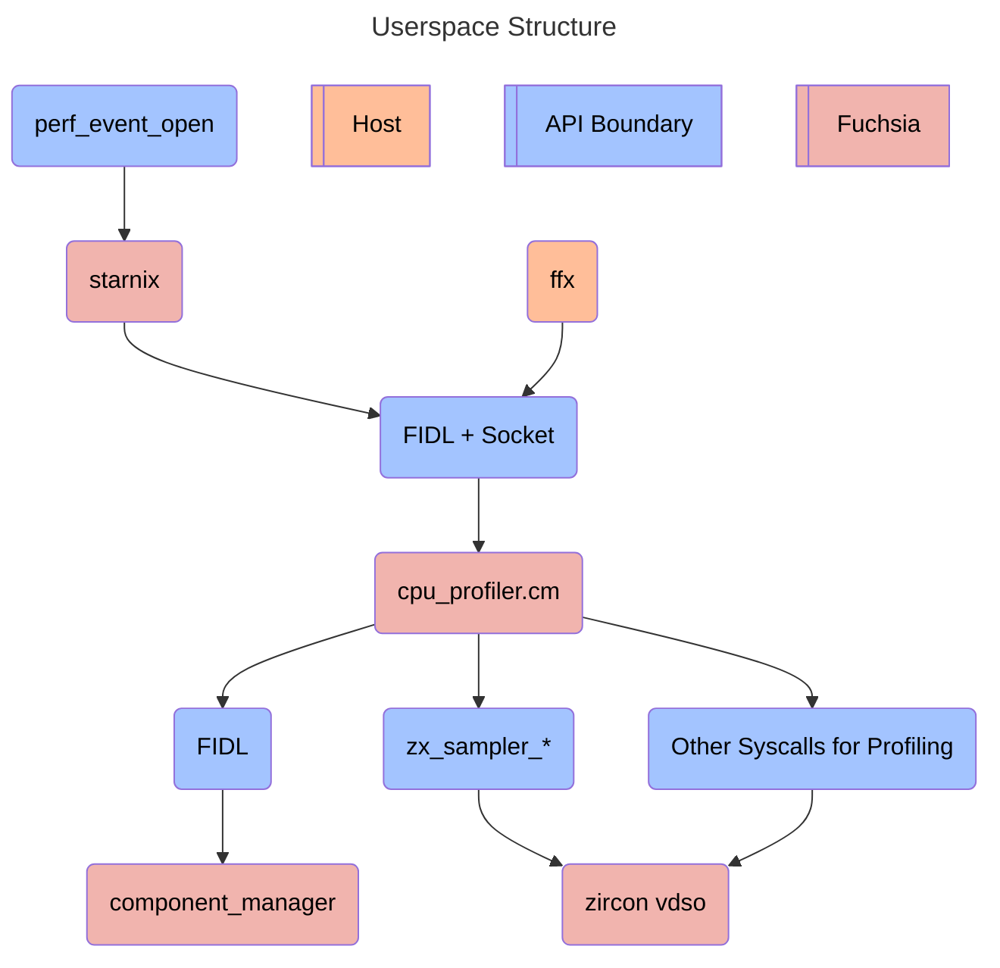

<!-- Generated with `fx rfc` -->
<!-- mdformat off(templates not supported) -->


# {{ rfc.name }}: {{ rfc.title }}
{# Fuchsia RFCs use templates to display various fields from _rfcs.yaml. View the #}
{# fully rendered RFCs at https://fuchsia.dev/fuchsia-src/contribute/governance/rfcs #}
<!-- SET the `rfcid` VAR ABOVE. DO NOT EDIT ANYTHING ELSE ABOVE THIS LINE. -->

<!-- mdformat on -->

<!-- This should begin with an H2 element (for example, ## Summary).-->

## Problem Statement

Fuchsia developers require effective tools for performance analysis, including
CPU profiling. Currently, Fuchsia lacks a stable API for CPU profiling, which is
essential for analyzing the performance of both native Fuchsia components and
binaries running in a Starnix container. We need this API to understand hot
spots in our code.

## Summary

This document proposes a design for CPU profiling in Fuchsia. Concretely, it
outlines a time-based, single-session CPU profiler that utilizes frame pointers
to obtain backtraces from user threads. Readers familiar with profiling on
Fuchsia may notice that the proposed design is very similar to the experimental
profiler that is currently checked in, but it does contain some key differences.

## Stakeholders

_Facilitator:_

* davemoore@google.com

_Reviewers:_

* eieio@google.com
* mcgrathr@google.com
* wilkinsonclay@google.com


_Consulted:_

* adamperry@google.com
* tq-performance@google.com
* maniscalco@google.com


_Socialization:_

This RFC was socialized on the zircon-discuss mailing list.

## Requirements

The profiler APIs proposed by this document are intentionally minimal to support
rapid development. This API MUST:

* Be able to sample call stacks of userspace threads using frame pointers.
* Be available in both eng and userdebug builds.
* Be able to gather frame pointer based backtraces of Fuchsia programs
  (including Starnix).
* Be able to gather frame pointer backtraces of Linux programs running in
  Starnix containers.
* Support time based sampling at a rate of up to 4000Hz.

And it SHOULD do all of these things while imposing minimal overhead on system
performance.

### Explicit Non-Goals and Future Work

We explicitly want to avoid the following which stray from the goals of keeping
Zircon runtime agnostic:

* Adding awareness of unique language runtimes (like the go runtime) to the
  kernel.

In addition, there are many features of profiling that were considered during
the formation of this proposal but have been declared out-of-scope in order to
facilitate faster progress. These are compatible with the design, but are
separated out as possible later date add ons.

* Hardware assisted profiling (such as Intel LBR or ARM performance counters).
* Profiling early-system boot, before userspace has been initialized and
  syscalls can be made.
* Profiling kernel call stacks.
* Handling cases where dynamically linked libraries reuse addresses (via
  dlopen/dlclose) before we are able to load symbols from them.
* Supporting the shadow call stack on architectures that support it.
* Supporting multiple concurrent profiling sessions.
* The ability to configure which tasks (threads, processes, or jobs) are
  profiled.

See [Future Work](#future_work) for a further breakdown.

## Design

### Kernel Design

**Figure 1 - Kernel Structure**


The preceding figure outlines the system we plan to implement. It utilizes a
single global sampling session that provides access to time-based sampling.

The general flow is as follows:

1. A user issues a syscall to create a sampler from a configuration. During this
   syscall:
  1. The kernel allocates, maps, and pins the per-CPU buffers used to store
     sampling data.
  1. A monotonic timer, henceforth referred to as the "sampling timer,"  is
     created for each CPU.
  1. The user is returned a handle on which they can request control plane
     operations as well as read data.
1. The user then issues a syscall to start sampling, which starts by setting
   each CPU's sampling timer.
1. Each time a sampling timer fires, we check the current thread. If the thread
   should be sampled, we take a sample and write it to the current CPU's buffer.
1. The user may read sampling data at any point.
1. The user may continue sampling until they wish to stop, at which point they
   would invoke a syscall to stop sampling, read the remaining data from the
   buffer, then close the handle to the sampler.

The main logic will be implemented in the ThreadSampler, a global singleton
which contains the state needed for a session. Users may interact with it
through the `zx_sampler_*` syscalls described in the next section.

### Syscall API

The following syscall API will be used to interact with the sampler. Note that
several different alternatives were considered; these alternatives and their
pros and cons are discussed in the "Alternatives Considered" section.

#### **`zx_sampler_create`**

The following syscall will create the sampler and return a handle to it:

```c
// The sampler_config_t sets the properties of a sampler.
//
// Note that there is no version number on this struct; the options argument in
// zx_sampler_create can be used as one to evolve this struct.
struct zx_sampler_config_t {
    // How often a sample should be taken.
    zx_duration_mono_t sample_period;
    // The maximum number of stack frames to collect in each sample.
    uint16_t  max_stack_depth;
};

// zx_sampler_create will create the sampler if it has not already been created
// and then return a handle to it.
//
// Arguments:
// * sampler_resource: A handle to the sampling resource.
// * options:          Must be zero.
// * config:           The configuration to sample with.
// * sampler_out:      An out parameter that will contain a handle to a
//                     sampler on success.
zx_status_t zx_sampler_create(
    zx_handle_t sampler_resource,
    uint64_t options,
    const zx_sampler_config_t* config,
    zx_handle_t* sampler_out);
```

The `sampler_resource` is a new system resource that will be created to gate the
creation of a sampler.

If userspace closes the handle returned by this syscall via a `zx_handle_close`,
the session is destroyed and sampling is stopped on all targets as if
`zx_sampler_stop` was called.

For this RFC, we plan to implement samplers with a single global singleton
sampler, and only allow a single sampler to be created at a time.
`zx_sampler_create` will return `ZX_ERR_ALREADY_EXISTS` if the global session is
in use and will do so until the existing handle is closed. See [Multiple
Sessions](#multiple_sessions) in [Future Work](#future_work).

#### **`zx_sampler_[start|stop]`**

The following syscalls will be used to start and stop sampling:

```c
// zx_sampler_start will start sampling, and zx_sampler_stop will stop sampling.
//
// Arguments (for both syscalls):
// * sampler: A handle to the global sampler.
// * options: Must be zero for now.
zx_status_t zx_sampler_start(zx_handle_t sampler, uint64_t options);
zx_status_t zx_sampler_stop(zx_handle_t sampler, uint64_t options);
```

Note that invoking `zx_sampler_start` while a sampler is already running is
invalid, and will return `ZX_ERR_BAD_STATE`. Similarly, invoking
`zx_sampler_stop` when a sampler is not running is also invalid, and will also
return `ZX_ERR_BAD_STATE`.

#### **`zx_sampler_read`**

The following syscall will be used to read sampler data:

```c
// zx_sampler_read reads sampler data.
//
// Arguments:
// * sampler: A handle to the global sampler.
// * options: Must be zero.
// * buf:     The user buffer to read data into.
// * buf_len: The size of buf.
// * actual:  An out parameter that will contain the amount of data that was
//            actually read on success.
zx_status_t zx_sampler_read(
    zx_handle_t sampler,
    uint64_t options,
    void* buf,
    size_t buf_len,
    size_t* actual);
```

This function will read all of the sampling data that is available into the
provided buffer. If the buffer is too small to contain the entirety of this
data, `ZX_ERR_INVALID_ARGS` will be returned.

It is valid to invoke this syscall when sampling is not in progress, i.e. after
`zx_sampler_stop` has been called. In this case, any data that was generated
during sampling will be read and returned.

### Taking a Sample

When a timer triggers, we check the current CPU. If we have been migrated, we
immediately return. We then check the thread running on the current CPU. If the
thread is not one we wish to sample, e.g. it is a kernel thread, then we simply
record a timestamp and return, since kernel stack sampling is out of scope for
this proposal.

Even if the current thread is a user thread, we cannot immediately sample the
callstack from the timer callback. This is because we cannot safely read user
memory from interrupt context, as it may require taking a page fault. Instead,
we set the `THREAD_SIGNAL_SAMPLE_STACK` thread signal and return.

Later, when the thread is about to exit the kernel, it will invoke
[ProcessPendingSignals][ProcessPendingSignals], which will check for the
`THREAD_SIGNAL_SAMPLE_STACK`. If the signal is present, then we sample the
stack. We can safely attempt a read of user memory here as:

* We're no longer in interrupt context, so we can take a page fault if needed
* We have released most of the locks we are holding
* The kernel stack is relatively shallow, allowing us to read a potentially deep
  call stack onto the kernel stack.

An issue the experimental apis ran into is that this approach can lead to lost
samples if the timer triggers more than once for a given trip into the kernel as
we only take one stack sample per trip. We improve upon the experimental sampler
by immediately emitting a partial record with timestamps and other auxiliary
data, then later emitting a continuation record with the stack trace. One or
more partial records may refer to the same stack trace continuation record (See
[Data Format](#data_format)). Format for details). As the partial record does
not read user memory and the buffer it writes to is mapped and pinned, it is
safe to emit during interrupt context.

#### **Call Stack Sampling from Userspace**

Sampling can be done inefficiently entirely in userspace and is an [option for
profiling][SamplerConfig] as of today. However, doing so involves multiple
`zx_process_read_memory` calls and takes roughly 2-3ms per sample. Sampling at
even 100Hz takes 20-30% CPU and is an untenable overhead. A similar operation in
the kernel takes 2-3us, allowing us sample rates in excess of 4000Hz with low
overhead.

### Unwinding Callstacks Using Frame Pointers

Stacks will be read by walking frame pointers. Sampling would require builds
with frame pointers enabled. Fuchsia currently enables frame pointers in user
products as well as in the kernel by default.

As user programs have control over their own stacks, the kernel needs to take
some precautions when reading the user memory. It must be careful to only follow
pointers that point to valid memory of the sampled target, and may need to limit
the depth of the stack it samples. Userstacks can be quite deep, exceeding 30
stack frames, so the kernel will provide a configurable max depth of stack to
sample as mentioned in the Syscall API section.

Frame pointers are used rather than other methods because the provide provide
both good cross platform use and limit the amount of memory copied. We do intend
to explore and implement other options in the future.

### Symbolization
In order for a user program to symbolize the call stack of instruction pointers
it receives, it requires additional information about the target program. It
needs to know which libraries and executables are mapped where. Userspace is
responsible for obtaining the relevant information it requires to symbolize the
call stacks it receives.

Symbolization requires that we first convert the instruction pointers on the
call stack to offsets within the appropriate ELF binary. Today, userspace does
that by:

 1. Retrieving the memory mappings in the current process using
    `zx_object_get_info(ZX_INFO_PROCESS_MAPS).`
 1. Iterating through the returned `zx_info_maps_t[]` to identify mappings of
    ELF binaries and the base address at which they have been loaded.
 1. Using `zx_process_read_memory` on each of these base addresses to read the
    ELF headers, which allows us to get the build-ID that corresponds to the
    mapped binary.
 1. The ELF build-ID and base address, along with a database of debug info, are
    then used to symbolize the instruction pointers after the session completes.

As repeatedly querying is expensive, the userspace CPU profiler currently scans
for mappings only twice. The first is when it intercepts a thread's debug start
notification which is triggered by ld.so directly after it has linked the
thread's libraries in. The second is directly after the profiling session ends.
The second pass aims to capture any dynamically loaded libraries (e.g by dlopen)
which may have been loaded after the first dynamic link.

While in practice, this captures most mappings used by existing Fuchsia
programs, it is not fully correct with regards to dynamically loaded libraries:

* it doesn't deal with mappings which get unmapped/unloaded/dlcose before the
  process exits, a reuse of the same address for a different library could cause
  corrupted symbols
* processes which exit before the session ends will not be scanned a second time
  for dynamically loaded libraries and will only have symbols for dynamically
  linked libraries.

We leave handling dlopen/dlclose to a future iteration of this design as
supporting them would require additional coordination between the kernel, the
dynamic linker and loader, component manager and its loader service
implementation, and possibly the file system in order to coordinate the data
needed to symbolize dynamically loaded files.

### Streaming Data From the Kernel

The sampler profiler will generate large volumes of data that need to be
efficiently streamed out of the kernel. Fortunately, streaming support for
kernel tracing has recently been added to Fuchsia and we plan to use a similar
approach.

In short, we plan to use per-CPU, single-reader, single-writer ring buffers to
store sampler data. The writer for each buffer can proceed without acquiring any
locks, while the reader and other control operations utilize a lock. When a
buffer is full, any new records that we attempt to write to the buffer will be
dropped, matching the supported behaviour of the existing kernel FXT writing
libraries.

### Data Format

Data is written as [FXT blob records][FuchsiaTraceFormat] to per-CPU mapped and
pinned buffers that implement the same approach as kernel tracing. Because the
buffers are mapped and pinned, it is safe to write to them during interrupt
contexts without risking page faults.

If the user space component is not able to read data fast enough and we attempt
to write a record which would overflow the buffer, we drop the record and
maintain a count of how many records were dropped. When userspace frees up
buffer space, we emit a record letting the user know how many records were
dropped.

#### Emitted Records

We write the following FXT blob record to the buffers containing the following
information

##### Sample Record

```
FXT Blob Record {
    u64 fxt_header, // Blob_type SAMPLE
    u64 fields_bitflags,
    // Each of the following optional fields are only included if the
    // corresponding `fields_bitflags` bit is set
    Optional<u64> continuation,
    Optional<u64> continuation_completion,
    Optional<u64> pid,
    Optional<u64> tid,
    Optional<u64> boot_ts,
    Optional<u64, [u64]> user_fp_call_stack,
}
```

Samples are written as an FXT blob record. The first field in the blob is a u64
with a bitfield for each included fields. The fields appear only if the
corresponding bit in the bitflags is set in the described order. The bit in the
bit flags are allocated as:

- 1: continuation (u64), set if more samples are to follow
- 1: continuation\_completion (u64), set if this adds samples to a previous
  record(s)
- 1: pid (koid/u64)
- 1: tid (koid/u64)
- 1: boot\_ts (u64)
- 1: user\_fp\_call\_stack (length prefixed array of u64s)
- 48: reserved

**Continuations**

A record can indicate that there is additional information to follow by setting
the "continuation" bit, and providing a u64 id. A record that later follows with
the "continuation\_completion" bit set with a matching id should have its
contents appended to the earlier record. Multiple records may use the same
continuation id in which a continuation\_completion record matching such ids
have its samples duplicated and appended to each record.

Each CPU keeps a monotonically increasing counter (divvying up the u64 space
between the number of CPUs) which it increments after emitting each completion
record.

[https://fxrev.dev/1252454](https://fxrev.dev/1252454) has an example
implementation of these continuation record being emitted from interrupt
context.

### CPU Events

The kernel is allowed to modify the power-state of CPUs in ways that may impact
the behavior of sampling. The interactions of those power-related CPU operations
and sampling is described here.

#### **CPU Hotplugging**

Buffers are owned by a data structure external to the individual CPUs. When a
CPU goes offline, the buffer remains, but will not be written to while the CPU
is offline. The reader can read data at its leisure, and the buffers will be
destroyed when the session handle is closed.

#### **Suspension**

The initial implementation of this design will utilize monotonic timers to
trigger the collection of call stacks. Therefore, no samples will be collected
during periods of system suspension, specifically suspend-to-idle. We deem this
to be an acceptable solution because no threads are scheduled during
suspend-to-idle, meaning that we wouldn't be sampling any callstacks even if we
utilized a boot timer.

### Userspace Design



Userspace interacts with profiling mainly through a component
"cpu\_profiler.cm". The userspace component is responsible for:

* converting a higher level user space config (e.g. attaching by
  tid/pid/test/component moniker/url) by filtering data from `zx_sampler_create`
* servicing buffers and exfiltrating data
* Reading through target's elf headers to obtain symbolization data
* Communicating with ffx, starnix, or other callers

## Implementation

The implementation will start from the existing experimental sampler APIs,
bringing them inline with what is described in this document, and updating them
to match this document should it change.

After consultation with security, privacy, and API council and issues raised are
addressed, the APIs will be put into the next vdso where development and
iteration will continue until ratification.

### Differential Between Proposal and Experimental APIs

Compared to the above proposal, the existing kernel sampling support is missing:

- Support for multiple samples per trip into the kernel.
- Kernel streaming support

## Performance

The sampling APIs should allow sampling at 4000Hz with under 10% overhead, or
less than 25us runtime for every 250us sampling period. This can be measured by
examining impact on benchmarks with and without profiling enabled as well as
measuring CPU, memory, and other resource usage with and without profiling
enabled.

## Ergonomics

The proposed API significantly eases the implementation of callstack sampling by
allowing callers to avoid calls the `zx_process_read_memory` during sampling
sessions.

## Backwards Compatibility

This API is an addition to the existing APIs exposed by Zircon. As we intend for
this API to be iterated on in the future, we have included a section on future
work and on how the proposed APIs could be extended to support it. We have left
reserved fields and other mechanisms to evolve this API in a backwards
compatible way.

## Security considerations

We introduce a new "sampling" resource, similar to the existing kernel tracing
resource. This is routed by component manager to a single user space profiling
component that is responsible for turning a higher level user space config (e.g.
attaching by tid/pid/test/moniker/url) into filters on the data of
`zx_sampler_create`.

### Summary of Security Review

- Client access is well-controlled, via specific sampling resource, limited allowlist for clients of
  cpu_profiler component, restriction to eng/userdebug builds, and debugging syscall cmdline flag
  (the last one may need to be relaxed for userdebug at some point; see below).
- Risks from malicious tracee stacks are limited, with controls on maximum stack depth and basic
  pointer validation. One could possibly imagine a convoluted attack using a side-channel to read
  privileged memory pointed to by forged frame pointers, but this is unlikely to be of any realistic
  concern. Code in the kernel is minimized, notably avoiding doing ELF parsing there.
- Further discussion (out of the scope of this initial design) may be needed to allow sampler
  syscall access on userdebug builds without enabling all other debugging syscalls.

## Privacy considerations

There are three main cases which profiles are intended to be taken and data would be removed from a
Fuchsia device.

1) Local developer on eng device for performance diagnoses/trouble shooting.
2) Infra based e2e CUJ performance tests. Infra automatically runs tests using test accounts on
   predetermined critical user journeys. We activate tracing and profiling to monitor performance
   characteristics.
3) Snapshotting and field tracing. This workflow periodically records profiles on testing devices
   and as such requires additional privacy controls. Data collected by this method is done by Perfetto,
   which has existing privacy controls. e.g. trace filtering and redacting. Adding additional field
   profiles for collection is further gated by additional privacy review.

### Access to Sensitive Data and Data persistence

Call stacks and execution traces, while useful for performance analysis, can potentially expose
sensitive data. Function names, parameters, or even parts of the data itself within the call stack
could reveal the type of data being processed or other private information.

Such sensitive data is expected to be exposed on developer devices and infrastructure test devices
and would not be redacted by higher layers of the profiling stack. As such, for use cases (1) and
(2), profiles are only taken when requested and the data is immediately return to the requester as a
file and not stored or uploaded anywhere else.

### Access restrictions

We use use a combination of:
- A system resource routed to a build time allow list of components
- FIDL APIs limited to a build time allow list of component
- Build time disabling for user products
to prevent unintended disclosure of sensitive information. Higher level allow listed components will
be responsible for redaction and filtering should they wish to store data. Profiles are never
automatically taken on user devices without said privacy controls.

## Testing

The current CPU profiler implementation existing unit, integration, and end to
end tests at the kernel and userspace level which test the current
zx\_process\_read\_memory based implementation (and the current experimental
apis when enabled).

These tests would continue to test the relevant flows and we will extend them
with tests for the added features proposed here such as streaming and the new
record types.

## Documentation

We will need to update the CPU profiler usage documentation at
//docs/development/profiling/profiling-cpu-usage.md to reflect the lack of need
for a build flag.

We will also need to update and refine the syscall documentation for the
zx\_sampler\_\* syscalls.

## Drawbacks, alternatives, and unknowns

Many alternatives were considered in the formulation of this design document.
Some of these alternatives were dismissed in favor of better options, but some
were excluded solely because the product does not require them at the present
moment. Therefore, future iterations on this design may incorporate some of the
items in this section.

### Alternative Syscall APIs

#### Task based

Alternatively, a task is a thing one can probe information from. One would
configure a task to begin sampling with a config to some output buffer. Control
plane could be handled by setting properties.

```c
zx_status_t zx_task_probe(zx_handle_t profiling_resource,
                          zx_handle_t task,
                          zx_sample_config_t config,
                          zx_handle_t* ep0_out // Buffer to write to)
zx_set_property(ep0, ZX_PROBE_STATE, ZX_PROBE_STATE_START);
```

**Pros**

* Don't need a new dispatcher, data is stored on the task dispatcher and the iob

**Cons**

* No obvious way to request sampling of kernel threads, we can't get a handle to
  them
* No obvious way to specify system wide sampling. Perhaps it's specified
  root-job \+ kernel\_threads in the config.
* Sampling two unrelated threads/processes requires multiple sessions (or
  additional logic to merge output to a single buffer)

#### Task profile based

Similar to Task based, but we also leverage the thread profile infrastructure.
In this approach, we create a probe\_profile with a configuration and output
buffer and can apply it to a task.

```c
zx_profile_create(zx_resource_t, zx_sample_config_t config, &ep0,
                  &profile);
zx_task_set_profile(zx_handle_t task, zx_handle_t profile, ...);
zx_set_property(zx_handle_t task, ZX_PROBE_STATE, ZX_PROBE_STATE_START);
```

**Pros**

* Reuse of existing kernel infrastructure
* Strong separation of concerns: creating profiles requires permission, threads
  can decide if they should have a profile applied or not, controlling requires
  different permissions than creation, reading and controlling can all be
  individually handled.

**Cons**

* syscalls are spread over three different `zx_` prefixes, which is a difficult
  to follow and non discoverable API.

#### Unfused Syscalls

We could instead provide userspace with a pair of syscalls:

1. The ability to wait for a requested event to occur
2. A form of kernel assisted data collection to efficiently collect data about a
   target

**Pros:**

* Buffer allocation and writing can be done entirely in userspace
* Configuration complexity can be split across multiple calls

**Cons:**

* Added overhead to wake up the userspace profiler only for it to immediately
  call into the kernel, then go to sleep again, at a rate of 16000Hz (4000Hz
  sampling across 4 CPUs).
* 4 CPUs would contend on waking/notifying a single user process
* Extra copies as user space copies sampled data into its own buffer
* The target process would need to be suspended until the profiler can be woken
  up and finishes its sample.

A lovely deconstruction of the problem, but we (admittedly somewhat baselessly)
assert that this would be unnecessary overhead and would be too difficult to
make efficient. The standard optimization approaches of:

* Provide sample data with the event instead of needing an extra syscall to get
  it
* Allow specifying where to write the event to avoid the extra copy
* Allow batching of reading events to avoid wakeups

cause us to rederive the above variations.

### Kernel Assisted Symbolization

A strategy Linux uses for tracking mappings is to emit a record when executable
memory is mapped for an attached process:

```
struct {
    struct perf_event_header header;
    u32    pid, tid;
    u64    addr; // Mapping address in target u64
    usize  len;  // Length of mapping
    u64    pgoff;  // Page offset of mapping
    char   filename[];  // Location of backing memory
};
```

This is more difficult to make work in Fuchsia because we don't have a similar
concept of a global file system to read the library that is being loaded. Shared
objects are distributed as part of each component package, and it's not easy (or
necessarily desirable) for external components to access them.

While given the address and length, of the mapping, we can use elf-search as we
do in [Symbolization](#symbolization) to get the information we need, we run
into the same limitations that this only works while the attached process is
alive. We still end up with a race where after receiving a mmap notification, if
we don't act on the notification soon enough, the process could exit.

Rather than using a filename, other approaches might be to instead include:

- an elf build id, which would involve teaching the kernel to parse elf from
  user memory, or,
- the koid of the relevant mapping, which would involve userspace maintaining
  some sort of koid -> build-id service.

We may need to more seriously consider these options should we find that the
approach of using `ZX_INFO_PROCESS_MAPS` to get the base address and
`zx_process_read_memory` to get the build id in userspace is not sufficiently
performant.

### Future Work

There are many possible features one would want. This section collects the
various features mentioned or not in this document that influence a future
ideal.

#### Multiple Sessions

Multiple sessions is a desired feature, it allows e.g. profiling a fidl client
and server at the same time without needing to do system wide profiling.
However, as it introduces many additional complexities, the proposal excludes it
from the scope. Instead, we propose APIs which could ostensibly be used as one
would a multiple session style api, but error if multiple sessions are created.
We defer multiple session support to a follow up.

#### Early boot profiling

Requiring a userspace component and depending on component manager for the realm
query API, like the current design does, puts some constraints on how early we
can begin profiling. More concretely, it will be impossible to profile before
component manager is ready and can launch the user profiling component.

A possible follow up would be to enable early boot profiling via boot arg a la
ktrace. The boot arg describes a buffer size, and configuration. This
automatically turns on profiling in the kernel as soon as it is ready, and
allows the user to read out of the buffers without overwriting them at its
leisure. This could be done either in the kernel or in userboot. We can then
deliver a sampler handle to component\_manager at startup.

#### Sampling Kernel Stacks

When servicing an event requesting a kernel stack, we are able to immediately
walk the kernel's frame pointer chain as it does not require user copies, and
write out the record, with a potential userspace call stack continuation for
later.

##### Zircon and Disabling Interrupts

Because we are relying on timer interrupts and because some kernel work is done
with interrupts disabled, we lose visibility into that work. For example,
`zx_futex_wake` does basic handle verification with interrupts enabled, but
walking the list of futexes, and waking waiters are both done with interrupts
disabled. This restricts the granularity of kernel stacks as a sampling
interrupt would only fire after interrupts are re-enabled. In this case, we would
only see CPU time attributed to the location where were-enable interrupts,
typically `Guard::~Guard` destructors.

#### CPU Perf Counters

Major CPU architectures provide a set of per CPU registers/counters which can be
set to count events such as instructions executed, cache misses, or branch
misses. These can generate an interrupt on overflow giving us an opportunity to
reset them and record data. Typically these can be accessed and configured only
by privileged mode code which can optionally expose a subset of functionality to
unprivileged code.

#### Software Events

Software events on OS operations like page-faults, syscalls, or context-switches
allow a user program to diagnose hotspots in its code which cause these events
to occur. While some may be possible to instrument using userspace wrappers, the
kernel provides an efficient source of truth for recording information on when
these events occur.

#### Task Based or Context Switch Aware Events

As hardware counters are a per-CPU resource, they need to be saved and restored
along with the thread being sampled. Otherwise, the first sample after each
context switch would be effectively random, it would depend on whichever process
was scheduled before it. Likewise, being context switch aware allows us to make
better use of our buffer space by sampling only from the tasks we care about
instead of filtering in post.

#### Alternate approaches to stack sampling

The current design utilizes frame pointers to walk the call stack. This is a
good starting point, but we will likely want to support other more architecture
specific methods, such as using the shadow-call-stack on ARM or LBR on Intel. We
may also eventually want to support allowing a userspace program to specify a
binary that the kernel could use to generate callstacks (similar to DTrace or
ebpf).

## Prior art and references

### What is CPU profiling?

This document discusses sample-based CPU profiling. For those unfamiliar, this
is an observability approach that helps answer the question: "Where are the
hotspots of my code?" In comparison to tracing, it does not require the addition
of compile time trace points, but data is randomly sampled. The main premise of
sample based profiling is to ask that each time some "x" occurs for a target,
record some "y" data. "x" could be "every 250us", or every 1000 L1 cache misses,
and "y" is often a call stack and time stamp. Results are often present as a
[flame graph][FlameGraphs]{:.external} as opposed to a time series.

While Linux focused, Brenan Gregg provides an [excellent
introduction][PerfBackground]{:.external} to the types of analysis facilitated
by this approach.

### Approaches Used by Other Operating Systems

#### Linux

Linux represents a "performance event" such as a hardware counter, timer, or
software event as something that when triggered, writes data to a file
descriptor. To get one of these fds, Linux provides a syscall
"[perf\_event\_open][PerfEventOpen]{:.external}". It creates a file descriptor
in which a configurable amount of data is written when a requested event occurs.
The file descriptor may be read directly for low frequency events, or mapped and
read like a ring buffer for high frequency events.

#### Windows

Windows provides a general [event tracing
framework][WindowsEventTracing]{:.external}. As part of the events that are
collected, a caller can [request call stacks][WindowsStackWalking]{:.external}
which are retrieved using frame pointers.

#### MacOS and Dtrace

MacOS provides [DTrace][DTrace]{:.external}. Rather than having a specific "get
some profiles" syscall, DTrace exposes a general purpose scripting language
interface that allows defining of customizable behaviour when some event occurs.
For example,

```
dtrace -x ustackframes=100 -n 'profile-99 /execname == "starnix_runner.cm" && \
arg1/ { @[ustack()] = count(); } tick-60s { exit(0); }' -o out.stacks
```

Would sample stack frames at 99Hz on tasks named "starnix\_runner.cm".

Some operating systems use DTrace as either a primary method of profiling (e.g.
macOS via Instruments.app and other BSDs) or have it available as an optional
add on (e.g. DTrace is implemented for Linux as a loadable kernel module, it
also exposes similar functionality through SystemTap).

[DTrace]: https://en.wikipedia.org/wiki/DTrace
[FlameGraphs]: https://www.brendangregg.com/flamegraphs.html
[FuchsiaTraceFormat]: /docs/reference/tracing/trace-format.md#blob-record "Fuchsia Trace Format"
[PerfBackground]: https://www.brendangregg.com/perf.html#Background
[PerfEventOpen]: https://man7.org/linux/man-pages/man2/perf_event_open.2.html
[WindowsEventTracing]: https://learn.microsoft.com/en-us/windows/win32/etw/event-tracing-portal
[WindowsStackWalking]: https://learn.microsoft.com/en-us/previous-versions/windows/desktop/xperf/stack-walking
[ProcessPendingSignals]: https://cs.opensource.google/fuchsia/fuchsia/+/main:zircon/kernel/kernel/thread.cc;l=1341?q=ProcessPendingSignals&ss=fuchsia
[SamplerConfig]: https://cs.opensource.google/fuchsia/fuchsia/+/main:src/performance/experimental/profiler/sampler.cc;l=37?q=sampler.cc&ss=fuchsia%2Ffuchsia
