<!-- Generated with `fx rfc` -->
<!-- mdformat off(templates not supported) -->


# {{ rfc.name }}: {{ rfc.title }}
{# Fuchsia RFCs use templates to display various fields from _rfcs.yaml. View the #}
{# fully rendered RFCs at https://fuchsia.dev/fuchsia-src/contribute/governance/rfcs #}
<!-- SET the `rfcid` VAR ABOVE. DO NOT EDIT ANYTHING ELSE ABOVE THIS LINE. -->

<!-- mdformat on -->

<!-- This should begin with an H2 element (for example, ## Summary).-->

## Problem Statement

> "The structure of the network, and the way we talk to each other and
> communicate, determines the kinds of things we can and cannot do"
>
> -- Mitch Kapor

Fuchsia's display drivers stack is described by [its README][display-readme].
The stack currently consists of display engine drivers and the Display
Coordinator that sits between them and display stack clients, such as Scenic.
Display engine drivers currently drive
[the entire display stack][display-hardware-readme], which includes the display
engine hardware in the SoC, and the display device (DDIC plus panel).

A single driver managing the entire display stack maps poorly to some target
hardware systems and scales inefficiently as Fuchsia's support for boards and
display engines grows. The [Requirements](#requirements) section describes the
types of systems that we aim to support, and the limitations of our current
driver topology.

## Summary

The display path is currently managed entirely by the display engine driver. We
propose having a **display engine driver** be responsible for the display engine
block on the host processor, and having a **panel driver** be responsible for
the display panel and its integration with the rest of the device hardware.

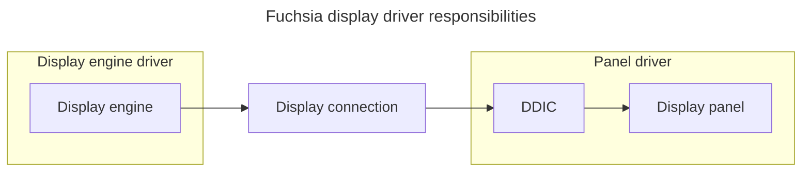

## Stakeholders

*Facilitator:* [Will Drewry](mailto:drewry@google.com)

*Reviewers:*

* FEC: [Will Drewry](mailto:drewry@google.com)
* Driver Framework: [Suraj Malhotra](mailto:surajmalhotra@google.com)
* Graphics Drivers: [Harsha Priya N V](mailto:harshanv@google.com),
  [Craig Stout](mailto:cstout@google.com)
* UI: [Josh Gargus](mailto:jjosh@google.com) (compositor),
  [Caroline Liu](mailto:carolineliu@google.com) (input)

*Consulted:* Members of Graphics Driver (Display and Magma) team, and Driver
Framework team.

*Socialization:* An internal draft of this RFC
([go/fuchsia-panel-drivers](https://goto.google.com/fuchsia-panel-drivers))
was sent to the reviewers above and FEC for comment. Comments have been
integrated into the current draft in Gerrit.

This section may be used to describe how the design was socialized before
advancing to the "Iterate" stage of the RFC process. For example: "This RFC went
through a design review with the Component Framework team."

## Requirements

A big part of successful software engineering is predicting what aspects of a
domain will not change, and building a system's high-level abstractions around
the unchanging aspects. We predict that the high-level hardware breakdown is
this aspect in our domain, based on ecosystem forces, relatively long product
development timelines, and the inability to change hardware once it has shipped.
For this reason, our design is heavily inspired by the hardware that we aim to
drive.

This section goes over representative hardware topologies, and quickly points
out mismatches in the Fuchsia driver topology. The subsections' names aim to
capture the essence of the systems they cover, rather than pointing to specific
hardware.

### Desktop

The display path is fairly independent from other subsystems in computers with
external displays. The diagram below describes both the Intel NUC system with an
external DisplayPort or HDMI display, and the Khadas VIM3 board with an attached
HDMI display.

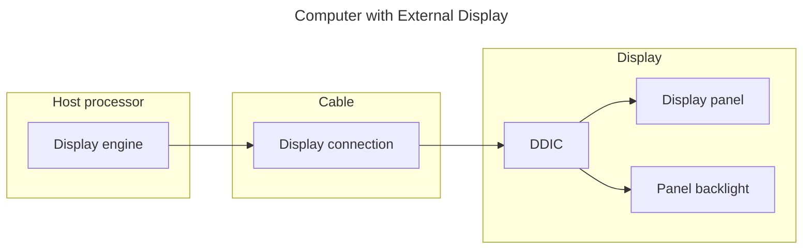

On an Intel NUC, the display engine hardware is inside the Intel processor. The
display engine exposes DisplayPort and HDMI ports on the computer's motherboard.
The display connection is a DisplayPort or an HDMI cable. The display device is
an external display (also called 'monitor") that follows the DisplayPort or HDMI
specification. Both specifications require the host to use E-EDID (Enhanced
Extended Display Identification Data) to learn the display device's identity and
capabilities. Both DisplayPort and HDMI dedicate a wire to the I2C protocol
subset used by E-EDID.

On a Khadas VIM3 board, the display engine hardware is inside the Amlogic A311D
SoC. The display engine exposes an HDMI port (used in this scenario) and a DSI
header (not applicable here) on the VIM3 board. The display connection is an
HDMI cable, and the display device is an external display that follows the HDMI
specification.

Fuchsia's current driver topology, where the display engine driver owns the
entire display path, works best on these systems. That being said, there are
still opportunities for panel drivers to improve how Fuchsia drives these
systems.

Given our current design, each display engine driver must duplicate the logic
for each supported display connection. For example, the intel-display driver's
DisplayPort implementation has DPCD (DisplayPort Configuration Data)
[register definitions][intel-display-dpcd] and
[logic][intel-display-dp-capabilities] that can be reused by any other
DisplayPort driver. This issue has not yet caused significant pain because we
only needed to support two major standards (DisplayPort and HDMI) - due to
ecosystem forces, the display connection is heavily standardized, and the two
standards we support cover the vast majority of the market.

E-EDID, which conveys the display identification and capabilities,
[is currently plumbed][coordinator-display-info-edid] throughout the
Coordinator. While the parsing itself is contained to [a library][lib-edid], the
E-EDID concept [shows up in the FIDL interface][fidl-display-engine-edid]
between the Coordinator and engine drivers. This issue hasn't caused significant
pain for the same reason as above, but it is a clear wrinkle - it wouldn't scale
to have the display engine driver API include all the supported display
connections.

### Laptop

Fuchsia's current driver topology works equally well on laptops with internal
displays built on the same standards as external displays. The diagram below
represents the Atlas (Google Pixelbook Go) system, whose backlight is directly
managed by the display engine.

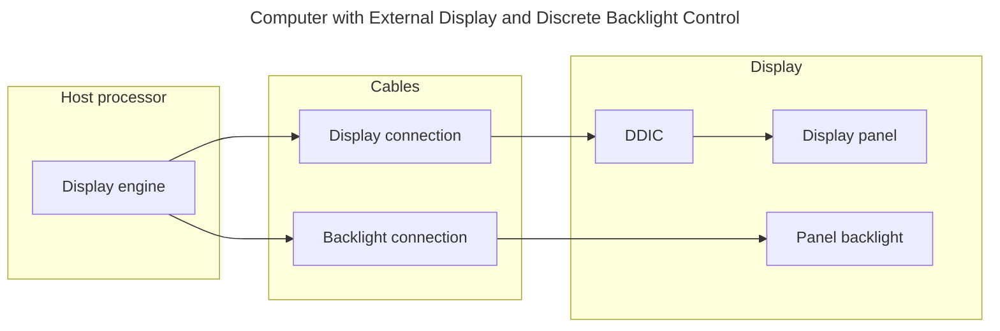

On an Atlas, the display engine is inside the Intel processor, and exposes an
eDP (Embedded DisplayPort) port on the motherboard. The display connection is an
eDP ribbon cable. The display device uses an LCD panel and a backlight that is
driven by the Intel display engine logic in the PCH (Platform Controller Hub) /
South Display Engine.

From a programming perspective, eDP is very similar to DisplayPort, so all the
findings in the [Desktop](#desktop) section apply here. In particular, eDP uses
E-EDID, so its inclusion in the Coordinator does not cause a burden for this
particular hardware platform.

This system can be supported by Fuchsia's current driver topology, taking
advantage of the fact that a single driver can implement and serve multiple FIDL
interfaces. More concretely, the display engine driver can also serve as a
backlight driver. eDP uses E-EDID for panel identification, similarly to
DisplayPort, so its implementation in the Coordinator is palatable.

### Smart Display

The separation of hardware gets progressively less clean on devices with
internal displays. The following diagram shows a Smart Display system that has
an LCD display with a discrete backlight component and a touch screen. The
diagram also matches the [Khadas VIM3 board][khadas-vim3] with a
[Khadas TS-050 display][khadas-ts050] attached via a DSI \+ touch cable.

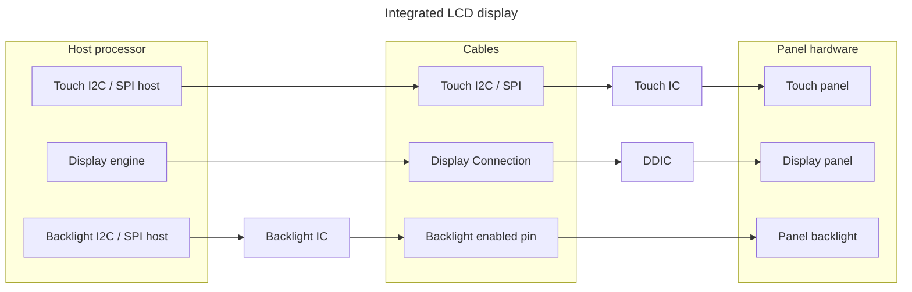

In the systems described above, the display engine hardware is in the Amlogic
SoC, which may be A311D or a similar model. The display connection is a DSI
ribbon cable, connected to the DSI header on the product's motherboard. Smart
Display products use a variety of DDICs (Fitipower JD9364 and JD9365), a variety
of touch ICs (a few FocalTech models, Goodix GT6853), and the
[Texas Instruments LP8556 backlight driver][ti-lp8556]. The touch IC and
backlight driver are connected via I2C buses. The Khadas TS-050 display uses a
NovaTek NT35596 DDIC, and a FocalTech FT5336 touch IC connected to I2C host pins
on the VIM3 board.

The lack of panel drivers has a more significant impact for this configuration.
DSI DDICs and panels use non-standard initialization commands that currently
push a significant amount of logic into the display engine driver. The
amlogic-display driver has
[a directory for panel-specific initialization commands][amlogic-display-panel-dir]
(created after we came up with the panel driver concept) for all panels it has
to support and the
[DSL (domain-specific language) for the initialization commands][amlogic-display-panel-config].
This coupling can be a significant burden to new product development initiatives
that aim to stay nimble by combining a supported SoC with new peripherals.
Instead of using the display engine driver as-is, the new product's developers
must either fork the display engine driver (foregoing future improvements), or
coordinate with the display engine driver developers to add support for the new
panel.

In addition to display-specific initialization, DSI display devices have control
pins outside the DSI connection, such as RESET. On DSI products, these pins are
typically connected to GPIO pins in the host processor. The display
initialization sequence includes modulating these pins correctly. As a
consequence, the amlogic-display driver
[includes GPIO logic][amlogic-display-lcd-gpio], and owns hardware that doesn't
seem directly related to the display engine.

DSI display devices do not typically use E-EDID for display identification. The
DSI standard recommends DCS (Display Command Standard) for talking to the DDIC,
and DCS includes commands for retrieving a DDB (Device Descriptor Block) from
the DDIC. However, most DSI DDICs implement an alternative non-standard set of
commands for retrieving a 3-byte panel ID. All the DDICs on Smart Display
products support the non-standard approach. The amlogic-display driver
[has logic for this non-standard approach][amlogic-display-lcd-gpio], which is
another DDIC detail leaking into the display engine driver.

Furthermore, many products that use DSI displays avoid depending on the DSI bus
for display identification. Products that use a single display device can avoid
identification altogether. Products that use a small number of display device
variants may encode that information in jumpers tied to GPIO pins. In Fuchsia,
this knowledge is encoded in the board driver. For example, the Nelson board
driver
[implements GPIO-based display identification][nelson-post-init-display-gpio].
Fuchsia's current driver topology supports this approach well, as it seems quite
appropriate to have this product-specific identification method implemented by
the board driver.

Fuchsia's current driver topology also makes it difficult to support discrete
backlights for LCD panels. Since the backlight is a separate piece of hardware,
it seems correct to write a separate driver, and treat it as a separate entity.
However, the backlight is usually tightly coupled with the panel that it is
attached to, and driving it requires knowledge of the panel operation. For
example, the driver for the Texas Instruments LP8556 has
[logic that depends on concrete panel models][ti-lp8556-panel-list].

he Fuchsia driver topology works as intended for the touch panel discussed in
this section. The touch panel is physically co-located with the display panel,
but the two functions are driven using entirely separate hardware paths. For
these systems, the touch panel can be driven by a touch input driver that is
completely independent of the display engine driver.

### Mobile device without MCU

This section describes a theoretical design intended to represent devices that
Fuchsia may support in the future. For this reason, we do not have concrete
examples of hardware, and we cannot point to code examples in the Fuchsia
platform source tree.

The diagram below illustrates a theoretical smartphone design, whose salient
features are an OLED panel and a TDDI (Touch and Display Integration) chip that
combines the DDIC with the Touch IC.

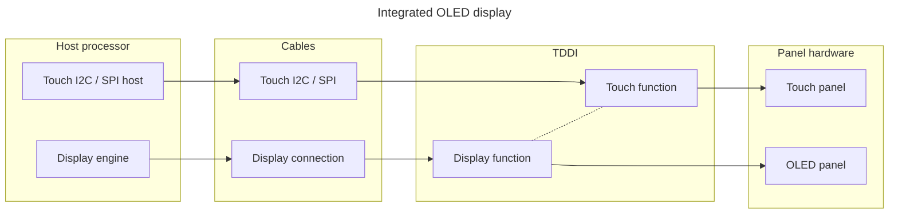

The display function in the TDDI is driven by a DSI connection, while the touch
function is driven by an I2C connection. This structure makes the system mostly
amenable to separate drivers. However, in the hardware we studied, the
integration also adds some coupling between the two functions. The two most
important examples are commands issued on one connection that change the state
of both functions, and processes that require precise sequencing of commands
across both connections.

Fuchsia's current driver topology makes it extremely difficult to support this
hardware system. In particular, building an independent touch input driver is
not possible, because the drivers that manage the display and touch function
must coordinate when issuing the power-up and power-down command sequences. The
current topology admits two straightforward solutions that come with significant
disadvantages.

*   Implement the display engine and touch interfaces in a single driver.
    Coordinating between touch and display follows the same approaches we've
    been using to coordinate across functional units in complex drivers. This
    approach amplifies the display engine / panel coupling issues described in
    the sections above.

*   Create a (presumably vendor-specific) FIDL interface between the display
    engine driver and the touch driver, and use it to coordinate power-up and
    power-down command sequences. This approach keeps the implementation in
    separate drivers, but still adds undesired complexity into the display
    driver, whose architecture would be twisted to accommodate specific display
    devices.

For completeness, we note that the backlight integration matches the Desktop
systems. OLED panels do not use a discrete backlight, and the TDDI emulates
backlight brightness by controlling the brightness ranges for individual OLED
pixels.

### Mobile device with MCU

This section describes a theoretical design intended to represent devices that
Fuchsia may support in the future. For this reason, we do not have concrete
examples of hardware, and we cannot point to code examples in the Fuchsia
platform source tree.

The diagram below illustrates a modern (at the time of this writing) design for
smartphones and smartwatches.

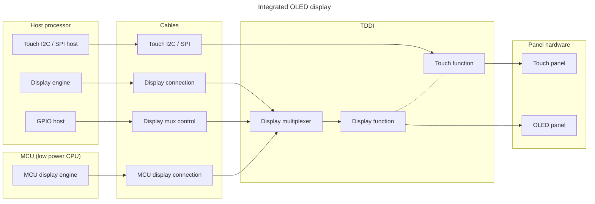

Modern mobile systems have converged on a system architecture that adds
significant complexity in return for reduced power consumption. The system board
hosts two SoC (System on Chip) instances with separate software stacks. The more
powerful SoC, which matches the Host Processor in previous designs, is now
called the AP (Application Processor), reflecting the fact that its software
stack runs installed applications. The less powerful SoC is called an MCU
(Micro-Controller Unit), and uses a design and manufacturing process that
sacrifices ease of development and capabilities to obtain a very low power
consumption. In these systems, Fuchsia would be running on the AP, so our
display drivers stack must support managing the AP's display-related hardware.

In the example system above, the AP and the MCU have separate display
connections to the TDDI. The TDDI contains a mux (multiplexer) that can toggle
between the display connections from the AP and from the MCU. So, the display
connection is owned by the AP or by the MCU, and the ownership can change while
the system is running. The AP controls the display connection mux, so the AP
software stack is responsible for toggling the mux source before passing the
display connection ownership to the MCU, and after taking the ownership back
from the MCU.

This system is another example where the current Fuchsia driver topology would
nudge developers towards pushing unrelated logic into the display engine driver.
The most straightforward implementation would have the display engine driver
implement the display connection ownership change, which would bring the
following unrelated concepts into the display engine driver codebase.

*   the GPIO pin logic changes needed to toggle the display connection source
    mux
*   the DDIC and panel state expected by the software running on the MCU during
    ownership changes

### Mobile device with external display

This section describes a theoretical design intended to represent devices that
Fuchsia may support in the future. For this reason, we do not have concrete
examples of hardware, and we cannot point to code examples in the Fuchsia
platform source tree.

The diagram below shows a mobile device that has an external display connected
via a USB-C cable. This operating mode is supported by many shipping smartphones
and tablets.

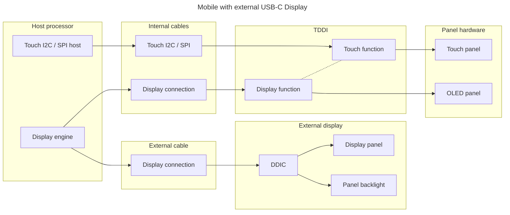

The USB-C connector exposed by modern mobile devices may support USB 4
Thunderbolt 4 operation, or the DP Alt Mode (DisplayPort Alternate Mode). In
both cases, the mobile device effectively gains an external display. Using the
external display as an extension of the device's internal display requires
multiple display support.

The Fuchsia display drivers stack does not currently support multiple displays,
and this document does not propose implementing multiple display support. At the
same time, we aim to consider interactions with multiple display support for all
the design options that we cover here.

## Principle

The new display architecture should follow these principles below to address the
pain points outlined in the [Requirements](#requirements) section.

### Clear separation of concerns

Fuchsia's display stack architecture was originally designed primarily for
desktop (including laptop) devices, where the display path is independent from
other parts of the system and the display device operates on its own.

On embedded devices, however, peripherals like the touch and backlight
controllers are exposed directly to the SoC, making the SoC responsible for
their coordination.

As this low-level hardware stack grows more complex, it becomes untenable for
the display engine driver to manage all of it. We must draw a clear boundary:
the display engine driver should handle encoding pixels into signals, while the
panel driver handles decoding those signals to light the screen.

Specifically, the display engine driver should be responsible for the display
engine block on the host processor, and the panel driver should be responsible
for the display panel and its integration with the rest of the device hardware.
This separation of concerns will make it easier to develop and maintain display
drivers, and will also make it easier to support new hardware.

### Scalable driver updates

One of Fuchsia's core principles is that Fuchsia allows the kernel, drivers, and
software components to be independently updatable. Specifically, software,
including drivers, is delivered in packages that can be updated independently
without affecting other drivers.

Currently, panel configurations are hardcoded within the SoC display engine
driver. This requires a full rebuild and update of the driver to support each
new panel.

Hardcoding panel configurations in the display engine driver is not scalable.
Adding support for a new panel requires rebuilding and updating the entire
driver. Every time a new panel is introduced to the system, either we fork a new
display engine driver to support that panel, or we update the display engine
driver that is used by multiple projects.

Similarly, in today's architecture, porting support for an existing panel to
another SoC also requires forking of the panel configuration code into another
driver.

We would like the new display architecture to fully decouple the driver code
provided by the SoC vendor and the panel vendor respectively, making both parts
easy and scalable to update.

### Stable interface for engine and panel vendors

Ideally, the display engine driver should be provided by the engine vendor,
while the driver that integrates the display panel's components should be
provided by the DDIC vendor and/or panel assembler.

A well-defined, stable interface allows SoC and panel vendors to develop their
respective drivers independently. This decoupling fosters a healthier and more
robust driver ecosystem.

## Design

The display path is currently managed entirely by the display engine driver. We
propose having a **display engine driver** be responsible for the display engine
block on the host processor, and having a **panel driver** be responsible for
the display panel and its integration with the rest of the device hardware.

In this new world, the display engine driver would work on any device whose host
processor uses the same display engine hardware. Device-specific concerns would
be implemented in the panel driver, which would embody knowledge about the
display panel and DDIC, as well as any integration points such as a backlight,
touch screen, or display connection multiplexer.

The panel driver will need to communicate with other drivers that own discrete
hardware blocks. For example, the panel driver knows how to configure the DDIC
via commands, but transmitting those commands entails using the display
connection managed by the display engine driver. Similarly, the panel driver may
know how to convert a brightness level (nits) to a backlight voltage level, but
translating the voltage level to I2C commands may be done by a dedicated
brightness IC driver.

### Panel device topology setup

Setting up the panel device topology involves two primary stages: detecting the
existence of a panel and identifying its type and capabilities.

Display panels can be categorized as either internal or external. An internal
panel is integrated into a board, remaining consistently available throughout
system operation, such as the display of a mobile phone. Conversely, an external
panel, such as a monitor, TV, or projector, can be connected or disconnected at
any time. Some internal panels, like the eDP display used by modern laptops, are
built on the same standards as external panels and can be handled using the same
mechanisms as external panels.

To detect the existence of a display:

*   For external display panels, Fuchsia must react when a user plugs in a new
    display, which comes down to handling HPD (Hot-Plug Detect) interrupts. On
    some hardware, the HPD signal is multiplexed with other display
    engine-specific signals on a single interrupt, and the display engine driver
    is the best owner for that interrupt.
*   For built-in display panels, the board driver or the devicetree already
    knows its existence. In such configurations, the device topology remains
    constant once the system has booted.

To identify the display type and capabilities:

*   External display panels typically use EDID (Extended Display Identification
    Data) to encode their display information and capabilities. Common
    interfaces like VGA, DVI, HDMI, and DisplayPort all provide DDC (Display
    Data Channel) channels for the host device to retrieve this encoded EDID
    from the panels.
*   Built-in display panels generally store panel information in the registers
    of the DDIC (Display Driver IC) during the manufacturer's OTP (One-time
    Programming) process. This panel information can then be accessed via the
    host-panel communication interface, such as MIPI-DSI, I2C, or SPI. Such
    interfaces usually don't have a standardized method for panel
    identification, and different manufacturers may use different registers to
    store panel information.

Given all the constraints above, for convenience and consistency, we'll make
display engine drivers responsible for creating
[Driver Framework nodes][dfv2-drivers-and-nodes] for panels, at least on systems
where the display panel type cannot be identified statically at design time.

Ideally, we would separate the board-specific panel identification logic from
the display engine driver, which may be shared across various boards. This
separation is best achieved by introducing a panel identification driver. This
specialized driver would identify the panel type and then instruct the display
engine to create a display panel node, incorporating bind properties derived
from the detected panel type data.

Panel identification drivers will utilize the same API as panel drivers for
issuing commands to the DDIC, as all known display connections employ a unified
channel for both display identification and command transmission.

In that case, at a high level, the boot flow involving panel identification
drivers would look as follows.

1.  The display engine driver creates a "panel identification node", passing the
    host-panel communication interface (such as MIPI-DSI controller or DDC
    channel) to the child.
2.  The panel identification driver binds to the panel identification node.
3.  The panel identification driver extracts the display identity, such as DSI
    ID bytes or an EDID structure, using the interface provided by the display
    engine driver.
4.  The panel identification driver asks the display engine driver to create a
    panel node whose attributes convey the panel identity.
5.  The correct panel driver binds to the panel node.
6.  Once the panel node is created, the display engine driver requests a
    deletion of the panel identification node. The panel identification driver
    will be unbound and the panel identification node will be removed from the
    device manager.

While this approach is versatile, the handshake process adds complexity for both
display engine and panel drivers.

For protocols such as MIPI-DSI and MIPI-DBI, almost all DDICs, regardless of
their manufacturers and models, have the same set of commands to retrieve panel
identifiers from specific registers. While not formally standardized, these
commands and registers are widely adopted as a de-facto standard.

Therefore, for the short- to medium-term, we will adopt a more direct approach:
the display engine driver will be responsible for identifying the panel and
creating the corresponding driver node, deferring the creation of a separate
panel identification driver. Specifically, the display engine driver is still
responsible for communicating with the interface and creating nodes, using the
identifiers it reads from the interface as properties. Similarly, panel drivers
would use these identifiers to create their binding rules.

### Panel driver interactions with display engine drivers

The display engine driver manages the engine's backend, which drives the host
processor's display connection. So, the display engine driver must expose an API
for the panel driver to configure the DDIC. This API must be specific to the
display connection. Here are two examples of API surfaces we know we will need.

*   DisplayPort and HDMI display connections will need an API for transmitting
    VESA DDC/CI commands. This will be a specialized I2C API.
*   DSI display connections will need an API for transmitting DSI command
    packets. This API may be supplemented by a library that simplifies putting
    together DSI packets representing MIPI DCS commands.

The API must allow low-latency implementations (for both clients and servers)
in C++ and Rust. This requirement overrides readability and complexity concerns.

The panel driver knows (or can discover) the capabilities of the display panel
and DDIC. So, the panel driver is responsible for exposing these capabilities to
the display engine driver. Fortunately, the capabilities relevant to the display
engine are covered by standards such as [CTA 861-I][cta-861] and
[VESA DMT][vesa-standards], so we can design a single connection-independent API
that will be implemented by panel drivers and consumed by display engine
drivers.

The display engine driver manages the display mode. It decides when a
modesetting (display mode change) operation is necessary, and coordinates the
operation. The panel driver may expose an API for applying a modesetting
operation to the DDIC and display panel. Panel drivers may skip modesetting
support when the display panel supports a single refresh rate, as the panel
resolution is generally fixed. However, modesetting can be offered in the
following situations.

*   The DDIC or display panel supports a variable refresh rate.
*   The DDIC supports multiple resolutions. This generally entails that the DDIC
    has internal image scaling logic.

### Display Coordinator interactions with display engine and panel drivers

The Display Coordinator is still responsible for managing all the system's
display hardware, which includes display engines and displays.

Since the display engine driver manages the engine's frontend, the display
engine driver still exposes an API for reading image pixel data from DRAM and
producing a composited image. This implies importing resources, and managing
the layers that make up display configurations.

The figures below illustrate the interactions between the Display Coordinator,
display engine drivers, and panel drivers.

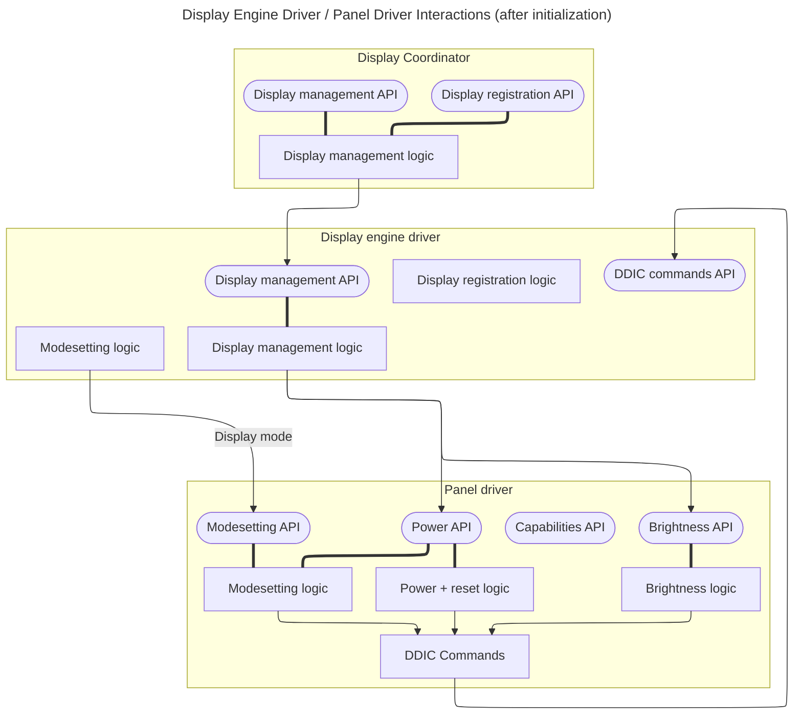

#### Panel Registration and Capabilities Propagation

```mermaid
---
config:
  layout: elk
  elk:
    mergeEdges: false
    nodePlacementStrategy: LINEAR_SEGMENTS
---
flowchart RL
 subgraph Coordinator["Display Coordinator"]
        CoordinatorDisplayRegApi(["Display registration API"])
        CoordinatorDisplayManagement["Display management logic"]
  end
 subgraph EngineDriver["Display engine driver"]
        DisplayRegistration["Display registration logic"]
  end
 subgraph PanelDriver["Panel driver"]
        PanelDisplayTimings(["Timing provision logic"])
        PanelCapabilitiesApi(["Capabilities API"])
  end
    CoordinatorDisplayRegApi === CoordinatorDisplayManagement
    PanelDisplayTimings --> PanelCapabilitiesApi
    PanelCapabilitiesApi -- Display timings --> DisplayRegistration
    DisplayRegistration -- Display modes --> CoordinatorDisplayRegApi

    CoordinatorDisplayRegApi@{ shape: stadium }
    PanelCapabilitiesApi@{ shape: stadium }

    PanelDisplayTimings@{ shape: rect}
    DisplayRegistration@{ shape: rect}
```

The display engine driver will still be responsible for registering panels and
display modes with the Display Coordinator. This design aspect is less obvious,
because the panel driver is the source of truth for panel capabilities. At the
same time, the display engine driver knows the limitations in the display engine
hardware, and can filter out non-viable modes from the capabilities reported by
the panel driver. Furthermore, the display engine driver needs to track all the
display devices connected to the engine anyway, in order to manage the engine
frontend's pipes.

#### Display Modesetting

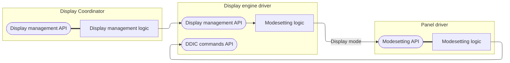

Panels can be configured to support different display modes. For desktop
monitors or TVs, this is usually automatically done by their internal DDIC
so that the host doesn't need to do anything on display mode switch. However,
for embedded devices, for example, phones or watches using SPI or MIPI-DSI
displays, the host usually needs to issue a DDIC-specific command to trigger
a change of display resolution and/or refresh rates.

In such cases, the panel driver is expected to issue DDIC commands when a
display config with a different mode is applied.

#### Display Management

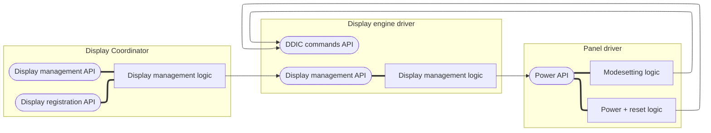

The panel is expected to handle all the panel power mode changes, such as
turning the panel on/off or switching to a low-power standby mode.

Similar to modesetting, the panel power control and power mode switch are
usually DDIC commands provided by the DDIC / panel vendor, so the panel needs
to communicate with the DDIC commands API of the SoC display engine driver to
issue such commands.

#### Brightness Control

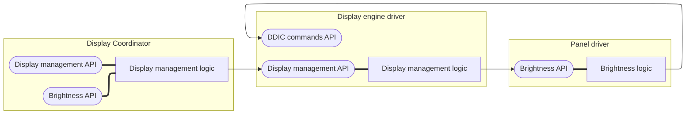

The display engine driver needs to intercept brightness requests received by the
panel driver, so we can implement features such as CABC (Content Adaptive
Backlight Control). To facilitate this, the Display Coordinator will expose a
brightness management API that is forwarded to the display engine driver, which
further forwards it to the panel driver. This approach also makes it relatively
easy to manage displays in a future where we need to support multiple displays.

To facilitate display management in a multiple display system, we'll use the
same plumbing approach for display device identity metadata such as vendor and
model strings, and for the display device's power state.

### Other panel driver interactions

The panel driver will take on all the display device management tasks that
involve hardware other than the display engine. The following tasks come to
mind:

*   Turning the display device on and off
*   Resetting the display device, as a last-ditch attempt to get out of a bad
    state
*   Changing the display's brightness
*   Bringing the display device into a specific power state

The driver may do these tasks directly, or may communicate with other drivers.
Here are some examples where communication is required:

*   Resetting the DDIC may involve changing the logic state of a RESET pin,
    which will likely be done by communicating with a GPIO driver
*   Changing the backlight's brightness may involve translating the desired
    brightness to a voltage, and asking a brightness IC driver to generate that
    voltage

The following figure illustrates all the interactions described here.

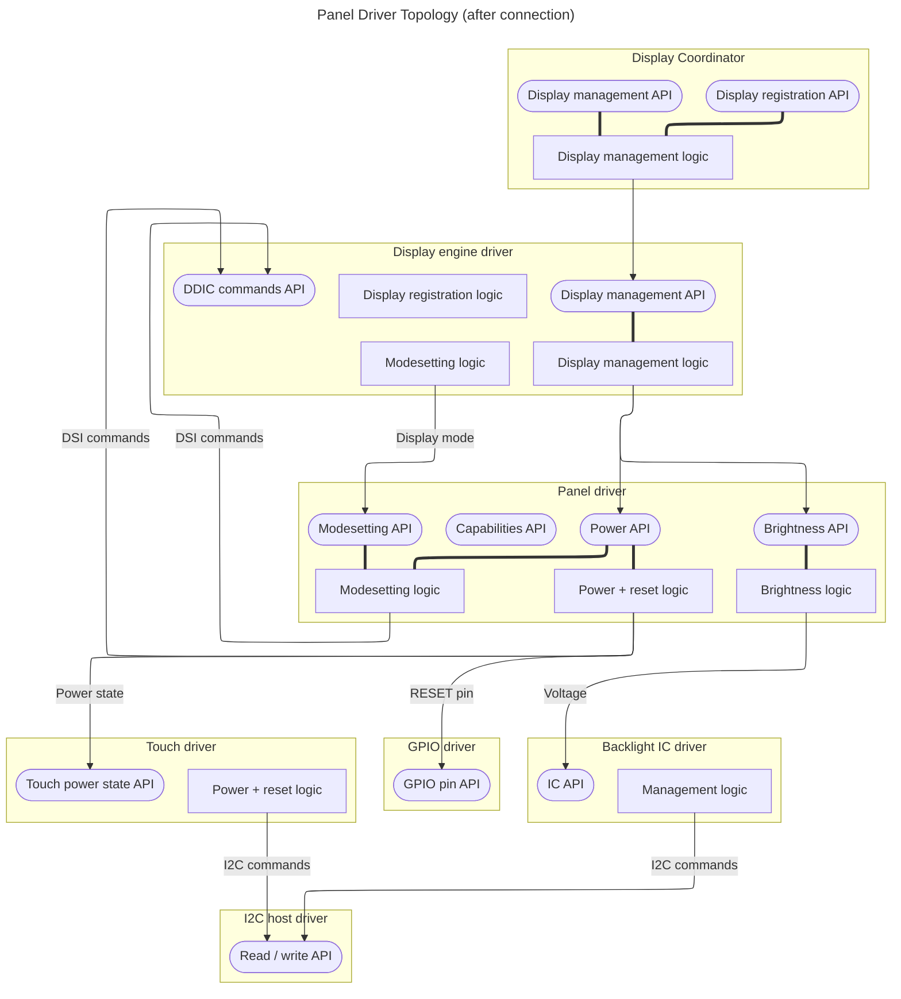

## Alternatives Considered

### Encode panel properties and logic in devicetree

Instead of hardcoding the panel properties in the drivers, we can store the
panel information as properties of the devicetree display engine node. This
includes:

*   Display timing parameters
*   Encoded display command sequences of power on / off, suspend and resume.
*   Encoded display identification logic

This is widely used in Linux display engine drivers, where the display engine
driver and the devicetree schema is usually provided by the SoC vendor as part
of the BSP, and board vendors add panel support to the devicetree file, which is
separated from the kernel drivers.

Pros:

*   This decouples the panel-specific data and logic from the display engine
    driver, making it possible to use one driver on different boards with the
    same SoC.

Cons:

*   The panel devicetree schema is still specific to certain SoC models and / or
    vendors. To port the display panel to a new SoC, we'll need to write new
    devicetree definitions.
*   The DSI command sequence and identification logic must be standardized in
    specially encoded formats to comply with the devicetree format requirements,
    adding more mental tax to the maintainers.
*   This approach only externalizes panel data; it does not separate hardware
    control. The display engine driver would still need direct access to panel-
    related hardware (e.g., GPIOs, I2C buses), which violates the core
    "separation of concerns" principle of this RFC.

## Implementation

Much like other operating systems, we will have one generic panel driver for
highly standardized DP and HDMI panels, and separate drivers for each DSI panel.

The standardized DP and HDMI drivers will parse the EDID and provides
capabilities of the display device to the engine driver. For devices that
support hardware control over the DDC/CI protocol, the generic driver will be
able to control the display power and brightness.

DSI panel drivers will handle DDIC and panel initialization, suspend, resume,
and any power mode switches. Most operations above require sending DSI command
sequences over the DSI host controller on the SoC display engine. Display engine
drivers will provide the FIDL interface to DSI panel drivers to access the DSI
host controller.

In most cases, it's recommended for drivers to adapt the engine-panel
architecture with some exceptions. For display engines that manage displays
directly or don't have a concept of display panel, there's no need for the
display engine to spawn a separate device node for the panels. For example:

*   The `goldfish-display` engine used by the Fuchsia Emulator, where the
    display engine directly creates and manages the emulated display panel by
    itself.
*   The `framebuffer-display` engines that write pixels directly to the
    bootloader-provided framebuffer.

### Threading model

The design above requires that the panel driver provides interfaces for power,
brightness and display mode control to the display engine, while the display
engine driver has to provide a service for the panel driver for handling DDIC
commands for mode control.

This cycle between the panel driver and the display engine driver indicates
that synchronous FIDL calls with a single dispatcher per driver won't work.

Generally, drivers making "down-calls" from the parent device into its
children are suggested to always issue asynchronous calls to avoid cycles and
extra latency caused by the driver runtime being unable to inline driver
transport calls.

For the same reason, the display engine (parent) driver should issue FIDL calls
to the panel (child) driver asynchronously. New engine drivers must be designed
to issue asynchronous calls to panel drivers. For existing engine drivers that
have urgent need for panel driver integration, they may continue using the
synchronous interface with a dedicated dispatcher handling DDIC commands as a
temporary workaround, but they must be migrated to issue async calls as soon as
possible, as handling multiple threads and dispatchers can be error-prone.

## Challenges

While separating the display engine and panel drivers provides a more scalable
and modular architecture, this approach introduces several complexities and
challenges that must be acknowledged. This section specifies the key challenges
of this architectural shift and our plans to address them:

### Increased interface complexity

This design requires a new FIDL interface to manage all interactions between
engine and panel drivers. Additionally, a new FIDL library will be needed to
support panel detection and binding. It also requires Fuchsia to define platform
FIDL interfaces for protocol-specific (for example, MIPI-DSI) communications
between panel drivers and display engine drivers.

In the long term, supporting drivers sourced directly from their respective
vendors will require a stable panel interface as part of the Fuchsia SDK.

An imperfect abstraction could lead to a cycle of API versioning and
maintenance, increasing the burden on driver developers. It's also challenging
to maintain protocol-specific interfaces as the protocol itself may evolve over
time.

This complexity is acknowledged as the necessary cost of supporting different
display panels in a scalable way on Fuchsia.

### More complex driver lifecycle and topology

The proposed driver discovery and binding process involves a multi-step
handshake between the engine driver, a panel identification driver, and the
final panel driver.

As mentioned in the [Panel device topology setup](#panel-device-topology-setup)
section above, for the short- to medium-term future, we would not introduce new
identification drivers (and their shutdown logic) unless necessitated by future
boards.

### Performance overhead from FIDL calls

Interactions that were previously simple in-process function calls now become
inter-driver FIDL calls. This could introduce latency for operations like panel
initialization, potentially slowing down system boot or resume from sleep.

The overhead can be mitigated / minimized as we colocate the display engine and
panel drivers and use [FIDL driver transport][fidl-driver-transport].

### Migration cost

This architectural shift introduces a migration cost for existing display
drivers. All current display engine drivers, which presently manage both engine
and panel functionalities, will need to be refactored. This involves:

*   Splitting existing drivers' functionality related to the display panel into
    new panel drivers, and
*   Updating display engine drivers, as the remaining display engine drivers
    will need to be updated to interact with the new panel drivers via the
    defined FIDL interfaces.

This refactoring effort requires significant development time and careful
coordination to ensure a smooth transition without introducing regressions.

As this design only involves the panel-engine driver interactions, the display
engine protocol used by the Coordinator will not be affected. This means we can
perform the migration in multiple phases and align the migration to Fuchsia team
priority.

## Performance

The primary performance impact is discussed in the
[Performance overhead from FIDL calls](#performance-overhead-from-fidl-calls)
subsection of the [Challenges](#challenges) section. We expect minimal overhead
due to the use of FIDL driver transport and driver colocation.

## Backwards Compatibility

This RFC proposes a significant refactoring of the display driver architecture.
The [Migration cost](#migration-cost) subsection of the [Challenges](#challenges)
section details the impact on existing drivers. The design aims to maintain
backwards compatibility at the Display Coordinator interface level, allowing for
a phased migration.

## Security considerations

This design focuses on restructuring how display hardware is managed by drivers.
It does not introduce new attack surfaces or change how display data is
processed or secured. Security considerations remain tied to the underlying
hardware and the existing display stack architecture.

## Privacy considerations

This RFC is focused on low-level hardware driver architecture and does not
involve the collection, processing, or storage of user data. Therefore, there
are no new privacy considerations introduced by this design.

## Testing

The new panel drivers will be covered by unit tests using fake/mock protocols
such as MIPI-DSI and I2C.

Integration tests and end-to-end tests for display panels will make sure if
specific Coordinator commands can change the panel state. These tests can be
hard to automate, as it's difficult to verify the panel state using the
panel-provided interface; external tools like power monitors may be helpful
during the verification process.

In the future when the display engine and panel drivers are directly provided
by the vendors, we should provide the integration tests above as a conformance
test suite for vendors to make sure that the display engine can drive panels
it supposed to support, and the display panel state can be controlled by
display engines on SoCs supported by Fuchsia. The design of the conformance
tests is out of the scope of this doc.

## Documentation

The [display drivers stack README][display-readme] will be updated to reflect
the concept of panel drivers. New FIDL interfaces will be thoroughly documented.

[amlogic-display-lcd-gpio]: https://cs.opensource.google/fuchsia/fuchsia/+/main:src/graphics/display/drivers/amlogic-display/lcd.cc;l=227-253;drc=466e3cb5977bd41339c6bb496965b180dccccb96
[amlogic-display-panel-dir]: https://cs.opensource.google/fuchsia/fuchsia/+/main:src/graphics/display/drivers/amlogic-display/panel/;drc=f8bc3af6341a1936949d837582aa623329beae24
[amlogic-display-panel-config]: https://cs.opensource.google/fuchsia/fuchsia/+/main:src/graphics/display/drivers/amlogic-display/panel-config.h;drc=e58ec89d24a35e17843c51b7668a8c1d60d20ac6
[coordinator-display-info-edid]: https://cs.opensource.google/fuchsia/fuchsia/+/main:src/graphics/display/drivers/coordinator/added-display-info.h;l=46-47;drc=e01ff8970a8873e522c066dda22e53b90d11c897
[cta-861]: https://shop.cta.tech/products/cta-861
[display-readme]: /src/graphics/display/README.md
[display-hardware-readme]: /src/graphics/display/docs/hardware.md
[dfv2-drivers-and-nodes]: /docs/concepts/drivers/drivers_and_nodes.md
[fidl-display-engine-edid]: https://cs.opensource.google/fuchsia/fuchsia/+/main:sdk/fidl/fuchsia.hardware.display.engine/engine.fidl;l=200-211;drc=9e5de3fe1711ec3285450ac02e762c5c53e899bf
[fidl-driver-transport]: /docs/development/languages/fidl/tutorials/cpp/topics/driver-transport.md
[intel-display-dpcd]: https://cs.opensource.google/fuchsia/fuchsia/+/main:src/graphics/display/drivers/intel-display/dpcd.h;drc=b417bf0922c6fba080bcf252677f70b5b710b378
[intel-display-dp-capabilities]: https://cs.opensource.google/fuchsia/fuchsia/+/main:src/graphics/display/drivers/intel-display/dp-capabilities.h;drc=53c814a2f17fa6a93798ab8a19a65b894e2a5cd3
[khadas-vim3]: https://www.khadas.com/product-page/vim3
[khadas-ts050]: https://www.khadas.com/product-page/ts050-touchscreen
[lib-edid]: https://cs.opensource.google/fuchsia/fuchsia/+/main:src/graphics/display/lib/edid/;drc=db2e9dea6532726295faafa80ea9b192474be827
[nelson-post-init-display-gpio]: https://cs.opensource.google/fuchsia/fuchsia/+/main:src/devices/board/drivers/nelson/post-init/display.cc;l=107-120;drc=3280cb7ce57dfed35b7153928895796070d3137a
[ti-lp8556]:https://www.ti.com/product/LP8556
[ti-lp8556-panel-list]: https://cs.opensource.google/fuchsia/fuchsia/+/main:src/ui/backlight/drivers/ti-lp8556/ti-lp8556.cc;l=26-81;drc=9e83a23ee806ccb8686fa42891d69f10d8698684
[vesa-standards]: https://vesa.org/vesa-standards/

