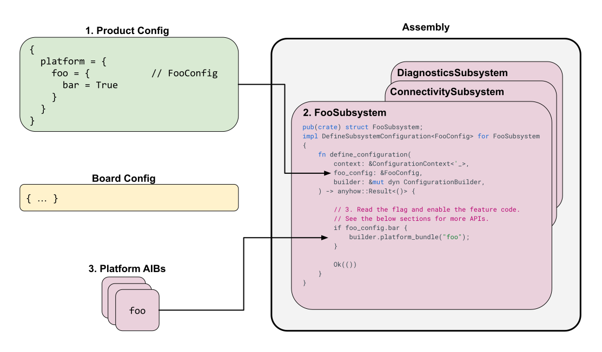

# Codelab: Implementing a platform feature

This codelab walks you through the process of implementing a new feature
in the Fuchsia platform that can be conditionally included and configured
by product or board configurations.

## Prerequisites

This codelab assumes you are familiar with:

*   Fuchsia's [source tree](/docs/development/source_code/layout.md) and build
    system ([GN](/docs/development/build/overview.md) and
    [Bazel](/docs/development/build/bazel_concepts/project_layout.md)).
*   Rust programming language.
*   [Fuchsia components concepts][components-concepts].
*   [Software Assembly concepts][software-assembly-concepts] (Product Config,
    Board Config, Platform).

## What you'll learn

*   How to decide if a feature belongs in the platform.
*   How to define feature flags in the Assembly configuration schema.
*   How to create and register an Assembly subsystem.
*   How to use subsystem APIs to include packages, configuration, and kernel
    arguments.
*   How to enable your new platform feature in a product or board.

## Feature placement guidelines

A platform feature is **always** implemented in `fuchsia.git` and must be
generic enough that it can be enabled on multiple products or boards. If a
feature is specific to a single product or board, it does not belong in the
platform.

The Fuchsia platform is the core, shared foundation for all products. Adding
product-specific or board-specific features to the platform increases its size
and complexity for all other products, and can create long-term maintenance
burdens. **It is critical to keep the platform generic.**

Use the following guidelines to decide where to place a feature:

*   **Platform feature**: A feature that is useful to multiple products or
    boards. It should be generic and configurable, such as a new, optional
    networking service that different products can choose to include and
    configure.

*   **Product feature**: A feature that is specific to one product. This is
    often a feature that is visible to the end-user, such as a Fuchsia package
    that constructs the UI, or a unique set of fonts for a single product.

*   **Board feature**: A feature that is specific to one board's hardware, such
    as a driver for a specific hardware component, or configuration values
    (like GPIO pin numbers) that are unique to that board.

## Codelab steps

Implementing a platform feature involves the following steps:

1.  [Declare feature flags in config_schema](#declare-feature-flags).
2.  [Define a new subsystem](#define-subsystem).
3.  [Implement the subsystem logic](#implement-subsystem).
4.  [Enable the feature in a product/board](#enable-feature).

{: width="800"}

**Figure 1**. Implementing a platform feature and enabling it in a product
config.

### 1. Declare feature flags in config_schema {:#declare-feature-flags}

Platform features are typically enabled conditionally based on flags set in
the product or board configuration. The first step is to define the schema
for these flags.

All platform feature flags are declared within Rust structs in
[`//src/lib/assembly/config_schema/src/platform_settings`][config-schema]. Each
subsystem usually has its own file in this directory (e.g. `fonts_config.rs` or
`network_config.rs`).

**Example:** For an example, follow these steps:

1. To define a flag to enable a hypothetical "Tandem" networking feature,
   create a new file
   `//src/lib/assembly/config_schema/src/platform_settings/tandem_config.rs`:

    ```rust
    use serde::{Deserialize, Serialize};

    /// Configuration for the Tandem networking feature.
    #[derive(Debug, Deserialize, Serialize, PartialEq)]
    #[serde(default, deny_unknown_fields)]
    pub struct TandemConfig {
        /// Enables the core Tandem service.
        pub enabled: bool,

        /// Specifies the maximum number of concurrent connections.
        pub max_connections: u32,
    }

    // Choose reasonable default values.
    impl Default for TandemConfig {
        fn default() -> Self {
            Self {
                enabled: false,
                max_connections: 10,
            }
        }
    }
    ```

    **Best practices for defaults:**

    *   Always use `#[serde(default)]` on the struct field within `PlatformSettings`
        (as shown in the next step).
    *   Implement `impl Default` for your config struct (`TandemConfig` in this
        case) to define the default values for each field.
    *   Avoid using field-level `#[serde(default = "...")]` in conjunction with
        `#[derive(Default)]` on the struct, as this can lead to inconsistent
        behavior.

    Note: For more details, see the
    [Best Practices for `config_schema`][config-schema-readme].

1.  Add this new config struct to the main `PlatformSettings` in
    `//src/lib/assembly/config_schema/src/platform_settings.rs`:

    ```rust
    // ... other imports
    mod tandem_config;

    // ... other fields
    pub struct PlatformSettings {
        // ... other fields
        #[serde(default)]
        pub tandem: tandem_config::TandemConfig,
    }
    ```

1.  In a product configuration, you can now enable this new feature. For example:

    ```bazel
    fuchsia_product_configuration(
        name = "my_product",
        product_config_json = {
            platform = {
                tandem = {
                    enabled = True,
                    max_connections = 20,
                },
            },
        },
    )
    ```

### 2. Define a new subsystem {:#define-subsystem}

An **assembly subsystem** is a Rust module responsible for processing the
configuration for a related group of platform features. It reads the flags
defined in `config_schema` and uses Assembly builder APIs to include and
configure the feature code.

**Location:** Subsystems are located in
[`//src/lib/assembly/platform_configuration/src/subsystems`][subsystems].

Note: Before creating a new subsystem, check if an existing one in
`//src/lib/assembly/platform_configuration/src/subsystems` fits your feature.
Only add a new one if necessary.

For an example, follow these steps:

1.  Create a new file
    `//src/lib/assembly/platform_configuration/src/subsystems/tandem.rs` for our
    "Tandem" feature:

    ```rust
    use crate::subsystems::prelude::*;
    use assembly_config_schema::platform_config::tandem_config::TandemConfig;

    pub(crate) struct TandemSubsystem;
    impl DefineSubsystemConfiguration<TandemConfig> for TandemSubsystem {
        fn define_configuration(
            context: &ConfigurationContext<'_>,
            tandem_config: &TandemConfig,
            builder: &mut dyn ConfigurationBuilder,
        ) -> anyhow::Result<()> {
            if tandem_config.enabled {
                // Actions to include the feature will go here
                // See Step 3 for details
                println!("Tandem feature enabled with max_connections: {}", tandem_config.max_connections);
            }
            Ok(())
        }
    }
    ```

    **Explanation:**

    *   The struct `TandemSubsystem` implements the `DefineSubsystemConfiguration`
        trait, typed with the `TandemConfig` struct we defined earlier.
    *   The `define_configuration` function receives the `ConfigurationContext`,
        our specific `TandemConfig`, and a `ConfigurationBuilder`.
    *   Inside this function, we check the `enabled` flag. If true, we'll use the
        `builder` to add the feature components to the system image.

1.  Add the module to `//src/lib/assembly/platform_configuration/src/subsystems.rs`:

    ```rust
    // ... other mods
    mod tandem;
    ```

1.  Call its `define_configuration` function within the main
    `Subsystems::define_configuration` function in the same file, passing the
    relevant part of the platform settings:

    ```rust
    // In Subsystems::define_configuration
    tandem::TandemSubsystem::define_configuration(
        context,
        &platform.tandem,
        builder,
    )?;
    ```

### 3. Implement the subsystem logic {:#implement-subsystem}

Inside the `define_configuration` function of your subsystem, you'll use the
`ConfigurationBuilder` methods to add the feature to the product based on the
feature flags.

**Updating `tandem.rs`, for example:**

```rust
use crate::subsystems::prelude::*;
use assembly_config_schema::platform_config::tandem_config::TandemConfig;
use assembly_platform_configuration::{
    ConfigurationBuilder,
    KernelArg,
    ConfigValueType,
    Config,
    PackageSetDestination,
    PackageDestination,
    FileEntry,
    BuildType
};

pub(crate) struct TandemSubsystem;
impl DefineSubsystemConfiguration<TandemConfig> for TandemSubsystem {
    fn define_configuration(
        context: &ConfigurationContext<'_>,
        tandem_config: &TandemConfig,
        builder: &mut dyn ConfigurationBuilder,
    ) -> anyhow::Result<()> {
{{"<strong>"}}
        if tandem_config.enabled {
            // 1. Add the feature's code at build time using an Assembly Input Bundle (AIB)
            builder.platform_bundle("tandem_core");

            // 2. Set a runtime configuration value
            builder.set_config_capability(
                "fuchsia.tandem.MaxConnections",
                Config::new(ConfigValueType::Int32, tandem_config.max_connections.into()),
            )?;

            // 3. Conditionally add a runtime kernel argument based on build type
            if context.build_type == &BuildType::Eng {
                builder.kernel_arg(KernelArg::TandemEngDebug);
            }

            // 4. Include a domain config package for more complex runtime configuration
            builder.add_domain_config(PackageSetDestination::Blob(PackageDestination::TandemConfigPkg))
                  .directory("config/data")
                  .entry(FileEntry {
                      source: "//path/to/tandem/configs:default.json".into(),
                      destination: "settings.json".into(),
                  })?;
        }
{{"</strong>"}}
        Ok(())
    }
}
```

**Build-time vs. runtime enablement:**

*   **Build-time:** Artifacts are only included in the image if the feature is
    enabled. This is preferred for saving space, tightening security, enabling
    static analysis, and increasing performance for other products that do not
    need the feature.
*   **Runtime:** Artifacts are always included, but their behavior is
    controlled at runtime (e.g., by config values or kernel arguments).

#### Build time {:#build-time}

Assembly organizes build-time features using Assembly Input Bundles (AIBs). A
feature owner can insert many types of artifacts into a single AIB, and
Assembly can be instructed when and how to add that AIB to a product. All AIBs
are defined in [`//bundles/assembly/BUILD.gn`][assembly-build]. For example:

```gn {:.devsite-disable-click-to-copy}
# Declares a new AIB with the name "tandem_core".
assembly_input_bundle("tandem_core") {
  # Controls which build types and feature set levels this AIB is allowed to be
  # included in. This prevents non-production code from ending up in production
  # user builds.
  # Options include:
  #   "everything" (equivalent to empty list)
  #   <build-type> (e.g. "user", "userdebug", "eng")
  #   <feature-set-level> (e.g. "standard", "utility", "bootstrap", "embeddable")
  #   <feature-set-level>::<build-type> (e.g. "standard::eng" or "utility::user")
  allowed_in = [ "standard", "utility::eng" ]

  # Include this package into the "base package set".
  # See RFC-0212 for an explanation on package sets.
  # The provided targets must be fuchsia_package().
  base_packages = [ "//path/to/my/tandem:pkg" ]

  # Include this file into BootFS.
  # The provided targets must be bootfs_files_for_assembly().
  bootfs_files_labels = [ "//path/to/my/tandem:bootfs" ]
}
```

**Access Control Fields:**

*   **`allowed_in`**: (Recommended) Lists the feature sets (e.g. `standard`,
    `bootstrap`) and build types (e.g. `user`, `eng`) that are allowed to
    include this AIB. If a user attempts to include an AIB in an improper
    product, then assembly will throw an error.
*   **`scrutiny_required`**: Lists the feature sets and build types where
    the contents of this AIB are expected in the scrutiny goldens. This is
    used only for scrutiny golden generation and does not affect what AIBs
    go into which products.
*   **`auto_include_in`**: Lists the feature sets and build types where this
    AIB is automatically included without needing an explicit
    `builder.platform_bundle()` call in the subsystem.

To include an AIB, you can either use `auto_include_in` in the AIB definition
to tell Assembly to automatically include the AIB in the listed build types
and feature set levels, or if you need to enable the AIB based on a board or
product-level flag, you can use the following method in your subsystem:

```rust {:.devsite-disable-click-to-copy}
builder.platform_bundle("tandem_core");
```

Note: If you're not adding a new feature flag, you can likely add your code
to an existing AIB instead of writing a new AIB. For example, the
`embeddable_eng` AIB is already added to every `eng` product, so if you want to
add a feature to all `eng` products, the feature code can be added to
`embeddable_eng`.

If you add a new AIB, don't forget to add it to the appropriate list in
[`//bundles/assembly/platform_aibs.gni`][platform-aibs-gni], or you will get an
error at build-time indicating that the AIB cannot be found.

#### Runtime {:#runtime}

Assembly supports multiple types of runtime configuration. These types are
listed in order of preference.

**Config capabilities**: A Fuchsia component can read the value of [config
capabilities][config-capabilities] at runtime, while Assembly sets the default
value for those capabilities at build time, for example:

```rust {:.devsite-disable-click-to-copy}
// Add a config capability named `fuchsia.tandem.MaxConnections` to the config package.
builder.set_config_capability(
    "fuchsia.tandem.MaxConnections",
    Config::new(ConfigValueType::Int32, tandem_config.max_connections.into()),
)?;
```

Assembly will add all default config capabilities to a config package in BootFS,
therefore the capability will need to be routed from the `/root` component realm
to your component.

##### Using platform-defined config capabilities in components

When a component needs to *use* a config capability that is defined and provided
by the platform (via `builder.set_config_capability` in a subsystem), the
component's CML file must include a `use` declaration. This declaration must
specify the `type` of the configuration value, even though the value is
provided by the parent realm.

**Example component CML (`my_component.cml`):**

```json
{
    use: [
        {
            config: "fuchsia.tandem.MaxConnections", // The capability name
            from: "parent",
            key: "max_conn", // The key used in this component's structured config
            type: "int32",     // The type MUST be specified here
        },
    ],
    // ... other parts of the manifest
    config: {
        max_conn: { type: "int32" },
    },
}
```

**Component Code:**

Your component's source code must also be updated to expect this key in its
structured configuration. This typically involves updating a struct that
deserializes the config values, often generated by the `ffx component config
get` command or a similar tool. Define a struct to deserialize the
configuration:

```rust
// Example in the component's config.rs (e.g., src/config.rs)
use serde::Deserialize;

// This struct should match the keys and types in the CML 'config' block.
#[derive(Debug, Deserialize)]
pub struct TandemComponentConfig {
    pub max_conn: i32,
    // ... other config fields
}
```

Then, in your component's initialization code, retrieve the configuration:

```rust
let config = fuchsia_component::config::Config::take_from_startup_handle();
let tandem_config: TandemComponentConfig = config.get();
```

**Key points:**

*   The `type` (e.g., `"bool"`, `"int32"`, `"string"`) MUST be included in the
    `use` stanza for platform-provided configs.
*   If the type is `"string"`, you must also include `max_size`.
*   The `key` in the `use` stanza maps the capability to a field name in the
    component's own `config` schema, and thus to the field in the struct used
    to load the configuration in the component's code.
*   Ensure the component's code (e.g., Rust, C++) is updated to handle the new
    configuration key.

Note: For more details on how configuration capabilities work, see the
[config capabilities][config-capabilities] documentation.

**Domain configs**: For complex configurations, lists of items, or those
requiring custom types, domain configs are preferable to config capabilities.
While it is often possible to "flatten" a complex configuration into a set of
simple key-value pairs for config capabilities, this can become unwieldy.

For example, consider a component that needs a list of network endpoints, where
each endpoint has a URL, a port, and a protocol. Using config capabilities,
you might have to flatten this into a series of keys. For example:

```none {:.devsite-disable-click-to-copy}
// This approach is NOT recommended for lists or complex types.
"endpoint.0.url": "host1.example.com",
"endpoint.0.port": 443,
"endpoint.1.url": "host2.example.com",
"endpoint.1.port": 8080,
```

This becomes difficult to manage, especially if the number of endpoints is
variable. A domain config is a much cleaner solution in this case. You can
provide a single JSON file in a package that the component can parse at
runtime:

```json {:.devsite-disable-click-to-copy}
// A domain config file (e.g., tandem_config.json)
{
  "endpoints": [
    {
      "url": "host1.example.com",
      "port": 443,
      "protocol": "HTTPS"
    },
    {
      "url": "host2.example.com",
      "port": 8080,
      "protocol": "HTTP"
    }
  ]
}
```

Domain configs are Fuchsia packages that provide a config file for your
component to be read and parsed at runtime, for example:

```rust {:.devsite-disable-click-to-copy}
// Create a new domain config in BlobFS with a file at "config/tandem_config.json".
builder.add_domain_config(PackageSetDestination::Blob(PackageDestination::TandemConfigPkg))
      .directory("config")
      .entry(FileEntry {
          source: config_src,
          destination: "tandem_config.json".into(),
      })?;
```

Your component must launch the domain config package as a child and `use` the
directory, for example:

```json {:.devsite-disable-click-to-copy}
{
    children: [
        {
            name: "tandem-config",
            url: "fuchsia-pkg://fuchsia.com/tandem-config#meta/tandem-config.cm",
        },
    ],
    use: [
       {
            directory: "config",
            from: "#tandem-config",
            path: "/config",
        },
    ],
}
```

**Kernel argument**: A kernel argument is only used for enabling kernel
features. Assembly constructs a command line to pass to the kernel at runtime,
for example:

```rust {:.devsite-disable-click-to-copy}
builder.kernel_arg(KernelArg::TandemEngDebug);
```

### 4. Enable the feature in a product/board {:#enable-feature}

Once you implement your subsystem, you can enable the feature across products
and boards depending on your feature's requirements. The following examples
cover the most common enablement patterns.

#### Enable on specific products (product opt-in)

To enable the "Tandem" feature for a specific product, modify its
`fuchsia_product_configuration` target (usually in a `BUILD.bazel` file) to set
the flag defined in [Declare feature flags in config_schema](#declare-feature-flags):

```bazel
fuchsia_product_configuration(
    name = "my_product",
    product_config_json = {
        platform = {
            # ... other platform settings
            tandem = {
                enabled = True,
                max_connections = 20,
            },
        },
    },
    # ... other attributes
)
```

#### Enable on all products of a specific build type or feature set level

When you want to automatically include a feature on all products of a given
build type (such as `eng`) or feature set level (such as `utility`), you do not
need to define a product configuration flag. Note that `platform.build_type` in
product configurations is used to *declare* whether a product is an `eng` or
`user` build; it is not a setting used to enable individual features.

To enable a feature automatically for a build type or feature set level, you can use any of the following options:

*   **Option A: Add to an existing bundle**: If your feature belongs in all
    `eng` products, you can add your code directly to an existing bundle such as
    `embeddable_eng`.
*   **Option B: Configure `auto_include_in`**: In your Assembly Input Bundle
    (`BUILD.gn`), specify the allowed build types and feature set levels:

    ```gn
    assembly_input_bundle("tandem_core") {
      auto_include_in = [ "utility::eng" ]
      # ...
    }
    ```

*   **Option C: Check context in subsystem**: In your subsystem logic
    (`define_configuration`), inspect `context.build_type` or
    `context.feature_set_level`:

    ```rust
    if context.build_type == &BuildType::Eng {
        builder.platform_bundle("tandem_core");
    }
    ```

#### Enable on all products that use a capable board (board-driven)

Board features are a way for a board to declare that they support a particular
piece of hardware. Subsystems can check board features using `BoardFeature` enum
constants via `context.board_config.provides_feature(...)`.

If your feature requires specific hardware support, ensure the board
configuration (for example, `//boards/my_board/BUILD.bazel`) includes it:

```bazel
fuchsia_board_configuration(
    name = "my_board",
    provided_features = [
        "fuchsia::tandem_hw",
    ],
    # ...
)
```

In your subsystem logic, check whether the board provides this feature using the
corresponding `BoardFeature` constant:

```rust
if context.board_config.provides_feature(BoardFeature::TandemHw) {
    builder.platform_bundle("tandem_core");
}
```

Any product built using `my_board` (or any other board providing
`fuchsia::tandem_hw`) automatically includes the feature.

#### Enable on products with a capable board and explicit opt-in

When a feature requires both capable hardware from the board and explicit opt-in
from the product configuration (for example, an optional service that only works
on capable boards), verify both conditions in your subsystem logic
(`define_configuration`):

```rust
if tandem_config.enabled
    && context.board_config.provides_feature(BoardFeature::TandemHw)
{
    builder.platform_bundle("tandem_core");
}
```

After you modify the configuration and subsystem logic, rebuilding the product
bundle includes the Tandem feature and its configurations as defined.

<!-- Reference links -->

[software-assembly-concepts]: /docs/concepts/software_assembly/overview.md
[components-concepts]: /docs/concepts/components/v2/README.md
[config-schema]: https://cs.opensource.google/fuchsia/fuchsia/+/main:src/lib/assembly/config_schema/
[config-schema-readme]: https://cs.opensource.google/fuchsia/fuchsia/+/main:src/lib/assembly/config_schema/README.md
[subsystems]: https://cs.opensource.google/fuchsia/fuchsia/+/main:src/lib/assembly/platform_configuration/src/subsystems/
[assembly-build]: https://cs.opensource.google/fuchsia/fuchsia/+/main:bundles/assembly/BUILD.gn
[platform-aibs-gni]: https://cs.opensource.google/fuchsia/fuchsia/+/main:bundles/assembly/platform_aibs.gni
[config-capabilities]: /docs/concepts/components/v2/capabilities/configuration.md
