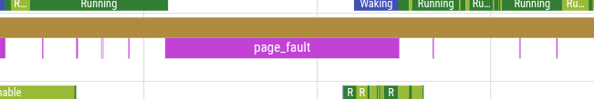
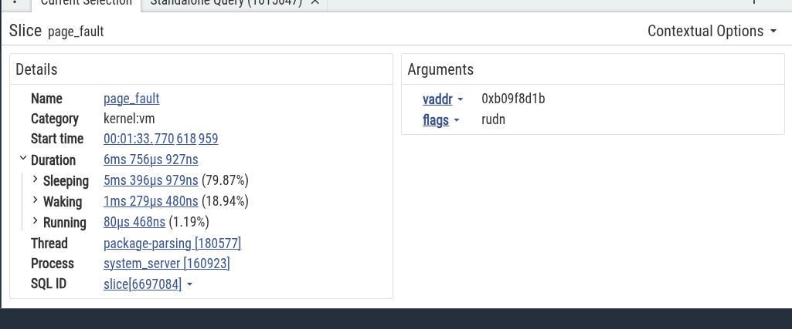

# Record page fault events in a trace

## Overview

Fuchsia tracing captures kernel events, one of which is named `page_fault`. This
event represents the duration of the time used to handle the page fault. Page
faults occur when the running process needs a page of memory to continue execution.

## Enable page fault events

Page faults are handled by the kernel and are part of the `kernel:vm` category.

## Capture the trace

For general information on Fuchsia tracing and how to capture trace events
with [`ffx trace`][ffx-trace], see [Fuchsia tracing][fuchsia-tracing].

To include page fault events in your trace, specify the
`kernel:vm` category:

```posix-terminal
ffx trace start --categories "#default,kernel:vm"
```

## Understand a page fault event



Page faults appear as slices in Perfetto.

The details of the event are shown in the bottom panel of Perfetto when you click
on the slice:



The left part of the details displays the standard properties of any slice.
On the right side, there are arguments included in the page fault event.

* `vaddr` is the address of the page being processed by the page fault.
* `flags` indicate the type of the page fault:

|Read/Write|Type|Kind|Present|
|----------|----|----|-------|
| **R**ead/**W**rite | **U**ser/**G**uest/**S**ystem | **I**nstruction/**D**ata | **N**ot Present/ **P**resent

See the source code for [fault.h][fault-h]

[fuchsia-tracing]: /docs/development/tracing/README.md
[ffx-trace]: /reference/tools/sdk/ffx.md#ffx_trace
[fault-h]: /zircon/kernel/vm/include/vm/fault.h
