

# Using the Fuchsia extension for VS Code

This extension adds support for working with Fuchsia targets and source code.

Note: To see how to perform the initial installation and configuration of the
extension, see [Installing the Fuchsia extension for VS Code][fuchsia-dev-ext].

## Compatibility

The Fuchsia extension is compatible with ffx `2025-08-12T20:40:15+00:00` and forward.

## Edit code

By default, VS code provides syntax highlighting, errors and warnings,
jumping to a definition, and lists references for C++.

Note: The Fuchsia extension does not directly implement support for C++
editor. Instead, it relies on additional VS Code extensions for that functionality.

VS Code actively analyzes your code in the background and can show you various
warnings or errors. For more information, see
[Errors and warnings][vscode-errors]{: .external}.

The Fuchsia extension also provides syntax highlighting for
[FIDL][fidl-docs] and [CML][cml-docs].

## Core features

All features are accessible via the VS Code command palette `Ctrl+Shift+P`
(Linux/Windows) or `Cmd+Shift+P`(Mac). Type "Fuchsia" in the command palette to
see a list of available commands.

### Building Fuchsia

#### fx set

This feature allows you to interactively select product, board, compilation mode,
and packages for your Fuchsia build.

The current build configuration shows at the top of the list.

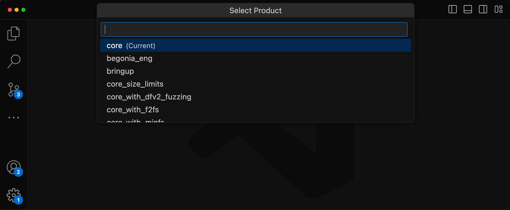

Packages show a history of selections made within the session.

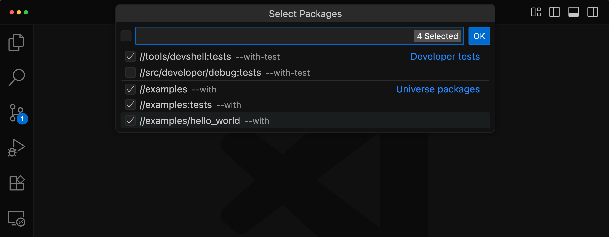

#### fx build

Run Fuchsia builds within VS Code. The extension displays current build progress
and you can see more details in `Output > Fuchsia Extension`.

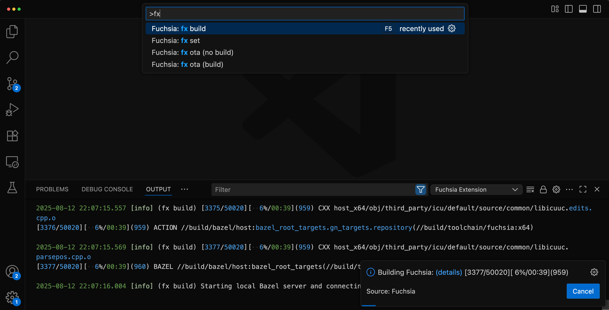

Tip: Set `fx build` as the default build task to run with `Ctrl+Shift+B`
(Linux/Windows) or `Cmd+Shift+B` (Mac). For a custom keyboard shortcut, assign
one in Preferences:Keyboard Shortcuts.

File paths in the build output errors are clickable, allowing you to jump directly
to the error in the source code.

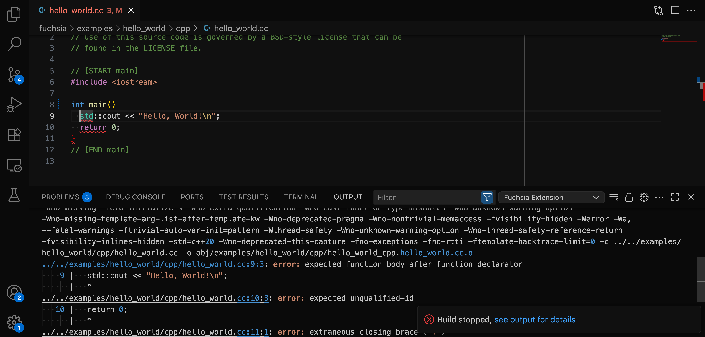

The extension parses build output to show C++ and Rust errors in the "Problems" panel of VS Code.

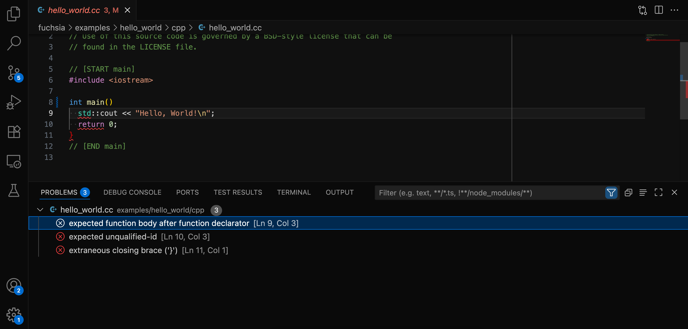

#### fx serve

Start and stop the package server from the command palette.

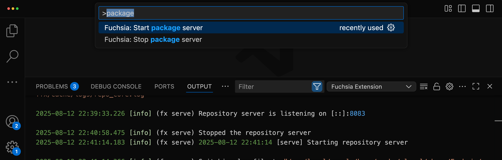

#### fx ota

Trigger an over-the-air update for a connected device.

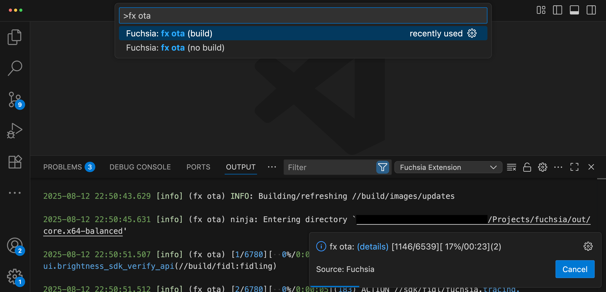

### Target management

#### Connect to a Fuchsia device

The Fuchsia extension allows you to connect to a Fuchsia target which
can be a physical device or an emulator. The extension supports multiple
target devices and allows you to easily switch between various Fuchsia devices.
You can only connect to a single device at any given time.

Note: For more information on getting started with Fuchsia and starting
an emulator, see [Get started with Fuchsia ][get-started].

If your emulator is properly configured and started, you should see a
computer and the
name of your Fuchsia device in the status bar of VS Code. If you are using
the emulator and not seeing a Fuchsia device, see
[Start the Fuchsia emulator][start-emulator].

#### Target interaction

You can click the computer and the
name of your Fuchsia device in the status bar of VS Code to see the various
options that you have for your Fuchsia devices.

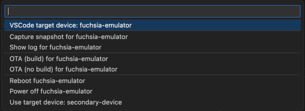

* **VSCode Target device: `<device-name>`**: Shows current Fuchsia device configured
  as the active target for the Fuchsia VSCode extension's features.
* **Switching between targets**: If you have additional targets, select
  `Use target device: <device-name>` to switch to that specific target.
* **Emulator control**: Start and stop the Fuchsia emulator (`ffx emu`).
* **Target controls**: Reboot or power off a connected target. Reboot shows
  autorenew until the target is available.
* **Capturing a snapshot**: Capture a snapshot of the active device.

### Viewing Logs

The Fuchsia extension allows you to view the symbolized logs
(human-readable stack traces) for your connected Fuchsia device. This is equivalent
to running `ffx log`. For more information on `ffx log`, see
[Monitor device logs][monitor-device-logs].

Select **Fuchsia logs** from the drop-down in the **Output** tab to see the
device logs.

Note: When you first open the **Fuchsia logs** tab, it may take a few minutes
to load all of the available Fuchsia logs. If no logs display, it may be an
indication that you do not have connected a Fuchsia device or an emulator.

#### Clear Fuchsia logs

Once the Fuchsia extension has streamed the Fuchsia logs, you can
clear the listed Fuchsia logs to see the incoming logging events for your Fuchsia
device.

To clear the Fuchsia logs, click the 
playlist_remove in the top right corner of the **Fuchsia logs**
tab.

#### Auto-scroll Fuchsia logs

To toggle auto-scroll for Fuchsia logs, click the
lock in the top right corner of the
**Fuchsia logs** tab.

### Debug code

The Fuchsia extension integrates the [zxdb][zxdb-docs] debugger into the VS Code IDE.

#### Component explorer

The Fuchsia extension provides a tree view of components on your Fuchsia device.
This is the equivalent of running [`ffx component list`][ffx-component-list].
To view the Fuchsia component list, open **Run and Debug** in the Activity Bar
and expand the **Fuchsia Components** section.

To debug a component, click the bug_report to the
right of the component name.

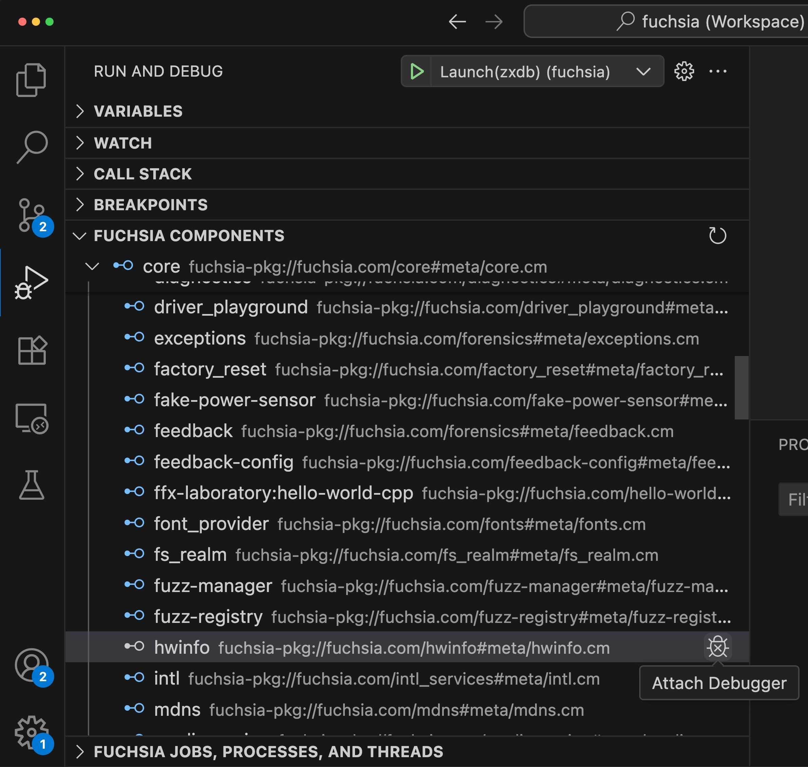

You can hover over a component to see its lifecycle information or click on it to
view more details. This opens a new window with details of the component and is the
equivalent of running [`ffx component show <component-name>`][ffx-component-show].

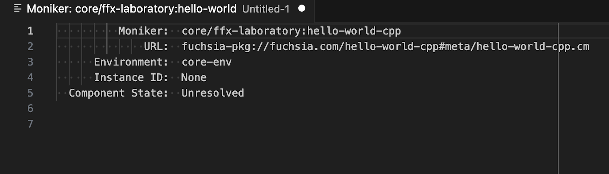

You can right click a component to control the component's lifecycle. For more
information, see [Component lifecycle][ffx-component-lifecycle].

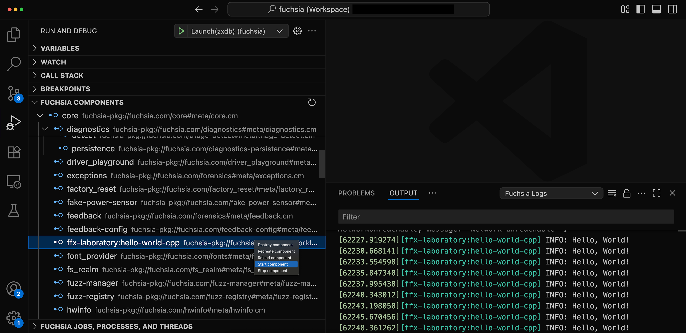

#### Task explorer

The Fuchsia extension provides a tree view of all jobs, processes, and threads
running in the Fuchsia system. To view the Fuchsia task explorer, open **Run and
Debug** and expand the **Fuchsia Jobs, Processes, and Threads** section.

To attach a debugger to a task, click the bug_report
to the right of the process.

### Testing

#### Test explorer

Run and debug tests within the VS Code UI. You can find the Test Explorer in the activity bar.

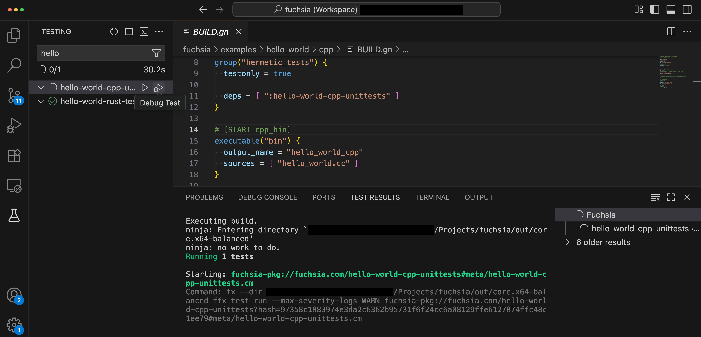

[fuchsia-dev-ext]: /docs/reference/tools/editors/vscode/fuchsia-ext-install.md
[get-started]: /docs/get-started/README.md
[start-emulator]: /docs/get-started/set_up_femu.md
[monitor-device-logs]: /docs/development/tools/ffx/workflows/view-device-logs.md#monitor-device-logs
[zxdb-docs]: /docs/development/debugging/debugging.md
[run-components]: /docs/development/components/run.md#run
[zxdb-commands-docs]: /docs/development/debugger/commands.md
[vscode-debug-actions]: https://code.visualstudio.com/docs/editor/debugging#_debug-actions
[fidl-docs]: /docs/concepts/fidl/overview.md
[cml-docs]: https://fuchsia.dev/reference/cml
[vscode-errors]: https://code.visualstudio.com/Docs/editor/editingevolved#_errors-warnings
[ffx-component-lifecycle]: /docs/concepts/components/v2/lifecycle.md
[ffx-component-list]: https://fuchsia.dev/reference/tools/sdk/ffx#ffx_component_list
[ffx-component-show]: https://fuchsia.dev/reference/tools/sdk/ffx#ffx_component_show
