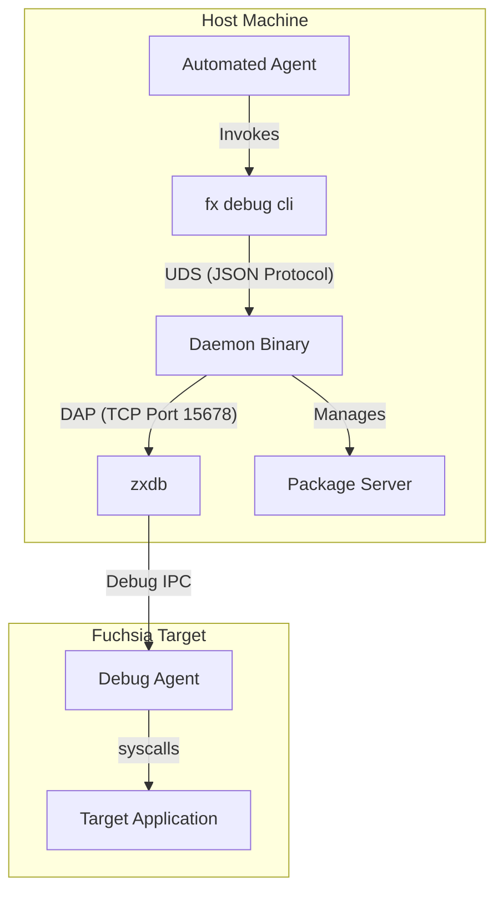

# zxdb_cli

## Problem Understanding

Traditional debugging tools like `zxdb` are designed for interactive, human
workflows. Developers can manage continuous streams of logs and maintain
debugger state across a long session.

However, automated agents and AI assistants operate differently. They work in
discrete turns, struggle with commands that run indefinitely, and can be
overwhelmed by the verbose output of the Debug Adapter Protocol (DAP).

To enable these tools to effectively use `zxdb`, we need a bridge between the
chatty, connection-oriented DAP and a simpler request-response model that fits
their turn-based workflow.

`fx debug cli` solves this by using a background daemon to manage the persistent
debugger connection. The CLI then exposes a clean, summarized interface to run
commands and get immediate feedback without getting stuck in interactive loops
or protocol noise.

## Usage and Behavior

### Fallback to Interactive Session

If the entry-point script is run without the `cli` subcommand (or with arguments
that don't match it), it behaves as a thin wrapper around `ffx debug connect`.
It will pass all arguments directly to the standard interactive `zxdb` session,
maintaining the experience for human developers.

### Automated Package Server

Both the interactive fallback and the background daemon automatically ensure
that the Fuchsia package server is running. This removes the need for developers
(or agents) to manually check and start the package server before beginning a
debugging session.

### Basic Workflow Examples

The CLI allows running a full debugging session using a request-response model.
Below is a standard workflow: starting the daemon, attaching to a process, and
stopping the daemon.

#### Standard CLI Usage

1. **Start the daemon**:
   ```bash
   fx debug cli start
   ```
   Output:
   ```
   Spawning daemon...
   Daemon is ready.
   ```

2. **Attach to a process** (e.g., attaching to `cobalt.cm`):
   ```bash
   fx debug cli attach cobalt.cm
   ```
   Output:
   ```
   Response: {"success": true, "message": "", "body": {"success": true}}
   ```

3. **Stop the daemon**:
   ```bash
   fx debug cli stop
   ```
   Output:
   ```
   Response: {"success": true, "message": "Daemon stopping", "body": null}
   ```

## Technical Architecture

The system is built around two primary components: a long-lived background
**Daemon** and a short-lived **CLI** wrapper (`fx debug cli`).

*   **The Daemon**: This process maintains the continuous connection to the
    debugger. It starts the package server and `zxdb`, connects to the DAP
    server, and listens on a Unix Domain Socket (UDS) for requests. It queues
    critical events and maintains the aggregate state of the session.
*   **The CLI (`fx debug cli`)**: This is a stateless tool designed for
    automated agents. It connects to the daemon via UDS, sends a command,
    receives the response, and exits.

### How They Fit Together



### Communication Protocol

The protocol between the CLI and the Daemon uses a simplified, non-strict
version of the Debug Adapter Protocol (DAP), transmitted as newline-delimited
JSON over the Unix Domain Socket.

#### Smart Proxy and Schemas

To maximize efficiency for automated agents, the daemon acts as a smart proxy.
It strips away verbose protocol metadata and boils messages down to their
essential fields. This ensures that response payloads are compact and
token-efficient.

Example `get-state` Response:
```json
{
  "processes": [
    {
      "id": "p1",
      "name": "target_app",
      "threads": [
        {
          "id": 1,
          "name": "main"
        }
      ]
    }
  ]
}
```

## Ecosystem Fit

This tool layers on top of Fuchsia's existing debug infrastructure. It does not
replace `zxdb`; instead, it leverages `zxdb`'s DAP support (found in
`src/lib/debug/dap/python`) to provide a machine-friendly interface. By bridging
the gap between interactive streams and request-response patterns, it enables
automated tools to use our standard debugging stack effectively.
