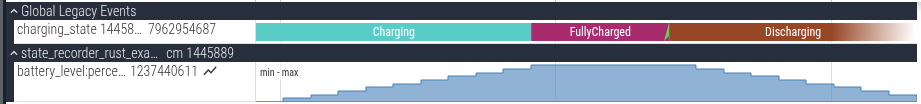

# State reporting

This directory provides Rust and C++ libraries that support standardized
reporting of time series data via Inspect and trace. It supports recording of
**enum states** and **numeric states**.

Currently, the Rust API supports both enum and numeric states. The C++ API
supports only enum states, but it will support numeric states soon.

Enum states generally correspond to categorical observations. They are
well-suited for scenarios in which the name of the state, rather than an
underlying numeric value, is most relevant for analysis purposes. Examples
include:
* A device with on and off states.
* A sensor with high-power, low-power, and off states.
* The charging state of a battery-powered device: discharging, charging, or
  fully-charged.

Numeric states can describe anything numeric-valued, including:
* System-configured states, like clock frequencies, that are precisely known
  and may be reported at every transition.
* Estimated values of system properties, like CPU load and battery level.


## Output formats

### Stability

The formats presented here may evolve based on emerging needs. If you are aware
of a stakeholder that may not be under consideration, please contact a code
owner!

### Inspect

Inspect data for all recorded states will be placed in a node named
`power_observability_state_recorders` that is a child of the inspector's root.
Each recorded state will be given a distinct node.

The key elements of the data are:
* The name of the entity. Both the C++ and Rust APIs guard against name
      collisions.
* The state type, enum or numeric.
* For enum states: The mapping between state names and integer representations.
* For numeric states:
    * Units of values.
    * (Optional) The range of expected values. Both bounds are inclusive. *The
      range is for eventual use by tooling (e.g. to select plot bounds) and
      does not affect the API (no errors for recording out-of-range values).
      If supporting exclusive bounds or API support for out-of-range values
      would be helpful to you, please [file a
      bug](https://issues.fuchsia.dev/issues?q=componentid:1585130).*
* History of state values, represented as a sequence of nodes with
      properties:
    * `@time`: Boot clock timestamp in nanoseconds
    * `value`: State value; string name for enum states, and numeric value for
    numeric states.

### Trace

Enum states are recorded as slices with state names, with each recorded entity
receiving a unique track. Numeric states are recorded as counters.

### Sample output

#### Inspect

Below is a brief example involving a battery, with charge recorded as an
integer percentage once per minute, and charging state -- one of `Charging`,
`FullyCharged`, or `Discharging` -- recorded on transition.

The specifications in the table result in the Inspect data that follows:

| Time (sec) | Event |
|------------|-------|
| 0          | Battery at 98% charge, and `Charging`; charges 1% per minute |
| 120        | Charge increases to 100%; now `FullyCharged` |
| 240        | Battery is `Discharging`; drains 1% per minute |

```
    root:
      power_observability_state_recorders:
        battery_level:
          metadata:
            name = battery_level
            range:
              min_inc = 0
              max_inc = 100
            type = numeric
            units = percent
          history:
            0:
              @time = 0
              value = 98
            1:
              @time = 60000000000
              value = 99
            2:
              @time = 120000000000
              value = 100
            3:
              @time = 180000000000
              value = 100
            4:
              @time = 240000000000
              value = 100
            5:
              @time = 300000000000
              value = 100
            6:
              @time = 360000000000
              value = 99
            7:
              @time = 420000000000
              value = 98
        charging_state:
          metadata:
            name = charging_state
            type = enum
            states:
              Charging = 1
              Discharging = 0
              FullyCharged = 2
          history:
            0:
              @time = 0
              value = Charging
            1:
              @time = 120000000000
              value = FullyCharged
            2:
              @time = 240000000000
              value = Discharging
```

#### Trace

To demonstrate trace output, we modify the Inspect example to span a larger
range of battery levels and key behavior on abstract "ticks":

| Time (ticks) | Event |
|------------|-------|
| 0          | Battery at 90% charge, and `Charging`; charges 1% per tick |
| 10         | Charge increases to 100%; now `FullyCharged` |
| 15         | Battery is `Discharging`; drains 1% per tick |



# Examples

Examples in both Rust and C++ are located at
[`//examples/power/state_recorder`](//examples.power/state_recorder).

When updating the libraries, these examples should be used to confirm that trace
output behaves as expected, as that depends on visual expectations in the
Perfetto UI for which we don't have automated tests.