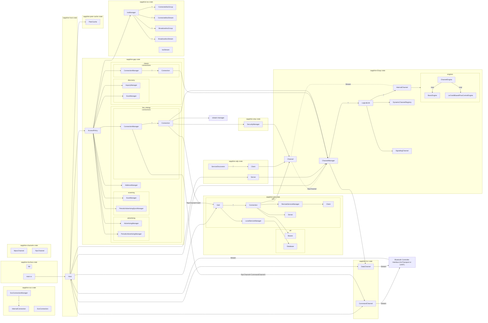
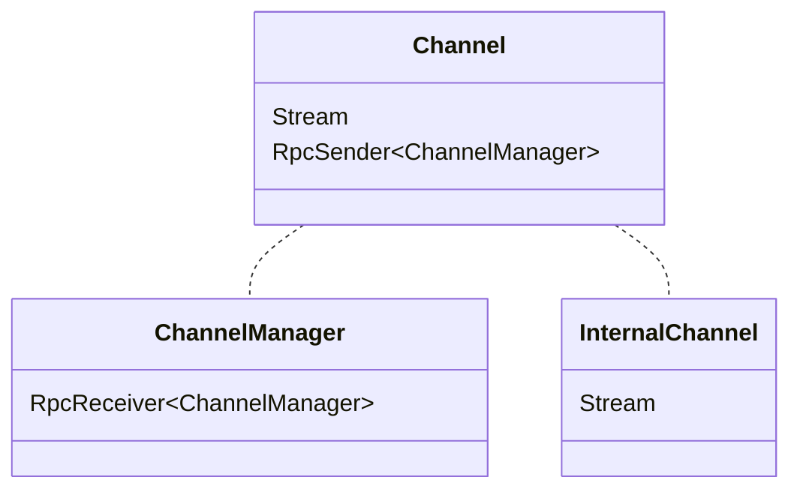
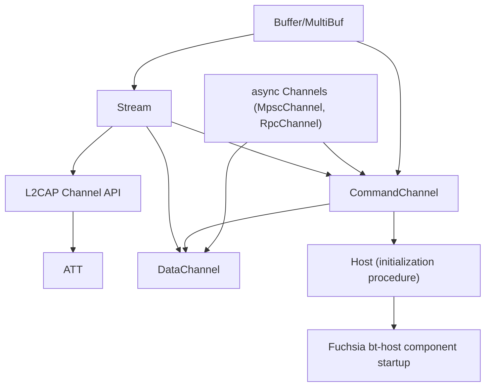
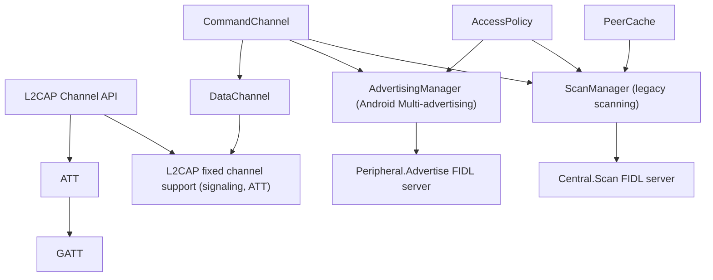
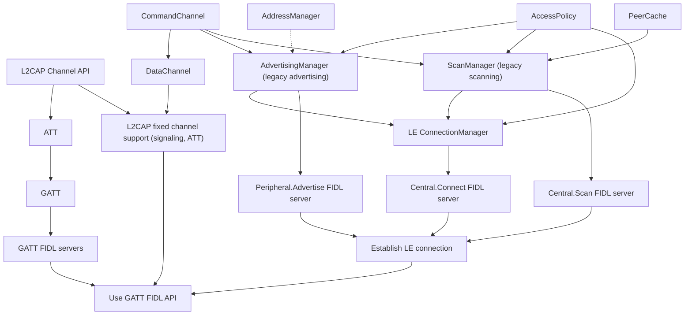

# Motivation

The software security landscape is rapidly changing and memory-safe programming
languages are becoming a requirement for new products. Bluetooth stacks are
especially vulnerable to attacks due to the combined attributes of processing
untrusted data, having access to sensitive user data, and being very complex
(and therefore bug-prone). The Sapphire Host stack was unfortunately written in
C++ for historical reasons, even as the Sapphire profiles were written in Rust.

Additionally, we would like the Sapphire Host to support embedded systems, but
refactoring the C++ Host stack to meet memory requirements would be a
significant undertaking. It makes more sense to take advantage of a Rust rewrite
to target embedded systems from the start.

AI tools have made it easier than ever before to efficiently rewrite software
and discover vulnerabilities, so now is the time for the Sapphire Host stack to
be rewritten in Rust.

# Non-Functional Requirements

* **100% Rust:** The primary objective of this project is to have a memory-safe
  Bluetooth stack. We do not want a hybrid Rust/C++ stack.
* **Embedded-friendly memory usage**: The Host stack must be viable on memory
  constrained embedded systems. The Zephyr Bluetooth stack, our primary
  competition, requires approximately 50-400 KB Flash and 10 \- 100 KB RAM
  depending on the configuration, so we should aim to be competitive with these
  ranges.
* **Modular:** Customers must be able to pick and choose which protocols, roles,
  and high-level features they want and assemble the minimal Bluetooth stack
  that meets their requirements. This also supports the memory usage
  requirement.
* **Hardware independent:** The Host stack must not be tied to any particular
  Bluetooth controller vendor, and should support multiple architectures (e.g.
  both 64-bit and 32-bit).
* **Platform Independent:** Other than the Fuchsia-specific FIDL layer and
  component initialization code, the Host stack should be platform agnostic and
  support non-Fuchsia systems such as Linux, Zephyr, and FreeRTOS (in theory).
* **Performant:** The data hot paths should be performant enough to support
  high-quality, glitch-free, imperceptible-latency audio streams.
* **Secure:** The Host stack should be resistant to memory vulnerabilities,
  privilege escalation attacks, and DoS attacks by design.
* **Maintainable:** The codebase must be maintainable for decades to come,
  meaning it must be easy to read, understand, modify, and verify changes.
* **Extensive Test Coverage:** The codebase must be thoroughly tested with unit,
  integration, and e2e tests. The code should be testable by design (e.g. by
  using mockable interfaces between layers).

# Functional Requirements

With few exceptions, the Rust Host stack will first achieve feature parity with
the C++ Host stack (to support existing products) and then surpass it with new
features like Channel Sounding. Unless otherwise mentioned, each feature will be
supported at a level consistent with the existing implementation.

* **GAP (BR/EDR)**
  * Inquiry (discovery)
  * Inquiry scan
  * Paging (connecting)
  * Page scan
* **GAP (LE)**
  * Central
  * Peripheral
  * Advertising
    * Legacy
    * Extended
  * Passive Scanning
  * Active Scanning
  * Extended Scanning
  * Role Switch (initiator and responder)
  * Feature Exchange
* **GAP (Dual Mode)**
  * Incoming Connections
  * Outgoing Connections
  * Secure Connections
  * Pairing
  * Bonding
  * Simultaneous BR/EDR and LE Operation
  * Cross-Transport Key Derivation (CTKD)
* **L2CAP (Dual Mode)**
  * Initiator and Acceptor roles
  * Enhanced Retransmission mode (ERTM)
  * LE Credit-Based Flow Control
  * BR/EDR Connection-Oriented Channels
  * LE Connection-Oriented Channels
* **GATT (LE Only)**
  * Client
  * Server
* **SM**
  * Initiator and Responder roles
  * Private Address Generation and Resolution
  * Authenticated MITM protection
  * LE Secure Connections
  * Secure Simple Pairing
    * Just Works
    * Numeric Comparison
    * Passkey Entry
* **SDP**
  * Client
  * Server
* **HFP**
  * In-band SCO
  * Offloaded SCO
* **Android Extensions**
  * Offloaded A2DP
  * Batch Scanning
  * Controller Scan Filtering
* **LE Audio**
  * L2CAP ISO Channels
  * CIS/CIG
  * BIS/BIG
  * Periodic Advertisement Scan
  * Periodic Advertisement Sync
  * Periodic Advertisement Sync Transfer (PAST)
* **MCU Offloading Features**
  * RFCOMM Connection Offloading
  * LE CoC Connection Offloading
  * Sniff Offload v2
* **New Features (not in C++)**
  * Enhanced ATT / GATT-over-EATT
  * Channel Sounding

**Unsupported**: The following feature is not planned to be supported in this
project.

* **SM**
  * Legacy Pairing

# Stakeholders

* **Sapphire Team:** The Sapphire team will own Sunstone and be responsible for
  designing, implementing, and maintaining it.
* **Pigweed Team**: We will need to work with them on embedded Rust support and
  module interoperability. The Pigweed team will be heavily consulted during the
  design process.
* **Fuchsia Security Team**: We will want the Fuchsia security team to consider
  our plans and identify potential vulnerabilities-by-design and approve crypto
  libraries.
* **Fuchsia Privacy Team:** Bluetooth processes sensitive user data and we will
  consult with the privacy team to ensure we are preserving user privacy as much
  as we reasonably can.

# Design

The design will largely be the same as the Sapphire C++ Host stack in order to
avoid re-designing everything from scratch. The C++ stack already has a good
library and class mapping to the specification. However, there will be some
significant changes and improvements. Rather than a callback-based approach to
asynchronous operations, Sunstone will use async Rust. Additionally, it will
target embedded systems from the start by avoiding binary size bloat and heap
allocations.

The code will be highly modular, with major libraries being separated into
crates and some features being optional. This enables products to omit
features/crates they don’t need. In addition to a default "full-stack"
configuration that will include all modules and initialize the host and
controller dynamically based on supported features, product integrators will be
able to compose their own stack from the public types exposed from each crate.
This will enable minimal stacks like an LE Beacon that simply advertises. We
will lean into async channel APIs (discussed below) to prevent modules from
being tightly coupled.


*Figure 1: High-level overview of the Sunstone architecture.*

## Async

### The Actor Model

Sunstone will primarily use the Actor Model design pattern to handle concurrent
access to shared state. Each major struct (e.g. ConnectionManager) will be an
Actor. Actors communicate by exchanging asynchronous messages over channels.
Each Actor processes its messages in a loop, often by updating its state and
sending messages to other Actors.

### Async Communication Primitives

Existing async channel types in the Rust ecosystem, such as those found in the
Tokio and Embassy crates, are unsatisfactory for various reasons. For example,
Tokio channels allocate memory, and Embassy channels don’t properly support
multiple senders. We would like to develop and control these critical async
primitives in collaboration with the Pigweed team.

#### MpscChannel

MpscChannel is a multi-producer, single-consumer channel that we will use for
sending packets and simple messages.

#### RpcChannel

RpcChannel is a MPSC channel that supports an RPC-like API with requests and
matching responses without allocations. This is a more ergonomic version of
using two MpscChannels to exchange requests and responses. On a system with
allocations this would normally be implemented by passing a oneshot channel
along with the request message, but this generally requires allocation.

#### BroadcastChannel

BroadcastChannel supports a single producer sending the same message to many
consumers.

### Circular Channel Deadlock Prevention

Since channels will be bounded, if there is a circular message path between
Actors, it is possible to get in a deadlock waiting for space in full channels.
To prevent this, the message/data flow must be acyclic.

### Async Race Conditions

One challenge of an asynchronous architecture is that events propagate
concurrently across different layers of the stack. Because futures are polled
non-deterministically by the executor, often across separate tasks, events like
an HCI Connection Complete can be processed out of sequence relative to
developer expectations. Without explicit synchronization, this non-deterministic
scheduling can lead to subtle race conditions and state desynchronization.
Therefore, code must either be resilient to desynchronization (e.g. by buffering
packets for an unknown connection), or make explicit RpcChannel calls to
synchronize state, or in rare cases (like PeerCache) use shared memory guarded
by a RefCell/Mutex.

### Executor

To support multiple platforms, multiple executors need to be supported: the
Fuchsia executor, Embassy executor, and Tokio executor. Thus, the portable
crates in Sunstone must be executor agnostic. This means that we must not spawn
async tasks directly except in platform-specific code. Instead we will return
futures that the client runs.

#### Timers

Async timers must be abstracted behind a Timer trait.

## no\_std

The requirement to support embedded systems precludes us from using the Rust
standard library. The full `std` crate requires an underlying operating system
and would result in an unacceptably large binary size. Additionally, we must not
use the heap for allocations. Instead, we will use just the `core` crate.

## No alloc

We will not use the `alloc` crate because we won’t be able to allocate on the
heap in most embedded systems. Instead, we will use bespoke collections and Box
types built on top of a fallible Storage API that enables integrators to
configure where memory is allocated. However, we *will* support clients that
want to use the Global allocator (heap) as the backing implementation of the
Storage API.

## Buffer Allocation & Copying Strategy

We will implement a custom Buffer type that is allocated using an implementation
of a BufferProvider trait. We will provide example implementations including
StdVecBufferProvider (backed by std::vec::Vec), StorageBufferProvider (backed by
Storage), and FixedPool (backed by static buffer pools). On Fuchsia we will use
StdVecBufferProvider for FIDL binding interoperability, but on other systems we
will likely use FixedPool with small/medium/large slab buffer pools.

### MultiBuf

We will create a Rust version of Pigweed’s C++ MultiBuf type, which is a data
structure wrapping multiple Buffers. MultiBuf supports scatter-gather as well as
header and footer reservation/hiding. This utility will enable us to avoid
copies when performing packet operations like fragmentation and recombination.

### Datagram Streams API

To facilitate flow control and minimal-copy buffer management across the HCI,
L2CAP, GATT, SCO, and ISO layers, each layer processing data packets will
implement async datagram stream traits. These stream traits will use async
read/write methods to signal backpressure in both directions. In addition, write
sinks may provide multiple buffer chunks for writers to write a datagram into,
so that the client can write their data directly into multiple packet payloads
(for fragmentation). Read sources can also provide datagram buffers in multiple
chunks as they are recombined from multiple packets.

Below is a sketch of these traits that is likely to change. A more detailed
design document will be forthcoming.

```rust
pub trait DatagramWriteStream {
    type Write<'a>: PendingWrite
    where
        Self: 'a;

    fn start_write(
        &mut self,
        total_size: usize,
    ) -> impl Future<Output = Result<Self::Write<'_>, StreamError>>;
}

pub trait PendingWrite {
    fn with_next_buffer<R, F>(
        &mut self,
        f: F,
    ) -> impl Future<Output = Result<R, StreamError>>
    where
        F: FnOnce(&mut [u8]) -> R,
        Self: Sized;
}

pub trait DatagramReadStream {
    type Read<'a>: PendingRead
    where
        Self: 'a;

    fn start_read(
        &mut self,
    ) -> impl Future<Output = Result<Self::Read<'_>, StreamError>>;
}

pub trait PendingRead {
    fn with_next_chunk<R, F>(
        &mut self,
        f: F,
    ) -> impl Future<Output = Result<Option<R>, StreamError>>
    where
        F: FnOnce(&[u8]) -> R,
        Self: Sized;
}

```

## Collections

We need to avoid heap allocations and use fallible collection interfaces (e.g.
Vec::try\_push()).

Conventionally in embedded Rust, projects use the `heapless` crate, which
provides fixed sized collections that are usually allocated on the stack.
However, in the case of a complex project like Bluetooth with many dynamic
objects, it is both a waste of memory and often very difficult to use only
statically sized collections.

In C++, Pigweed solves this problem with a custom Allocator API and dynamic
containers built on top of Allocator. Upstream Rust technically supports a
similar approach with the nightly allocator\_api feature, but it is unstable
with no stabilization in sight.

We will instead implement the [pre-RFC Store
API](https://github.com/matthieu-m/rfcs/blob/store/text/3446-store.md) and
associated Storage trait, which works similarly to the Allocator API but uses
handles instead of pointers to identify allocations. This enables more flexible
allocation strategies such as inline allocation. We will implement bespoke
collections on top of the Storage trait. Clients will provide an implementation
of Storage when instantiating Sunstone types, which can simply be GlobalStorage
on Fuchsia. We believe that the Store API better aligns with Pigweed, which
needs to provide collections that use either inline storage or a custom
allocator.

## Packet Serialization/Deserialization

We will add Rust code generation support to
[Emboss](https://github.com/google/emboss) and encode/decode packets using the
Rust Emboss bindings. We already have extensive Bluetooth packet definitions
written in Emboss in the Pigweed repository (pw\_bluetooth).

## Host-Controller Interface (HCI)

The HCI layer is responsible for abstracting the interface between the Host and
the Controller, including flow control and event routing. The product integrator
will need to provide a duplex Stream for sending and receiving H4 packets
between the Host and the Controller. Both CommandChannel and DataChannel will
write packets to the Stream, but received packets will be centrally handled by
the Host struct and forwarded to the correct module.

### CommandChannel

CommandChannel is responsible for sending HCI commands, processing command flow
control, and routing HCI events to modules that have registered listeners. It
provides a direct interface for sending commands and registering event
listeners, as well as an RpcChannel interface for doing so.

### DataChannel

DataChannel is responsible for data packet (ACL, SCO, ISO) flow control to the
controller. Flow control is implemented by listening for the HCI Number of
Completed Packets event, which indicates controller buffer slots freed per
connection handle, and the HCI Disconnection Complete event, which frees all
buffer slots used by a connection.

The L2CAP ChannelManager, ScoConnectionManager, and IsoStreamManager will each
be initialized with Sender and Receiver ends of two MpscChannels used for
packets. DataChannel will hold the other ends of these channels.

Fairness algorithms like round-robin will not be implemented in DataChannel and
must be implemented in the L2CAP, SCO, and ISO layers.

DataChannel will also be initialized with a channel that provides notifications
of connection complete events and disconnection complete events. DataChannel
will track active connections in an internal map and drop packets for inactive
connections from either clients or the controller.

#### No Controller-To-Host Flow Control

We will intentionally not implement controller-to-host flow control for data
packets. MCUs can normally process packets faster than the controller can
receive them over the air, and UART and SPI can also be used for flow control by
the product integrator. The host-to-controller flow control situation is
different because it is easy to send packets faster than the radio can transmit
them, and the controller has very limited buffers.

## Generic Access Profile (GAP)

### AccessPolicy

The AccessPolicy is the top-level API for the GAP layer. It mediates API
requests to ensure that conflicting procedures aren’t run at the same time and
procedure dependencies are met. Examples include:

1. Scanning must be paused while a connection is being established.
2. Inquiry must be paused while performing a remote name request procedure.
3. Scanning must be enabled during periodic advertising synchronization.
4. Scanning and advertising must be disabled when changing the LE random
   address.

In the original C++ stack, this functionality was handled either by the
CommandChannel’s "exclusive commands" feature or by spaghetti code: manager
classes had pointers to each other to control each other’s procedures. This was
an unsatisfactory design.

### Generational Connection Handles

The Host-Controller Interface uses 12-bit connection handles to identify
connections. It is legal for controllers to reuse these handles, even for
multiple connections in a row. We have seen this behavior in real controllers.
Without careful handling, this is likely to result in race conditions where
packets or commands are associated with the wrong connection. To help mitigate
this, the GAP connection managers will assign generation numbers to connection
handles. To avoid storing a generation number for every possible handle, the
generation number will be shared across connection handles. We will take
advantage of the unused 4 bits in a connection handle’s u16 to store the
generation number, and call this type "ConnectionId". It is easy to recover the
raw connection handle or generation number with a bitmask. Here is an example
sequence of connection handles:

| Seq. No. | Connection\_Handle assigned by controller | Internal ConnectionId |
| :---- | :---- | :---- |
| 1 | 0b0000\_0000\_0000\_0001 (1) | 0b0000\_0000\_0000\_0001 (1) |
| 2 | 0b0000\_0000\_0000\_0001 (1) | 0b0001\_0000\_0000\_0001 (4,097) |
| 3 | 0b0000\_0000\_0000\_0001 (1) | 0b0010\_0000\_0000\_0001 (8,193) |
| 4 | 0b0000\_0000\_0000\_0010 (2) | 0b0011\_0000\_0000\_0010 (12,290) |

### Low Energy

#### ConnectionManager

The ConnectionManager processes API and peer connection requests and tracks
active connection state. It is also responsible for tearing down connections
upon disconnection requests or disconnection complete events. Unlike the C++
implementation, ConnectionManager will keep track of all connections until the
disconnection complete event.

#### AddressManager

The AddressManager periodically rotates the LE random device address when
privacy is enabled and the controller is in a state that allows changing the
address (e.g. not while scanning).

#### ScanManager

The ScanManager will implement starting scans, stopping scans, scan result
reporting, scan result filtering, and scan filter offloading. It will also
multiplex multiple scan requests.

#### AdvertisingManager

The AdvertisingManager will implement Android Multi-advertising and Extended
Advertising procedures. It is also responsible for reporting connections
received from connectable advertisements.

#### PeriodicAdvertisingSyncManager

The PeriodicAdvertisingSyncManager will support synchronizing to periodic
advertising trains and reporting advertisements. It will also support
transferring synchronization parameters (PAST Sender) and receiving
synchronization parameters (PAST Receiver).

#### PeriodicAdvertisingManager

The PeriodicAdvertisingManager will support broadcasting periodic advertising
trains with dynamic payloads.

### Classic

#### ConnectionManager

The ConnectionManager processes API and peer connection requests and tracks
active connection state. It is also responsible for tearing down connections
upon disconnection requests or disconnection complete events. Unlike the C++
implementation, ConnectionManager will keep track of all connections until the
disconnection complete event.

#### InquiryManager

The InquiryManager is responsible for starting and stopping the Inquiry
procedure, which is used to discover Classic devices, as well as processing and
reporting Inquiry results.

#### ScanManager

The ScanManager is responsible for managing Inquiry Scan (discoverable) and Page
Scan (connectable) state.

## Generic Attribute Profile (GATT)

The GATT layer is managed by a top-level Gatt struct, which contains a
LocalServiceManager and a map of Connections (one for each ATT channel). The
LocalServiceManager builds upon the ATT Database to group attributes into
characteristics, descriptors, and services, and it has an API for registering
them. Each Connection contains a Server, which routes peer requests to the
LocalServiceManager, and a RemoteServiceManager, which discovers and caches a
peer’s services. RemoteServiceManager uses a Client utility that maps GATT-level
concepts (read, write, discover) into ATT packets.

### Attribute Protocol (ATT)

There will be two primary structs in the ATT module: the Bearer and the
Database. The Bearer wraps the L2CAP channel for the ATT fixed channel and
manages inbound and outbound ATT transactions. Database contains a map of local
attributes, each assigned a handle and configured with methods to read and write
their value.

## Logical Link Control and Adaptation Layer Protocol (L2CAP)

The L2CAP layer will be responsible for the segmentation of SDUs (application
data) into L2CAP PDUs, the fragmentation of PDUs into ACL packets, the
recombination of ACL packets into PDUs, and the reassembly of PDUs into SDUs.
Additionally it will implement flow control and retransmission for channel modes
that require it. L2CAP will also enforce a fairness algorithm, both between
links and between channels on the same link.

L2CAP will be designed with channel back pressure from the start, which corrects
a mistake made in the original C++ implementation. The L2CAP layer will have
minimal queueing and signal when it is ready to send more packets via async
Stream backpressure. This ensures that the client implements the policy for
slowing, queueing, or dropping data when flow control can’t keep up.

ChannelManager is the top-level struct that provides the public API. The API
includes methods for registering links, registering service listeners, and
opening channels. ChannelManager owns one end of an ACL packet Stream between
ChannelManager and the HCI DataChannel.

A LogicalLink is created for each registered link. ChannelManager routes
incoming ACL packets to the corresponding LogicalLink. Each LogicalLink owns
many channels and routes inbound PDUs to the correct channel. LogicalLink also
polls all channels for outbound packets.

There are two kinds of channels: fixed and dynamic. The signaling channel is a
fixed channel that is owned by LogicalLink. Other fixed channels like ATT and SM
are returned to the client when the link is registered. Dynamic channels are
managed by the DynamicChannelRegistry, which requests outbound channels and
accepts inbound channels for PSMs that have been registered by clients.

Each channel has a specification-defined "channel mode" that indicates what
headers, flow control protocol, and retransmission scheme to use. Channels will
use composition of objects that implement the transmission and reception logic
for the configured mode. These objects will implement the ChannelEngine trait
and be wrapped in a ChannelMode enum.

The client API for an L2CAP channel is a wrapper around a Stream for sending and
receiving packets and an MpscChannel for sending messages to the ChannelManager.
An InternalChannel owns and processes the other end of the Stream.


*Figure 2\. L2CAP Channel architecture*

## PeerCache

The PeerCache is a central database of peer information, keyed on a unique peer
identifier (u64) that is randomly generated when a new peer is discovered.
Identifying peers with a random identifier preserves privacy in APIs and logs,
as the public address can be used to track a user’s location. It also supports a
consistent ID before and after bonding to an LE peer.

To prevent unbounded memory usage, PeerCache operates as an LRU cache, evicting
the oldest peer data when new peers are discovered. Peers that are bonded or
connecting/connected are exempt from eviction.

PeerCache is also responsible for Resolvable Private Address (RPA) resolution
using the Identity-Resolving Key (IRK) for bonded peers.

PeerCache is used by the FIDL servers to implement the PeerWatcher and
BondingDelegate protocols.

## Synchronous Connection-Oriented link (SCO)

The SCO layer will primarily consist of a ScoConnectionManager and an
InternalConnection struct. Unlike the C++ Host, a single ScoConnectionManager
will manage all SCO connections. SCO connections are associated with an existing
classic ACL connection, so ScoConnectionManager will need to be notified of
changes in classic ACL connection state.

ScoConnectionManager will process incoming and outgoing connection requests and
manage a map of InternalConnections. Each InternalConnection processes incoming
and outgoing packets.

Similar to the L2CAP Channel/InternalChannel pair, SCO connections will have a
client-owned ScoConnection type that wraps an MpscSender and MpscReceiver. The
other ends of the channels will be owned by the InternalConnection.

ScoConnectionManager will have an MpscSender and MpscReceiver to exchange HCI
SCO packets with DataChannel.

## Isochronous Channels (ISO)

A top level IsoManager will own collections of ConnectedIsoGroup,
ConnectedIsoStream, BroadcastIsoGroup, and BroadcastIsoStream objects.

IsoManager is responsible for configuring Connected Isochronous Groups (CIGs)
with the controller and tracking them with IsoGroup objects. IsoManager will
also accept stream requests and initiate outgoing stream requests. Connected
streams will be modeled with ConnectedIsoStream objects that process the ISO
data packets.

In the peripheral role, streams are associated with an existing LE connection,
so IsoManager will need to be notified of LE connection state changes.

IsoManager will also support synchronizing to a Broadcast Isochronous Stream
after the parameters have been discovered via periodic advertising
synchronization, as well as creating Broadcast Isochronous Groups and
broadcasting Broadcast Isochronous Streams.

Similar to the L2CAP Channel/InternalChannel pair, ISO streams will have a
client-owned IsoStream type that wraps an MpscSender and MpscReceiver. The other
ends of the channels will be owned by the ConnectedIsoStream and
BroadcastIsoStream structs.

IsoManager will own MpscSender and MpscReceiver objects for 2 data channels
between IsoManager and DataChannel. IsoManager will be responsible for
implementing a round-robin fairness algorithm between the active streams and
routing incoming packets to the correct stream.

## Service Discovery Protocol (SDP)

The SDP layer has 3 main structs: Server, Client and ServiceDiscoverer.

There is one Server per host. Server registers the SDP service with the L2CAP
ChannelManager and processes SDP search requests over new SDP L2CAP channels.
Profiles can register local services with the Server so that peers can discover
them.

The Client struct implements the SDP client protocol by converting API service
search requests into SDP packets and managing request/response transactions. A
Client is created for each classic connection.

ServiceDiscoverer initiates service discovery for new peers. Profiles can
register searches for attributes that they care about.

The classic ConnectionManager will open L2CAP channels for SDP when new
connections are established or a profile registers a new search. A Client will
be created with that L2CAP channel, and the Client will be given to the
ServiceDiscoverer to perform searches.

## LE Security Manager (SM)

The SecurityManager implements the LE pairing protocol (SMP). One
SecurityManager exists per connection. When a security upgrade is requested
either locally or by the peer, the SecurityManager performs the 3 SMP pairing
phases by exchanging SMP packets over an L2CAP channel. SecurityManager is
responsible for generating and exchanging security keys.

SecurityManager is created with the SM fixed channel that is returned when a new
connection is registered with L2CAP.

On classic connections, the SecurityManager is used to perform Cross-Transport
Key Derivation by skipping to phase 3, key distribution.

## Project Organization

Each protocol layer and utility will live in its own crate with minimal
dependencies. This enables customers to assemble a Bluetooth stack with only the
modules their product requires. The sapphire-host module will also provide a
quick-start Bluetooth Host stack that initializes all of the modules.This is the
configuration that will be used on Fuchsia.

| Crate | Modules | Description |
| :---- | :---- | :---- |
| sapphire-fuchsia | fidl low\_energy gatt classic hci platform src/bin/… | This crate contains the Fuchsia component binary as well as the FIDL clients/servers. |
| sapphire-host |  | The C++ Adapter class will be moved into its own crate in Rust, tentatively named "host". This crate is responsible for initialization and wiring up all of the protocol layers. |
| sapphire-gap | gap classic discovery connections low\_energy advertising scanning connections peer_cache | Splitting classic and low\_energy into separate modules will support disabling classic with a feature flag. Splitting advertising, scanning, and connections into separate modules will support central and peripheral role feature flags. PeerCache will be implemented in this crate.|
| sapphire-iso |  | The implementation of isochronous channels. |
| sapphire-sco |  | The implementation of SCO connections (ScoConnectionManager, ScoConnection). |
| sapphire-gatt | gatt client server att |  |
| sapphire-sm |  | LE Security Manager |
| sapphire-l2cap | l2cap classic low\_energy engines |  |
| sapphire-hci |  | CommandChannel, DataChannel, etc. |
| sapphire-sdp |  |  |
| sapphire-testing |  | Put testing types in the crate they correspond to. E.g. MockController goes in the HCI crate because that is where the Controller interface/trait is defined. MockChannel goes in the L2CAP crate. If we have Rust test harness code shared across all crates, that can go in this testing crate. Something like FakeController is such a large project that it could get its own crate. |
| sapphire-common | uuid address peer_id | Small types used by many crates, including Uuid, DeviceAddress, and PeerId. |
| sapphire-collections | storage vec | Map, Vec, Queue, etc. |
| sapphire-sync |  | Mutex types (single-threaded, std, spinlock) |

## Configurable

Sunstone will provide per-crate configuration options. By using Rust feature
flags, we will support enabling/disabling the following features:

* Bluetooth Classic (BR/EDR)
  * This will support LE-only and Dual Mode stack configurations.
* LE Central (scanning, connecting)
* LE Peripheral (advertising, connecting)

Additionally, we will organize the following code into modules that could easily
be put behind a feature flag someday if needed:

* LE Audio
  * Includes isochronous channels and periodic advertising/synchronizing
* LE Observer (scanning only, no connections)
  * LE Central is a superset of this option
* LE Broadcaster (advertiser only, no connections)
  * LE Peripheral is a superset of this option
* Android vendor extensions enabled/disabled
  * A2DP offloading
  * Android Sniff Offload
  * Android Batch Scanning
  * Android Advertising Packet Content Filter
* Legacy Advertiser & Scanner enabled/disabled
  * Smart Displays require legacy advertising/scanning, but most newer hardware
    won’t. Note that legacy advertisements are also supported by extended
    advertising commands and events.
* SCO enabled/disabled.
  * Not all BR/EDR products have microphones and support HFP. Newer products may
    prefer to use LE Audio for phone calls.

# Resource Constraints & Requirements

One of our goals is to be a viable alternative to the Zephyr Bluetooth stack,
which means our flash and RAM requirements must be competitive. Zephyr is very
configurable, so it is difficult to determine the exact memory requirements.
Sunstone is just the Host stack, so we need to also save memory for profiles.

| BT Stack | Minimal BLE | Maximum BLE | Minimal Dual-Mode | Maximum Dual-Mode |
| :---- | :---- | :---- | :---- | :---- |
| Zephyr Host | Flash 15 KB, RAM 2 KB | Flash 45 KB, RAM 35 KB | Flash 40 KB, RAM 8 KB | Flash 85 KB, RAM 50KB |
| Apache NimBLE | Flash 15 KB, RAM 4 KB | Flash 80 KB, RAM 40 KB | N/A | N/A |

Crypto libraries like BoringSSL will require an unacceptable amount of memory
given these constraints, so we will eventually need to also support an
embedded-friendly crypto library like MbedTLS.

These resource constraints also require that we use a tokenized logging library
like defmt or pw\_log to avoid binary size bloat due to strings.

# Alternatives, Drawbacks, and Unknowns

## Alternative: GAP ProcedureScheduler

ProcedureScheduler was proposed as a centralized struct in the GAP layer that
all managers need to register their active procedures with. The managers are
then notified when their procedures must start and stop. Each procedure can
include a list of procedures it must be exclusive with. Additionally, procedures
have a priority (connecting is high priority, scanning is low priority), and
higher priority procedures can interrupt low priority procedures. After
discussion, we decided that this approach was unnecessarily complicated and that
top-down procedure scheduling was a better initial approach.

## Alternative: Embassy

Embassy is the most popular embedded Rust framework. It provides an executor,
channels, futures utilities, HAL interfaces, and even a BLE Host stack. However,
we want to support multiple executors and have more control over our channel
types and HAL interface. We would also like to use Pigweed as our embedded Rust
framework instead, though it is still being developed.

## Alternative: GATT Isolation & Randomization

Virtualizing the GATT database that each peer sees, such that each peer sees
different services (corresponding to the advertisement they connected to) with
randomized handles, has been proposed as a security and privacy strategy. It
mitigates fingerprinting that would otherwise bypass privacy strategies like
address randomization, and makes it more difficult to identify the system that
is being connected to.

However, there are significant risks and costs to this approach. It may break
interoperability with devices that use GATT caching, even if we support Database
Hashes. It also requires storing extra state for each peer, which increases
memory requirements. Additionally, this approach doesn’t work well with older
devices that don’t support Database Hashes or Extended Advertising. We may
re-evaluate this feature for follow-on work someday.

## Unknown: What will the unoptimized memory requirements be?

Despite having memory targets and trying to minimize memory usage, the amount of
memory our initial implementation will require is unknown. It is likely we will
exceed our target and need to optimize our code later.

# Implementation strategy

The implementation roadmap is organized into milestones that each have a new
feature that can be validated on real hardware. Additionally, the roadmap
attempts to parallelize work on different areas of the stack to maximize
development efficiency.

## Milestone 0: Build & Validate Primitives

The goal of this phase is to build our basic utility libraries like collections,
channels, executors, and buffers. We will validate them with extensive unit
tests and examples. By the end of this phase we will have all of the building
blocks we need to start writing feature code. We should be able to demonstrate
that our primitives enable portability and modularity.

* sapphire-collections
  * Storage API
  * Vec
* sapphire-async
  * MPSC channel
  * RpcChannel
  * BroadcastChannel
  * Notification (wrapper around waker lists)
  * Executor trait
* sapphire-sync
  * RawMutex
* sapphire-buffer
  * Buffer
  * MultiBuf
  * Stream

## Milestone 1: bt-host startup, ATT

The goal of this phase is to get a minimal bt-host component to boot and
initialize the controller. In addition, we will start working on L2CAP and ATT
on the side to parallelize work.

* HCI
  * CommandChannel
  * DataChannel
* L2CAP
  * define Channel API
* GATT
  * implement ATT
* Host
  * implement initialization procedure (HCI\_Reset, feature interrogation, etc.)
* FIDL
  * Implement minimal Host FIDL server so that the bt-host and bt-gap components
    start successfully


*Figure 3: Milestone 1 dependency graph*

## Milestone 2: LE discovery, GATT

The goal of this phase is to implement and validate the Peripheral.Advertise and
Central.Scan FIDL APIs, while making progress on GATT.

* GAP
  * AccessPolicy
  * ScanManager (legacy scanning)
  * AdvertisingManager (Android Multi-advertising)
  * LE ConnectionManager
* L2CAP
  * LogicalLink
  * Support Basic Mode channels
  * LE fixed channel support (signaling, ATT)
* GATT
  * Server
    * publish services
    * handle read, write requests
    * send notifications
  * Client
    * read, write, read characteristics and descriptors
    * receive notifications
* PeerCache


*Figure 4: Milestone 2 dependency graph*

## Milestone 3: LE connections, GATT

This milestone introduces the LE ConnectionManager, which builds upon the
AdvertisingManager and ScanManager to establish LE connections. The GATT FIDL
servers will also be implemented. Together, these features will enable
establishing a GATT connection to a peer and verifying the GATT implementation.
In parallel, we will build the LE AddressManager to support LE random address
rotation when privacy is enabled.

* FIDL
  * GATT
    * Client
    * Server
  * GAP
    * Central.Connect
* GAP
  * LE ConnectionManager
  * LE AddressManager


*Figure 5: Milestone 3 dependency graph*

## Milestone 4: Classic discovery & SDP

This phase will start bringing up Bluetooth Classic support, including
discovery, dynamic L2CAP channels, and the Service Discovery Procedure (SDP).
After this milestone is complete, we will be able to manually test inquiry
(discovery) and inquiry scanning (discoverable).

* FIDL
  * Host.StartDiscovery
  * Host.SetDiscoverable
* GAP
  * InquiryManager
  * InquiryScanManager
* L2CAP
  * classic dynamic channels
* SDP
  * publish services
  * perform service search

## Milestone 5: Classic connections

This phase will introduce the classic ConnectionManager, which will support both
outgoing and incoming connections. In addition, we will implement the FIDL APIs
for establishing a connection, advertising a classic profile, and searching for
classic services. After this milestone is complete, we should be able to
establish a connection to a classic peer and perform service discovery in both
directions.

* FIDL
  * Profile.Advertise
  * Profile.Search
  * Host.Connect
* GAP
  * classic ConnectionManager

## Milestone 6: Pairing & Bonding

This phase will focus on implementing pairing and bonding for both LE and
Classic. At the end of this milestone, we will be able to verify that we can
bond on both transports.

* FIDL
  * PairingDelegate
  * BondingDelegate
* SMP
  * LE Secure Connection pairing procedure
* GAP
  * Secure Simple Pairing

## Milestone 7: L2CAP Features & CTKD

Now that pairing is supported, we can implement Cross-Transport Key Derivation
(CTKD) and start working on some more advanced L2CAP features in parallel. We
will implement LE Connection-Oriented Channels, which includes implementing LE
Credit-Based Flow Control Mode, A2DP offloading via the Android vendor
extension, and Enhanced Retransmission Mode (ERTM), which is used by some
Classic profiles. At the end of this milestone we should be able to manually
verify CTKD happens during pairing, establish a LE CoC channel, and offload
A2DP.

* FIDL
  * LE Connection-Oriented Channels
  * A2DP offloading in the Profile API
* L2CAP
  * LE Connection-Oriented Channels
  * Enhanced Retransmission Mode (ERTM)
  * offloaded A2DP
* GAP
  * CTKD
* SMP
  * CTKD

## Milestone 8: SCO & ISO

This milestone focuses on supporting the HFP and LE Audio profiles with SCO and
Isochronous Stream support. When this milestone is complete we should be able to
test the HFP and LE Audio profiles.

* FIDL
  * Profile.ConnectSco
  * Central.CreateConnectedIsochronousGroup
* SCO
  * ScoConnectionManager
* ISO
  * IsoStreamManager
* HCI
  * DataChannel support for ISO
  * DataChannel support for SCO

## Milestone 9: Extended Advertising, Extended Scanning, Periodic Advertising Synchronization

This milestone focuses on the newer scanning and advertising features, including
extended advertising, extended scanning, and periodic advertising
synchronization. When these features are complete we should be able to broadcast
extended advertisements, scan extended advertisements, and synchronize to a
periodic advertising train.

* FIDL
  * Central.SyncToPeriodicAdvertising
* GAP
  * Add extended advertising support to AdvertisingManager
  * Add extended scanning support to ScanManager

# Documentation

## rustdoc

The primary documentation for Sunstone will be written in source code files
using rustdoc. Extensive rustdoc comments will document each crate, module, and
non-trivial type. Public APIs will have usage examples.

## Design Docs as Documentation

Design docs, such as this one, will be checked into version control alongside
the code as markdown files. This will enable AI agents and human engineers to
easily reference them. Each document will be assigned an RFC number for easy
reference.

# Testing

## Unit Tests

All functionality will have extensive unit test coverage (\>85%), and will be
facilitated by mocks/fakes of significant dependencies.

### Property-Based Tests

We will write property tests via the proptest crate to write general unit tests
that better test complex state machines (e.g. pairing) without exhaustively
writing tests for every possible input.

## Integration Tests

### Layer Integration

We need quick, deterministic tests that verify the integration of the layers of
the Sunstone stack as well as integration with the controller. To facilitate
this we will create a PiconetEmulator utility similar to the FakeController
utility in the C++ Host stack. PiconetEmulator simulates controller behavior so
that tests can be written without writing packet expectations for every packet.
PiconetEmulator will also support discovering and connecting to multiple peers
in a virtual piconet.

### Fuchsia

We will continue running and improving the existing Fuchsia bt-host integration
tests, which test the integration of the bt-host component with the Fuchsia
system, including bt-gap.

## End-to-end Tests

We will use the Google Pandora project to implement two types of virtual E2E
tests: PTS-bot, and Bumble. The PTS-bot tests will automate testing against PTS.
The Bumble tests will test Sunstone against the Bumble Bluetooth stack.

## Certification

Sunstone will be certified with the Profile Tuning Suite (PTS), which will
validate that our stack complies with the Bluetooth SIG Core Specification.

# Security & privacy

## Crypto Libraries

As recommended by the Fuchsia security team, we will use the
[BoringSSL Rust bindings crate](https://boringssl.googlesource.com/boringssl/+/refs/heads/main/rust/bssl-crypto)
for crypto algorithms like ECDH and AES. This crate has first-party support,
unlike the third party RustCrypto crate. However, BoringSSL will require too
much memory for some embedded targets so we will need to explore embedded
crypto crates in the future and support multiple crypto backends. This mirrors
our strategy for the C++ Host stack.

## Random Number Generation

Sunstone will use the rand\_core crate’s traits (Rng) to request random numbers
from the system. On Fuchsia these will be implemented with
`fuchsia_zircon::cprng_draw.`

## Peer Identifiers

Bluetooth code needs a way to identify peers. Most Bluetooth stacks use the
BD\_ADDR (public/MAC address) to identify peers, but this can leak location
information to API clients. This can also leak PII in logs and metrics. We will
copy the solution from the Sapphire C++ Host stack, which is to use randomly
generated peer identifier numbers that are assigned when a new peer is
discovered. PeerCache maintains the mapping between peer identifiers and
addresses.

## Resolvable Private Address (RPA) Address Rotation

To help mitigate device tracking, we will support RPA rotation, where the LE
advertising address is randomly changed at an interval. Furthermore, we will
support randomizing the update interval to make correlation attacks more
difficult.

## Sanitizers

We will run AddressSanitizer and Miri in CI/CQ to help catch memory bugs and
undefined behavior in unsafe code. All tests must pass these sanitizers.

# Future work

This design document is high-level, and further documents that specify the
design of each component in greater detail are forthcoming.

# Prior Art

## Sapphire C++ Host Stack

The Sapphire team’s existing Bluetooth Host stack was written in C++ and
implemented most of the Sunstone requirements. It was originally written for
Fuchsia and adapted for embedded later, so it still has significant memory
requirements. It also uses callbacks instead of coroutines. The Sunstone
architecture is largely based on this code.

## Embassy

Embassy is the most popular embedded async Rust framework and has existing
libraries for async channels, mutexes, HALs, Bluetooth, futures utilities, async
executors, and time. However, we have decided that we want full control over our
channels, mutexes, HALs, and time. We would also like to support any executor
and not just the Embassy executor. Finally, we prefer to use futures libraries
that have already been audited for Fuchsia (e.g. futures-lite).

### TrouBLE

TrouBLE is an embedded BLE stack created by the Embassy team. It does not nearly
meet our feature requirements, but it is the closest existing project.
