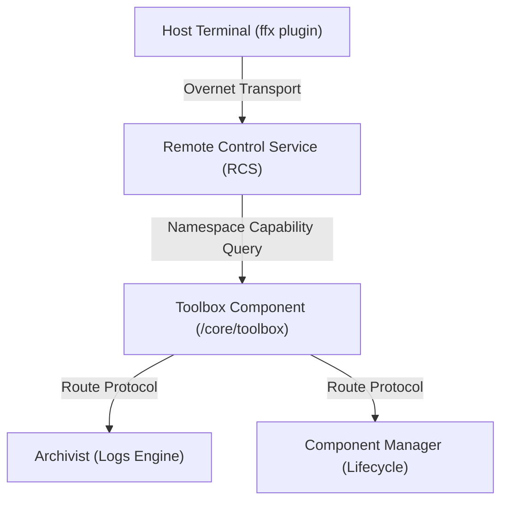

<!-- Copyright 2026 The Fuchsia Authors. All rights reserved. -->
<!-- Use of this source code is governed by a BSD-style license that can be -->
<!-- found in the LICENSE file. -->

# The Toolbox Capability Routing Mechanism

This document blueprints the architectural layout and operational principles of the Fuchsia **Toolbox** component mechanism used by host developer utilities (`ffx`) to communicate with low-level protocols running on target devices.

## Architectural Overview

Fuchsia utilizes a component topology model where capabilities (FIDL protocols) are encapsulated and tightly controlled. Host developer tools connected via the **Remote Control Service (RCS)** frequently need to communicate with internal target protocols that reside outside the direct scope of RCS.

The **Toolbox** component (`/core/toolbox` or similar product configurations) acts as a centralized capability aggregator and namespace registry. It serves as a dynamic bridge, aggregating developer-centric capabilities exposed by diverse system sub-components and offering them collectively to the Remote Control Service.



## The Problem It Resolves

Without a dedicated toolbox aggregation layer, routing developer tools capabilities would induce significant maintenance costs:
1.  **Topology pollution**: Every system component declaration file (`.cml`) would need complex, manual `offer` and `expose` capability blocks linking them directly to RCS.
2.  **Security Violations**: Exposing high-privilege debugging capabilities directly to a broad transport service increases attack vectors. The toolbox acts as a local gateway that encapsulates these tools.

## How It Operates

1.  **Capability Exposure**: Components that provide debugging or diagnostic hooks (such as the Archivist emitting `fuchsia.diagnostics.ArchiveAccessor`) expose their service protocols up to their parent realms.
2.  **Toolbox Collection**: The product configuration offers these specific capability channels into the `toolbox` instance sandbox space.
3.  **RCS Binding**: When an `ffx` host plugin initiates an operation (e.g. requesting logs streaming), the host client maps the query to a target protocol type marker.
4.  **Moniker Scoped Connect**: RCS intercepts the host request, targets the `/core/toolbox` namespace, and maps the lookup connection using a moniker-scoped path pointer to bind the server socket channel to the client tool.

## Plugin Implementation Code Pattern

Host plugin authors do not need to manage raw socket routing manually. The `rcs` and `fho` core developer framework libraries provide high-level convenience wrappers targeting the toolbox namespace layout.

Example pattern from the `ffx log` sub-command implementation core:

```rust
// Connect to the ArchiveAccessor protocol exposed by the Archivist component via the toolbox namespace
let diagnostics_client = rcs_fdomain::toolbox::connect_with_timeout::<ArchiveAccessorMarker>(
    &rcs_client,
    Some("bootstrap/archivist"), // Path relative to the toolbox component's capability offers, not the absolute system moniker
    TIMEOUT,
)
.await
.map_err(anyhow::Error::from)?;
```

By leveraging the `toolbox` proxy layout modules, host utilities can execute transparent protocol discovery across the full Fuchsia component ecosystem topology safely.
