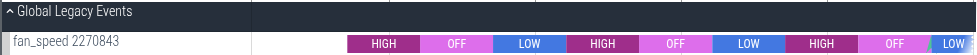

# State reporting

This directory aspires to support standardized state reporting via Inspect
and trace for entities with discrete or continuous states. It does so by
providing a library that emits conformant Inspect.

Currently, only discrete states in Rust are supported. Extensions to C++ and
continuous states will be prioritized based on needs.

## Format stability

The formats presented here may evolve based on emerging needs. If you are aware
of a stakeholder that may not be under consideration, please contact a code
owner!

## Discrete state format

### Inspect

Inspect data for all recorded states will be placed in a node named
"power_observability_state_recorders" that is a child of the component
inspector's root. Each recorded state will be given a distinct node.

The key elements of the data are:
    - The name of the entity. This must be unique per-component to avoid data
      collisions.
    - Metadata that describes a mapping of enumerated state values to state
      names.
    - Transition history, which records timestamped state transitions. Because
      Inspect interns strings, states can be efficiently recorded by name.

For example, a component recording states for two entities, one called
"example_switch" and the other called "fan_speed", would have data structured
like this in its Inspect hierarchy:
```
  root: {
    power_observability_state_recorders: {
      example_switch: {
        metadata: {
          name: "example_switch",
          type: "discrete",
          states: {
            "0": "OFF",
            "1": "ON"
          }
        },
        transition_history: [
          {
            value: "OFF",
            @time: 150000000000,
          },
          {
            value: "ON",
            @time: 250000000000,
          }
        ]
      },
      fan_speed: {
        metadata: {
          name: "fan_speed",
          type: "discrete",
          states: {
            "0": "OFF",
            "1": "LOW",
            "2": "HIGH"
          }
        },
        transition_history: [
          {
            value: "LOW",
            @time: 100000000000,
          },
          {
            value: "OFF",
            @time: 500000000000,
          },
          {
            value: "HIGH",
            @time: 980000000000,
          }
        ]
      }
    }
  }
```

### Trace

Trace data is recorded to a global track named according to the entity name and
PID, as seen here:

