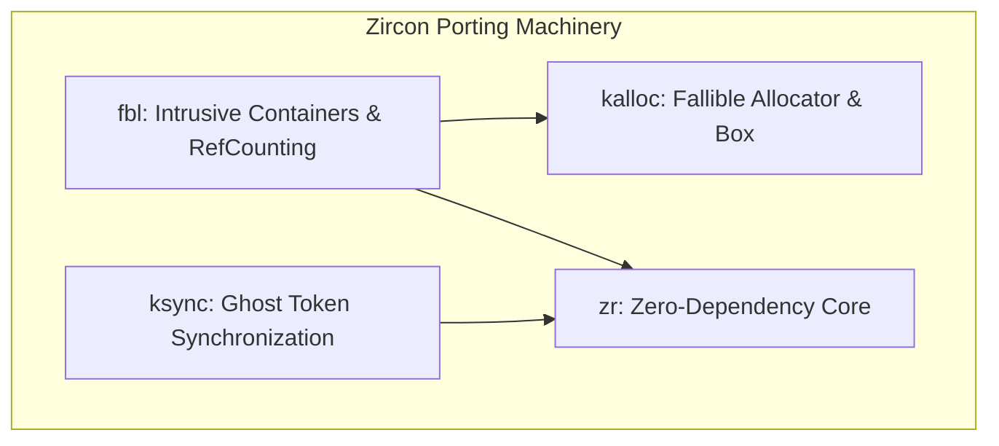
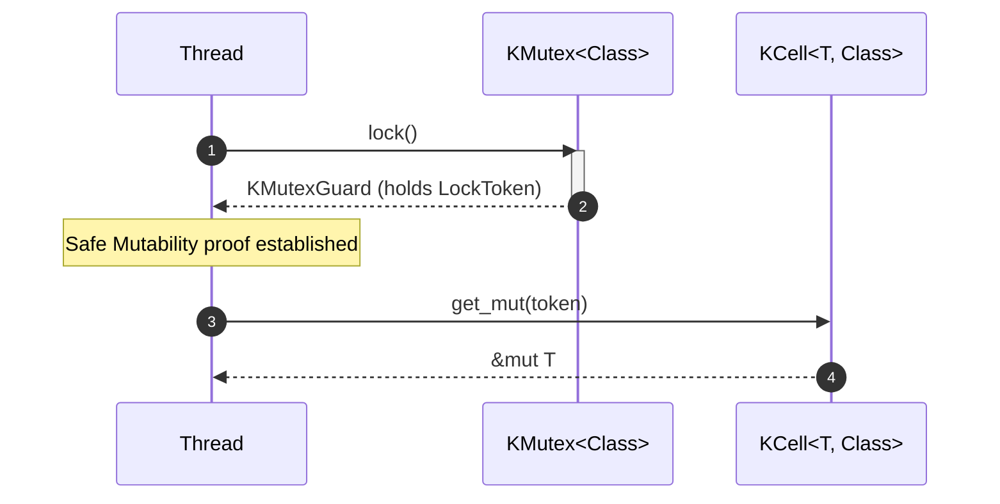

# C++ to Rust Porting Patterns in Zircon

This skill documents the patterns and guidelines applied when porting Zircon
kernel and library code from C++ to Rust. It details the core principles,
cross-language ABI compatibility tricks, and the custom in-tree machinery
developed to support this migration.

## Core Principles

1.  **Direct Translation**: Translate C++ code to Rust using exactly the same
    data structures and algorithms where possible.
2.  **Memory Layout Parity**: The memory layout of Rust structs must match
    corresponding C++ objects exactly.
3.  **Test & Fuzz Parity**: Test and fuzz coverage for Rust code must match C++
    code exactly. Always cross-check Rust test coverage against C++ tests and
    close any gaps. If the C++ code has fuzz tests, implement equivalent Rust
    fuzzers using `rustc_fuzzer` and the `arbitrary` crate.
4.  **Ergonomic Design**: Rust code should follow Rust best practices where they
    don't conflict with layout or behavior requirements.
5.  **DRY Principle**: Apply "Don't Repeat Yourself" to minimize duplication.
6.  **Fallible Allocation**: All allocations in kernel mode must be explicit and
    fallible. Panics on OOM are unacceptable.
7.  **Locking and Synchronization**: The locking strategies and concurrency
    control protocols must match C++ code and integrate with standard validation
    frameworks (e.g., lockdep).
8.  **Documentation Parity & Rustdoc**: Port and adapt documentation and
    comments from the C++ version.
    * **Public API Documentation**: All public traits, structs, enums, methods,
      and functions MUST be documented using Rustdoc (`///`) comments.
    * **Safety Sections**: If a function is `unsafe`, its Rustdoc must contain a
      `# Safety` section explaining the requirements for safe usage.
    * **Implementation Comments**: Retain explanations of algorithms, design
      constraints, and usage notes, while updating code examples and API names
      to reflect Rust idioms.
9.  **Preservation of Named Constants**: Avoid hardcoding values that are
    defined as named constants in the C++ version. Extract these to equivalent
    `pub const` definitions in Rust and use them for defaults, limits, or
    configurations.

---

## The Rust Porting Machinery

We have built a suite of custom Rust crates in Fuchsia specifically to
facilitate porting low-level Zircon structures.



---

## Patterns & Guidelines

### 1. Memory Layout Matching & Verification

To ensure Rust structs can safely replace C++ objects or be shared across the
FFI boundary:
- Always use `#[repr(C)]` on structs shared with C++.
- Use compile-time assertions to verify size and alignment.
- Use the `zr::static_assert!` macro from the `zr` crate.
- Add matching static asserts on the C++ side (e.g., using `static_assert`) in
  test files to double check compatibility.

Example:
```rust
#[repr(C)]
pub struct Canary<const MAGIC: u32> {
    magic: u32,
}

zr::static_assert!(core::mem::size_of::<Canary<0>>() == 4);
zr::static_assert!(core::mem::align_of::<Canary<0>>() == 4);
```

### 2. Fallible Allocation (`kalloc`)

Standard Rust collections and `alloc::boxed::Box` panic on Out-Of-Memory (OOM)
conditions, which is unacceptable in the Zircon kernel.
- **Do not** use the standard Rust `alloc` crate directly in kernel code.
- Use `kalloc::Box` for fallible allocation of sized types and slices.
- `kalloc` defines an `Allocator` trait similar to `core::alloc::Allocator`.
- `DefaultAllocator` delegates to standard `alloc` in userspace/tests and kernel
  `malloc`/`calloc`/`realloc` when compiling with `--cfg=is_kernel`.

#### Allocating Sized Values & Slices:
```rust
// Allocating a single value fallibly
let my_box = kalloc::Box::try_new(42u32)?;

// Allocating a zeroed slice fallibly
let mut uninit_slice = kalloc::Box::<[u32]>::try_new_zeroed_slice(10)?;
// SAFETY: Guarantee that values are initialized (zeroed is valid for u32)
let mut slice = unsafe { uninit_slice.assume_init() };
```

#### Growing and Shrinking Slices:
```rust
let mut slice = kalloc::Box::<[u32]>::try_new_zeroed_slice(5)?;
// Grow the slice to a size of 10
kalloc::Box::try_grow(&mut slice, 10)?;

// Shrink the slice back to a size of 2 (requires unsafe because discarded elements are dropped)
unsafe {
    kalloc::Box::try_shrink(&mut slice, 2)?;
}
```

### 3. ABI Compatibility & Opaque Storage (`zr`)

When a C++ object cannot be fully ported to Rust yet, but needs to reside inside
a Rust structure:
- Use `zr::Opaque<T>` to wrap C++ types, indicating to the compiler that the
  type possesses interior mutability (`UnsafeCell`) and might be uninitialized
  (`MaybeUninit`).
- Use `zr::OpaqueBytes<SIZE>` as a generic transparent container with an exact
  compile-time size constraint.
- **Do not** attempt to pass an alignment parameter to `OpaqueBytes` as a
  generic. Instead, enforce the correct alignment by wrapping `OpaqueBytes` in a
  **newtype struct** annotated with standard Rust `#[repr(C, align(N))]`
  annotations. This guarantees the underlying memory exactly matches the
  alignment of the corresponding C++ object.
- Use `zr::pin_init_ffi!` to initialize complex pinned C++ structures in-place
  via a raw FFI constructor.

```rust
// Match the size (64 bytes) and alignment (8-byte aligned) of the corresponding C++ type exactly
#[repr(C, align(8))]
pub struct CppStateStorage(pub zr::OpaqueBytes<64>);

#[repr(C)]
pub struct RustWrapperStruct {
    pub cpp_state: CppStateStorage,
    pub rust_val: u32,
}

// In-place FFI initialization of a pinned struct
let pinned_init = zr::pin_init_ffi!(extern_cpp_constructor_fn);
```

### 4. Token-Based "Ghost Token" Synchronization (`ksync`)

Instead of encapsulating data inside a Mutex (like `std::sync::Mutex<T>`),
Zircon's concurrency control separates the lock state (`KMutex`) from data
storage (`KCell<T, Class>`).



- **`LockToken<'a, Class>`**: A zero-sized compile-time proof that the exclusive
  lock is held.
- **`KMutex<Class>`**: The lock state. Pinned in memory to support safe FFI
  active-list registration for loop-detector validation.
- **`KCell<T, Class>`**: A wrapper around `UnsafeCell<T>` accessible only by
  proving ownership of a matching `LockToken`.

#### The `#[guarded]` Procedural Macro:
Annotate structures to automatically rewrite fields into `KMutex` and `KCell`
wrappers, generating safe Guard and Split Accessor structures.

```rust
use ksync::{guarded, KMutex};

#[guarded]
pub struct NetworkDevice {
    #[mutex]
    mu: KMutex,

    #[guarded_by(mu)]
    pub tx_packets: u64,

    #[guarded_by(mu)]
    pub rx_packets: u64,
}
```

#### Lock Class Autogeneration:
The `#[guarded]` macro automatically generates a unique lock class (a Zero-Sized
Type) for the annotated struct and applies it to the `KMutex` fields. Do not
introduce a generic `Class: LockClass` parameter to your struct for the sake of
the mutex unless explicit caller customization of the lock class is required by
the design.

#### Usage & Disjoint Borrows:
To access fields, stack-pin both the structure and the guard, then utilize
generated helper projections like `fields()` or `fields_mut()` to resolve
borrows.

```rust
use ksync::lock;
use pin_init::pin_init;

pin_init::stack_pin_init!(let dev = pin_init!(NetworkDevice {
    mu <- KMutex::init(),
    tx_packets: 0.into(),
    rx_packets: 0.into(),
}));

// Pin-initialize the mutex guard
lock!(let mut guard = dev.lock_mu());

// Access individual fields mutably
*guard.as_mut().tx_packets_mut() += 1;

// Access disjoint borrows simultaneously
let fields = guard.as_mut().fields_mut();
*fields.tx_packets += 1;
*fields.rx_packets += 1;
```

#### Custom Raw Locking & RAII Guards:
When implementing low-level components that require custom raw synchronization
traits (e.g., `RawLock` with manual `lock()` and `unlock()` calls) rather than
standard wrappers, **always** define and utilize a lightweight RAII `LockGuard`
helper. This guarantees the lock is automatically released on any early returns,
panics, or `?` operator propagations, preventing permanent deadlocks.

```rust
pub struct LockGuard<'a, L: RawLock> {
    lock: &'a L,
}

impl<'a, L: RawLock> LockGuard<'a, L> {
    pub fn acquire(lock: &'a L) -> Self {
        lock.lock();
        Self { lock }
    }
}

impl<'a, L: RawLock> Drop for LockGuard<'a, L> {
    fn drop(&mut self) {
        self.lock.unlock();
    }
}
```

### 5. Intrusive Containers & Reference Counting (`fbl`)

Low-level Zircon kernel structures heavily use intrusive reference counting and
intrusive collections (`fbl`).

#### Intrusive Reference Counting (`#[ref_counted]` & `RefPtr`):
- Annotate structs with `#[fbl::ref_counted]` (requires `#[repr(C)]`).
- This automatically injects a thread-safe `ref_count: fbl::RefCounted` at
  **offset 0** (enforced via a compile-time offset assertion) and
  `__fbl_ref_counted_guard: ()`.
- Use `fbl::RefPtr<T>` and the `fbl::make_ref_counted!` macro to manage
  lifecycle.

```rust
#[fbl::ref_counted]
#[repr(C)]
pub struct ProcessNode {
    pub pid: u64,
}

// Allocate and construct a reference-counted object
let node = fbl::make_ref_counted!(ProcessNode { pid: 1001 }).unwrap();
let node_clone = node.clone(); // increments ref count
```

#### Cross-Language Lifecycle & `Recyclable`:
When sharing ref-counted objects with C++, objects must be deallocated by the
language that allocated them to prevent allocator mismatches.
- Implement the `fbl::Recyclable` trait (automatically implemented by
  `#[derive(Recyclable)]` using `kalloc::Box` under the hood).
- Provide a `rust_recycle_...` FFI callback on the C++ side that calls
  `Recyclable::recycle_ffi`.

```rust
#[unsafe(no_mangle)]
pub extern "C" fn rust_recycle_process_node(ptr: *mut core::ffi::c_void) {
    // SAFETY: The caller must ensure ptr is a valid, unique pointer to a ProcessNode
    unsafe { ProcessNode::recycle_ffi(ptr) }
}
```

#### Intrusive Containers (`DoublyLinkedList`, `SinglyLinkedList`, `WavlTree`):
- Derive containable traits: `DoublyLinkedListContainable`,
  `SinglyLinkedListContainable`, or `WavlTreeContainable`.
- **Always prefer using the derive macros** (e.g.,
  `#[derive(SinglyLinkedListContainable)]`) over manual trait implementations.
  Manual implementations should be reserved only for cases with custom logic
  that the macros cannot support.
- Annotate the intrusive node fields with `#[dll_node]`, `#[sll_node]`, or
  `#[wavl_node]`.
- For objects participating in multiple containers, use the `tag` attribute to
  declare disjoint paths.

```rust
use fbl::{DoublyLinkedListContainable, SinglyLinkedListContainable};

#[derive(DoublyLinkedListContainable, SinglyLinkedListContainable)]
#[repr(C)]
pub struct Task {
    #[dll_node]
    global_link: fbl::DoublyLinkedListNode<Task>,

    #[sll_node(tag = ActiveQueue)]
    active_link: fbl::SinglyLinkedListNode<Task>,
}

pub struct ActiveQueue; // marker tag class
```

### 6. Workaround for Generic Const Expressions

Stable Rust does not allow generic parameters in const operations (e.g., `[u8; N
+ 1]`). When porting C++ templates that use a capacity `N` and allocate `N + 1`
  elements for a null terminator:
- Let the Rust generic parameter `N` represent the **total size** of the backing
  array.
- Document that a C++ `Type<M>` corresponds to a Rust `Type<{M + 1}>`.
- The Rust implementation will have a capacity of `N - 1`.

### 7. Ergonomic Design via `Deref`

When porting collection-like or string-like C++ structures:
- Avoid porting methods like `data()`, `length()`, or custom indexing directly
  if they can be provided by `Deref` and `DerefMut` to a slice (e.g., `[u8]` or
  `[T]`).
- Implementing `Deref` automatically provides `len()`, `is_empty()`, and
  standard indexing, making the Rust code more idiomatic.

### 8. Avoid Redundant Initialization

When initializing an array with `[0; N]`, do not explicitly set elements to `0`
immediately after, as they are already zero-initialized.

### 9. Namespace Usage

Prefer adding `use` directives at the top of the file rather than writing out
fully qualified namespaces (e.g., `core::ffi::CStr`) for everything explicitly.
This makes the code more compact and readable.

### 10. Pointer Safety, `NonNull`, and Strict Provenance

When porting C++ code that uses raw pointers (`T*` or `const T*`):
- **Avoid raw pointers** (`*const T` or `*mut T`) in Rust interfaces unless
  strictly necessary for raw FFI boundaries.
- **Use `NonNull<T>`** if the pointer must never be null. This provides compiler
  guarantees and helps document safety.
- **Use `Option<NonNull<T>>`** if the pointer is optional (can be null). Rust
  optimizes `Option<NonNull<T>>` to have the exact same memory layout and size
  as a raw pointer (Null Pointer Optimization), meaning there is no runtime
  overhead.
- **Avoid `Cell` for interior mutability of pointers** if the containing object
  needs to be `Sync` (which is common for shared kernel objects). `Cell` makes
  the object `!Sync`.
- Ensure traits and macros reflect this type-safety. For example, setter methods
  should accept `NonNull<T>` and take `&mut self` if they mutate the origin,
  allowing safe mutation without `Cell` (e.g., using `Option<NonNull<T>>`
  directly).

Example:
```rust
pub struct Node {
    value: i32,
    parent: Option<NonNull<Node>>,
}

impl Node {
    // Returns Option<NonNull> because the parent might be null (None)
    pub fn parent(&self) -> Option<NonNull<Node>> {
        self.parent
    }

    // Takes NonNull because the parent must be a valid instance, and &mut self to allow safe mutation
    pub fn set_parent(&mut self, parent: NonNull<Node>) {
        self.parent = Some(parent);
    }
}
```

#### Strict Provenance & Casts:
Rust is transitioning to a "Strict Provenance" model where pointers are not just
integers (addresses), but also carry "provenance" (the permission to access the
memory).
- **Avoid raw casts (`as *const T` / `as *mut T`)** when converting integer
  addresses (e.g., `usize` returned from OS memory mapping APIs) back to
  pointers.
- **Use `core::ptr::with_exposed_provenance`** (or `with_exposed_provenance_mut`
  for mutable pointers) to construct pointers from integers that represent
  exposed memory addresses (like those returned from VMAR mapping syscalls).
- This makes the provenance cast explicit and ensures compliance with Rust's
  strict provenance guidelines, helping the compiler perform correct alias
  analysis.

Example:
```rust
// Converting a raw mapped address (usize) back to a slice safely and with correct provenance:
pub fn get_slice(mapped_addr: usize, size: usize) -> &'static [u8] {
    if mapped_addr == 0 {
        &[]
    } else {
        // SAFETY: `mapped_addr` is a valid address mapped from a VMO with `size` bytes.
        // We use `with_exposed_provenance` to construct a pointer with exposed provenance,
        // and then `from_raw_parts` to construct a slice.
        unsafe {
            let ptr = core::ptr::with_exposed_provenance::<u8>(mapped_addr);
            core::slice::from_raw_parts(ptr, size)
        }
    }
}
```

### 11. Zircon Status and Error Handling

When porting Zircon code that returns error codes (e.g., `zx_status_t` in C++):
- **Do not** duplicate `zx_status_t` type definitions or `ZX_ERR_*` constants
  locally in the ported Rust crate.
- **Do** depend on the `//sdk/rust/zx-status` library.
- **Do** use `zx_status::Status` as the error type in `Result` (e.g.,
  `Result<(), Status>`).
- Use the associated constants on `Status` (e.g., `Status::INVALID_ARGS`,
  `Status::NOT_FOUND`) instead of `ZX_ERR_` prefixes.
- Leverage the `?` operator for clean error propagation by returning `Result`
  from internal helper methods where applicable, rather than returning raw
  status codes and manually checking them.

Example:
```rust
use zx_status::Status;

pub fn add_region(&self, base: u64, size: u64) -> Result<(), Status> {
    if size == 0 {
        return Err(Status::INVALID_ARGS);
    }
    // ...
    self.check_overlap(base, size)?;
    Ok(())
}
```

### 12. Code Organization Parity

When porting a C++ library or component, match the file and module structure of
the C++ codebase:
- If the C++ library is split into multiple headers and source files (e.g.,
  `bitmap.h`, `storage.h`, `raw-bitmap.h`, `rle-bitmap.h`), organize the Rust
  port similarly using separate module files (e.g., `src/bitmap.rs`,
  `src/storage.rs`, `src/raw_bitmap.rs`, `src/rle_bitmap.rs`).
- Use `pub mod` declarations in the root `src/lib.rs` (or `src/main.rs`) to
  define these modules.
- Re-export the public types and traits at the root level (using `pub use`) to
  maintain a unified, flat public API if the C++ library exposed everything from
  a single entry point or header.
- Ensure that the unit tests are also modularized or placed appropriately (e.g.,
  in a `tests.rs` file or submodule) and explicitly declared in `lib.rs` via
  `mod tests;` (usually under `#[cfg(test)]`) to ensure they are compiled and
  executed.

### 13. Fuzz Testing Parity

If the C++ library or component being ported has fuzz tests, you must implement
equivalent Rust fuzzers to maintain testing parity.

#### Fuzzer Implementation Structure:
- **Separate Crate**: Compile the fuzzer as a separate crate (usually staticlib
  linked with clang by the build system) rather than part of the library crate.
- **Imports**: Import the library crate using absolute paths (`use
  ::library_name::*;`) instead of `use crate::*` to avoid ambiguity since the
  fuzzer is its own crate root.
- **Structured Inputs (`Arbitrary`)**: Use the `arbitrary` crate to define
  structured inputs for the fuzzer. This is the idiomatic Rust equivalent to
  C++'s `FuzzedDataProvider`.
- **Fuzz Target**: Use the `#[fuzz]` attribute from the `fuzz` crate to define
  the fuzzer entry point.

Example (`src/fuzzer.rs`):
```rust
use ::my_library::*;
use arbitrary::Arbitrary;
use fuzz::fuzz;

#[derive(Arbitrary, Debug)]
enum Op {
    Add { val: u32 },
    Remove { val: u32 },
    Clear,
}

#[fuzz]
fn my_library_fuzzer(ops: Vec<Op>) {
    let mut obj = MyStruct::new();
    for op in ops {
        match op {
            Op::Add { val } => { let _ = obj.add(val); }
            Op::Remove { val } => { let _ = obj.remove(val); }
            Op::Clear => { obj.clear(); }
        }
    }
}
```

#### Build Configuration (`BUILD.gn`):
- Import fuzzing templates:
  ```gn
  import("//build/fuzz.gni")
  import("//build/rust/rustc_fuzzer.gni")
  ```
- Define the fuzzer targets:
  ```gn
  rustc_fuzzer("my-fuzzer") {
    edition = "2024"
    deps = [
      ":my-library",
      "//src/lib/fuzzing/rust:fuzz",
      "//third_party/rust_crates:arbitrary",
    ]
    source_root = "src/fuzzer.rs"
    sources = [ "src/fuzzer.rs" ]
    rustfunction = "my_library_fuzzer"
  }

  fuchsia_fuzzer_component("my-fuzzer-component") {
    manifest = "meta/my-fuzzer.cml"
    deps = [ ":my-fuzzer" ]
  }

  fuchsia_fuzzer_package("my-fuzzers") {
    rust_fuzzer_components = [ ":my-fuzzer-component" ]
  }
  ```
- Add the fuzzer package to the `tests` group:
  ```gn
  group("tests") {
    testonly = true
    deps = [
      ":my-fuzzers",
      ":my-library-tests",
    ]
  }
  ```

#### Component Manifest (`meta/my-fuzzer.cml`):
Create a basic component manifest that includes the default libFuzzer shard:
```json
{
    include: [ "//src/sys/fuzzing/libfuzzer/default.shard.cml" ],
    program: {
        args: [ "test/my-fuzzer" ],
    },
}
```

#### Verification:
- Add the fuzzer to your build using `fx add-test //path/to:my-fuzzers`.
- Verify compilation by building the target: `fx build //path/to:my-fuzzers`.

### 14. Safe Initialization in PinInit

When initializing structures that use `PinInit` (such as those containing
`KMutex` or intrusive collections), you may need to initialize nested fields
that require post-construction setup (e.g., calling `reset()` on a bitmap).
- **Avoid `unsafe` in post-init blocks**: Do not use the `_:`
  post-initialization block to perform setup on fields if it requires `unsafe`
  pointer casting to bypass lock/cell wrappers (like `KCell`).
- **Initialize before moving**: If the field type is `Move` (like
  `RawBitmapGeneric`), perform the setup *before* moving it into the struct. You
  can do this by using a block expression in the field initializer:
  ```rust
  pin_init!(Self {
      mutex <- KMutex::init(),
      bitmap: {
          let mut bitmap = RawBitmapGeneric::default();
          bitmap.reset(MAX_ID)?;
          bitmap
      }.into(),
  }? Status)
  ```
- This keeps the initialization 100% safe.

### 15. Leverage Default Trait

Prefer using `Default::default()` or `Type::default()` to construct types that
have a natural empty/default state, rather than calling custom `new()`
constructors with empty arguments (e.g., prefer `RawBitmapGeneric::default()`
over `RawBitmapGeneric::new(FixedStorage::new())`). This improves readability
and allows the compiler to infer the correct types more easily.

### 16. Use Standard Library & Third-Party Crates (num-traits, zerocopy)

When porting C++ code, leverage standard, audited third-party crates available
in the Fuchsia tree instead of writing custom traits or unsafe casting
boilerplate.

#### 16.1. Generic Numeric Types (`num-traits`)
- **When to use**: If a C++ class template is parameterized over numeric types
  (e.g. `template <typename T>`), use bounds from the `num-traits` crate (like
  `Unsigned`, `Bounded`, `FromPrimitive`, `AsPrimitive<usize>`) to constrain the
  generic type `T`. Avoid defining local numeric helper traits (like
  `UnsignedInt`) unless absolutely necessary.
- **Const Generics Limitation**: Associated constants (like
  `Bounded::max_value()`) are not `const fn` in `num-traits` v0.2. If you need
  compile-time checks involving these values, you must replace them with runtime
  assertions (e.g. in the `init()` constructor's post-initialization block)
  returning `Status::OUT_OF_RANGE` on failure.
- **Dependency**: Add `//third_party/rust_crates:num-traits` to `deps` in
  `BUILD.gn`.

#### 16.2. Safe Byte Casting (`zerocopy`)
- **When to use**: When casting structs to byte slices (e.g. for FFI, IPC, or
  storage serialization) or parsing raw byte arrays into structs.
- **Safety**: Do NOT write manual `unsafe` pointer casts (e.g.
  `slice::from_raw_parts`) or use `mem::transmute` for these conversions.
  Instead, derive `FromBytes`, `IntoBytes` (or `AsBytes` depending on the
  version), and `KnownLayout` from the `zerocopy` crate to perform these
  operations safely at compile-time.
- **Dependency**: Add `//third_party/rust_crates:zerocopy` to `deps` in
  `BUILD.gn`.

### 17. FFI Dependencies

When there is C++ code that is not to be ported, but needs to be called from
Rust, code FFI shims should be used. These shims should not contain logic beyond
complex type serialization and deserialization and should use `lower_snake_case`
names of the form `cpp_$namespace_$classname_$functionname`.

If ported Rust code needs to be called from unconverted C++ code FFI shims
should also be used, in this case the names should also be `lower_snake_case`
but take the form `rust_$modpath_$struct_$functionname`.
