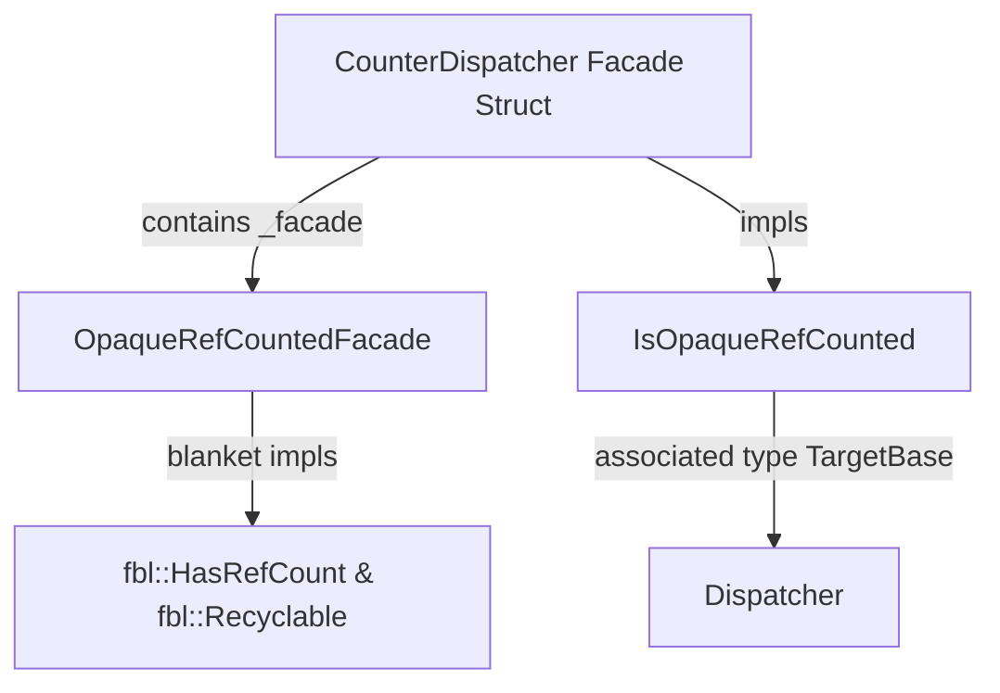

# Porting Zircon Dispatchers from C++ to Rust

This skill documents the standard patterns, architectural conventions, and
code-sharing practices for migrating Zircon kernel `Dispatcher` subtypes and
their associated syscalls from C++ to Rust.

---

## 1. Core Principles

1.  **Exact Behavioral & Functional Parity**: The Rust implementation of a
    dispatcher and its syscalls must behave identically to the C++ version
    across all success, error, and concurrency paths (including error codes like
    `ZX_ERR_BAD_HANDLE`, `ZX_ERR_WRONG_TYPE`, `ZX_ERR_ACCESS_DENIED`, and
    `ZX_ERR_INVALID_ARGS`).
2.  **Code Sharing & Boilerplate Reduction (DRY)**: Do not duplicate FFI
    bridging, handle table lookup, downcasting, or reference-counting code
    across individual dispatcher subtypes. Leverage shared infrastructure in
    `fbl` and `kernel/object`.
3.  **Facade Object Pattern**: Subtype dispatchers wrapping C++ objects or
    zero-sized FFI handles use facade types with zero-sized interior mutability
    wrappers (`OpaqueRefCountedFacade`).
4.  **State & Synchronization Separation**: Internal mutable state is held in a
    dedicated `#[guarded]` `<Type>DispatcherState` struct embedded within the
    dispatcher's memory layout.
5.  **Fallible Allocation & Status Handling**: Kernel operations must be
    fallible. Use `zx_status::Status` for error propagation with `Result<T,
    Status>`.

---

## 2. Shared Reference-Counting & Facade Machinery (`fbl`)

Dispatcher objects in Zircon use intrusive reference counting
(`fbl::RefCounted`). To prevent repeating `HasRefCount`, `Recyclable`,
`PhantomPinned`, `Send`, and `Sync` boilerplate on every dispatcher subtype, use
`fbl::OpaqueRefCountedFacade` and `fbl::IsOpaqueRefCounted`.



### Struct Definition

Each concrete dispatcher subtype defines a `#[repr(C)]` facade struct containing
`_facade: fbl::OpaqueRefCountedFacade<TargetBase>`:

```rust
use fbl::{IsOpaqueRefCounted, OpaqueRefCountedFacade};
use zircon_object::dispatcher::Dispatcher;

#[repr(C)]
pub struct CounterDispatcher {
    _facade: OpaqueRefCountedFacade<Dispatcher>,
}

unsafe impl IsOpaqueRefCounted for CounterDispatcher {
    type TargetBase = Dispatcher;
}
```

### Benefits:
- **Zero Memory Overhead**: `OpaqueRefCountedFacade` wraps `zr::OpaqueFacade` to
  communicate interior mutability to LLVM optimization passes without adding
  size bytes.
- **Automatic Trait Implementations**: `HasRefCount` and `Recyclable` are
  automatically implemented for `CounterDispatcher` via blanket trait impls on
  `IsOpaqueRefCounted`.
- **Thread Safety**: Automatically provides `Send` and `Sync` implementations.

---

## 3. The `<Type>DispatcherState` Pattern (Synchronization & State Layout)

When migrating a dispatcher, separate the public **Facade Struct**
(`CounterDispatcher`) from the internal **State Struct**
(`CounterDispatcherState`):

```mermaid
graph LR
    Facade[CounterDispatcher Facade] -->|offset math via .state()| State[CounterDispatcherState]
    State -->|#[guarded_by(lock)]| Data[State Fields e.g. value: i64]
    State -->|#[mutex]| Lock[KMutex]
```

### 1. State Struct Definition (`#[guarded]`)
Annotate `<Type>DispatcherState` with `#[guarded]` and `#[repr(C)]`. Wrap all
internal fields guarded by mutex/rwlock (`KMutex` / `BrwLockPi`) inside this
struct:

```rust
use fbl::Canary;
use ksync::{guarded, KMutex, RawCriticalMutex};

#[guarded]
#[repr(C)]
pub struct CounterDispatcherState {
    canary: Canary<{ fbl::magic(b"SOLO") }>,

    #[guarded_by(lock)]
    value: i64,

    #[mutex]
    lock: KMutex<RawCriticalMutex>,
}
```

### 2. Memory Alignment & Static Offset Verification
When embedded inside a cross-language C++ object allocation, enforce exact size,
alignment, and offset matching using compile-time static assertions against
constants in `object-constants`:

```rust
zr::static_assert_size_and_align!(
    CounterDispatcherState,
    object_constants::kCounterDispatcherStateSize,
    object_constants::kCounterDispatcherStateAlign,
);
```

### 3. In-Place Pin-Init Construction
Construct the state struct safely in-place using `PinInit`:

```rust
impl CounterDispatcherState {
    pub fn init() -> impl PinInit<Self, core::convert::Infallible> {
        pin_init!(Self {
            canary: Canary::new(),
            value: 0.into(),
            lock <- KMutex::init(),
        })
    }
}
```

### 4. Offset Pointer Accessor in Facade Struct
The facade struct `<Type>Dispatcher` resolves its state by calculating the
offset pointer to `kCounterDispatcherStateOffset`:

```rust
impl CounterDispatcher {
    pub fn state(&self) -> &CounterDispatcherState {
        unsafe {
            let ptr = (self as *const Self)
                .cast::<u8>()
                .add(object_constants::kCounterDispatcherStateOffset as usize)
                .cast::<CounterDispatcherState>();
            &*ptr
        }
    }
}
```

### 5. Safe Concurrency Operations & `LockToken` Proofs
Use `ksync::lock!` to acquire state locks, access guarded fields via projection
helpers (`fields()`, `fields_mut()`), and pass `LockToken` down to helper
functions to prove lock ownership at compile time:

```rust
pub fn add(&self, amount: i64) -> Result<(), Status> {
    ksync::lock!(let mut guard = self.state().lock_lock());
    let fields = guard.as_mut().fields_mut();
    let old_val = *fields.value;
    let new_val = old_val.checked_add(amount).ok_or(Status::OUT_OF_RANGE)?;
    *fields.value = new_val;
    self.update_signals_locked(guard.token(), old_val, new_val);
    Ok(())
}
```

Functions that require a lock to be held when called should be named with a
`locked` suffix, especially FFI functions.

### 6. Exposing Lock Pointers for FFI & Lockdep Integration
When C++ or lock validation frameworks need to inspect raw locks, export an FFI
shim returning raw lock pointers using `ToMutPtr`:

```rust
#[unsafe(no_mangle)]
pub unsafe extern "C" fn rust_counter_dispatcher_state_get_lock(
    ptr: *const CounterDispatcherState,
) -> *mut KMutex<CounterDispatcherStateLockClass, RawCriticalMutex> {
    unsafe { (&(*ptr).lock).to_mut_ptr() }
}
```

---

## 4. Dispatcher Base & Downcasting (`DispatcherOps` & `Dispatcher`)

All dispatcher subtypes implement `DispatcherOps` to associate their unique lock
class and `zx_obj_type_t`:

```rust
use zircon_object::dispatcher::DispatcherOps;
use zircon_object::types::zx_obj_type_t;

impl DispatcherOps for CounterDispatcher {
    type LockClass = CounterDispatcherStateLockClass;
    const TYPE: zx_obj_type_t = ZX_OBJ_TYPE_COUNTER;
}
```

### Generic Handle Resolution & Downcasting

Handle resolution is centralized in `Dispatcher` and `ProcessDispatcher` to
avoid duplicated downcasting logic:

- **`Dispatcher::get_with_rights<T>(handle, rights)`**: Fetches a
  `RefPtr<Dispatcher>` from the handle table, verifies rights, verifies
  `dispatcher.get_type() == T::TYPE`, and safely casts to `RefPtr<T>`.
- **`ProcessDispatcher::get_dispatcher_with_rights<T>(&self, handle, rights)`**:
  Method on `ProcessDispatcher` to look up typed dispatcher handles directly for
  a process.

Example usage in a syscall:

```rust
let counter = process.get_dispatcher_with_rights::<CounterDispatcher>(
    handle,
    Rights::READ | Rights::WRITE,
)?;
```

---

## 5. Porting Syscalls & Handle Creation

Syscalls related to the dispatcher are implemented under
`zircon/kernel/lib/syscalls/<dispatcher>.rs` and declared in FIDL under
`zircon/vdso/<dispatcher>.fidl`.

### Creating Handles (`KernelHandle`)

When a syscall creates a new dispatcher object, wrap it in a `KernelHandle<T>`:

```rust
let (counter_dispatcher, rights) = CounterDispatcher::create(initial_value)?;
let mut handle = KernelHandle::new(counter_dispatcher);
let handle_value = process.make_handle(&mut handle, rights)?;
```

---

## 6. FFI Boundary Guidelines

When interfacing between C++ and Rust during incremental dispatcher migrations:

1.  **Minimal Shims**: Keep FFI functions (`*_ffi.cc` / `*_ffi.rs`) purely
    declarative with zero business logic.
2.  **Naming Conventions**:
   - Rust exposed to C++: `rust_$module_$type_$method`
   - C++ exposed to Rust: `cpp_$namespace_$type_$method`
3.  **Safety Assertions**: Always verify structural memory layout parity across
    language boundaries using compile-time static assertions:
   ```rust
   zr::static_assert!(core::mem::size_of::<CounterDispatcher>() == core::mem::size_of::<usize>());
   ```
