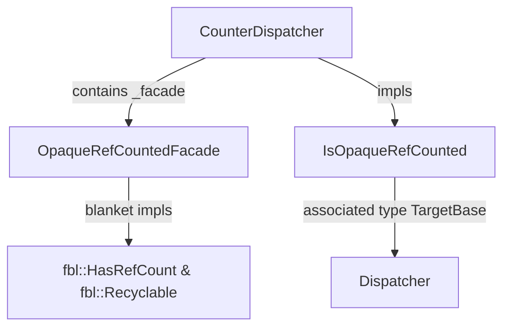

# Porting Zircon Dispatchers from C++ to Rust

This skill documents the specialized patterns, architectural conventions, and
code-sharing practices for migrating Zircon kernel `Dispatcher` subtypes and
their associated syscalls from C++ to Rust.

> [!NOTE]
> This skill extends the general Zircon C++ to Rust porting guidelines.
> All general memory layout, fallible allocation (`kalloc`), synchronization (`ksync`),
> intrusive container (`fbl`), testing, trace logging (`ltrace`), and code organization
> rules defined in `zircon/skills/cpp-to-rust-rubric/SKILL.md` apply to
> dispatcher ports as well.

---

## 1. Core Principles

1.  **Rubric Compliance**: Follow all general rules in
    `zircon/skills/cpp-to-rust-rubric/SKILL.md`.
2.  **Exact Behavioral & Functional Parity**: The Rust implementation of a
    dispatcher and its syscalls must behave identically to the C++ version
    across all success, error, and concurrency paths (including error codes like
    `ZX_ERR_BAD_HANDLE`, `ZX_ERR_WRONG_TYPE`, `ZX_ERR_ACCESS_DENIED`, and
    `ZX_ERR_INVALID_ARGS`).
3.  **Code Sharing & Boilerplate Reduction (DRY)**: Do not duplicate FFI
    bridging, handle table lookup, downcasting, or signal checking across
    individual dispatcher subtypes. Leverage shared infrastructure in `fbl`,
    `kernel/object`, and base `Dispatcher` helpers (such as
    `UserSignalSelfSolo`).
4.  **Facade Object Pattern**: Subtype dispatchers wrapping C++ objects or
    zero-sized FFI handles use facade types with zero-sized interior mutability
    wrappers (`OpaqueRefCountedFacade`).
5.  **State & Synchronization Separation**: Internal mutable state is held in a
    dedicated `#[guarded]` `<Type>DispatcherState` struct embedded within the
    dispatcher's memory layout. Embedded C++/native sub-storages use in-place
    `pin-init` initializers.
6.  **Bindgen & Single Source of Truth for Constants**: Do not duplicate
    `constexpr` or `#define` constants across languages. Generate constants
    directly via bindgen target libraries (e.g., `debuglog-types`), and simplify
    `var_allowlist` patterns (e.g., `[ "k.*" ]` in `object-constants`).

---

## 2. Shared Reference-Counting & Facade Machinery (`fbl`)

Dispatcher objects in Zircon use intrusive reference counting
(`fbl::RefCounted`). To prevent repeating `HasRefCount`, `Recyclable`,
`PhantomPinned`, `Send`, and `Sync` boilerplate on every dispatcher subtype, use
`fbl::OpaqueRefCountedFacade` and `fbl::IsOpaqueRefCounted`.


```mermaid
graph TD
    Subtype[CounterDispatcher] -->|contains _facade| Facade[OpaqueRefCountedFacade<Dispatcher>]
    Subtype -->|impls| IsOpaque[IsOpaqueRefCounted]
    IsOpaque -->|associated type TargetBase| Base[Dispatcher]
    Facade -->|blanket impls| RefCount[fbl::HasRefCount & fbl::Recyclable]
```

### Struct Definition & Facade Macro Integration

Each concrete dispatcher subtype facade is declared directly using
`impl_dispatcher_facade!` (for stateless facades) or
`impl_dispatcher_facade_with_state!` (for stateful facades). The macros
automatically apply `#[repr(C)]`, embed `_facade:
fbl::OpaqueRefCountedFacade<Dispatcher>`, and implement `Deref<Target =
Dispatcher>`, `IsOpaqueRefCounted`, and `DispatcherOps`:

```rust
// Stateless facade (e.g., ThreadDispatcher, ProcessDispatcher):
crate::impl_dispatcher_facade!(
    pub struct ThreadDispatcher,
    zx_types::ZX_OBJ_TYPE_THREAD
);

// Stateful facade (e.g., CounterDispatcher, SuspendTokenDispatcher):
crate::impl_dispatcher_facade_with_state!(
    pub struct CounterDispatcher,
    CounterDispatcherState,
    ZX_OBJ_TYPE_COUNTER,
    object_constants::kCounterDispatcherStateOffset
);
```

### Benefits:
- **Zero Memory Overhead**: `OpaqueRefCountedFacade` wraps `zr::OpaqueFacade` to
  communicate interior mutability to LLVM optimization passes without adding
  size bytes.
- **Automatic Trait & Struct Generation**: Struct definition (`#[repr(C)]`
  layout), `HasRefCount`, `Recyclable`, `IsOpaqueRefCounted`, `Deref`, and
  `DispatcherOps` are automatically generated via the facade macros.
- **Thread Safety**: Automatically provides `Send` and `Sync` implementations.

---

## 3. The `<Type>DispatcherState` Pattern (Synchronization & State Layout)

When migrating a dispatcher, separate the public **Facade Struct**
(`CounterDispatcher`) from the internal **State Struct**
(`CounterDispatcherState`):

```mermaid
graph LR
    Facade[CounterDispatcher Facade] -->|offset math via .state()| State[CounterDispatcherState]
    State -->|#[guarded_by(lock)]| Data[State Fields e.g. value: i64]
    State -->|#[mutex]| Lock[KMutex]
```

### 1. State Struct Definition (`#[guarded]`)
Annotate `<Type>DispatcherState` with `#[guarded]` and `#[repr(C)]`. Wrap all
internal fields guarded by mutex/rwlock (`KMutex` / `BrwLockPi`) inside this
struct:

```rust
use fbl::Canary;
use ksync::{guarded, KMutex, RawCriticalMutex};

#[guarded]
#[repr(C)]
pub struct CounterDispatcherState {
    canary: Canary<{ fbl::magic(b"SOLO") }>,

    #[guarded_by(lock)]
    value: i64,

    #[mutex]
    lock: KMutex<RawCriticalMutex>,
}
```

### 2. Memory Alignment & Static Offset Verification
When embedded inside a cross-language C++ object allocation, enforce exact size,
alignment, and offset matching using compile-time static assertions against
constants in `object-constants`:

```rust
zr::static_assert_size_and_align!(
    CounterDispatcherState,
    object_constants::kCounterDispatcherStateSize,
    object_constants::kCounterDispatcherStateAlign,
);
```

### 3. In-Place Pin-Init Construction & Sub-Object Pinning
Construct the state struct safely in-place using `PinInit`. For embedded fields
that require pinning or native C++ initialization (such as `DlogReaderStorage`),
annotate the field with `#[pin]` inside `#[guarded]` structs and initialize it
in-place using `field <- ...`:

```rust
impl LogDispatcherState {
    pub fn init(
        dispatcher: *const LogDispatcher,
        flags: u32,
    ) -> impl pin_init::PinInit<Self, core::convert::Infallible> {
        pin_init!(Self {
            canary: Canary::new(),
            flags,
            lock <- KMutex::init(),
            reader <- ksync::kcell_init(unsafe {
                DlogReaderStorage::init(
                    flags,
                    rust_log_dispatcher_notify,
                    dispatcher.cast_mut().cast(),
                )
            }),
        })
    }
}
```

Sub-objects should expose a single `unsafe fn init(...) -> impl
pin_init::PinInit<Self, ...>` rather than two-phase `new()` and `initialize()`
functions.

### 4. Offset Pointer Accessor in Facade Struct (Auto-generated)
The stateful facade macro `impl_dispatcher_facade_with_state!` automatically
generates the `pub fn state(&self) -> &$state` method, which resolves the state
by calculating the offset pointer to `k<Type>DispatcherStateOffset`:

```rust
// (Auto-generated by impl_dispatcher_facade_with_state!)
impl CounterDispatcher {
    pub fn state(&self) -> &CounterDispatcherState {
        unsafe {
            let ptr = (self as *const Self)
                .cast::<u8>()
                .add(object_constants::kCounterDispatcherStateOffset as usize)
                .cast::<CounterDispatcherState>();
            &*ptr
        }
    }
}
```

### 5. Safe Concurrency Operations & `LockToken` Proofs
Use `ksync::lock!` to acquire state locks, access guarded fields via projection
helpers (`fields()`, `fields_mut()`), and pass `LockToken` down to helper
functions to prove lock ownership at compile time:

```rust
pub fn add(&self, amount: i64) -> Result<(), Status> {
    ksync::lock!(let mut guard = self.state().lock_lock());
    let fields = guard.as_mut().fields_mut();
    let old_val = *fields.value;
    let new_val = old_val.checked_add(amount).ok_or(Status::OUT_OF_RANGE)?;
    *fields.value = new_val;
    self.update_signals_locked(guard.token(), old_val, new_val);
    Ok(())
}
```

Functions that require a lock to be held when called should be named with a
`locked` suffix, especially FFI functions.

### 6. Exposing Lock Pointers for FFI & Lockdep Integration (Auto-generated)
The stateful facade macro `impl_dispatcher_facade_with_state!` automatically
exports the `rust_<type:snake>_state_get_lock` FFI shim returning raw lock
pointers via `ToMutPtr`:

```rust
// (Auto-generated by impl_dispatcher_facade_with_state!)
#[unsafe(no_mangle)]
pub unsafe extern "C" fn rust_counter_dispatcher_state_get_lock(
    ptr: *const CounterDispatcherState,
) -> *mut KMutex<CounterDispatcherStateLockClass, RawCriticalMutex> {
    unsafe { (&(*ptr).lock).to_mut_ptr() }
}
```

### 7. State Destruction & Initialization Trampolines (`impl_dispatcher_state_init!`)

#### State Destruction (Auto-generated)
During dispatcher state destruction, the C++ destructor calls the FFI function
`rust_<type>_state_destroy`. This function is automatically generated by
`impl_dispatcher_facade_with_state!`:

```rust
// (Auto-generated by impl_dispatcher_facade_with_state!)
#[unsafe(no_mangle)]
pub unsafe extern "C" fn rust_<type:snake>_state_destroy(state: &mut <Type>State) {
    // SAFETY: The caller is destroying the dispatcher and will not use it again.
    unsafe {
        core::ptr::drop_in_place(state);
    }
}
```

All cleanup logic (such as disconnecting readers or incrementing destroy
counters) should be implemented in the `PinnedDrop` trait for
`<Type>DispatcherState`.

Acquiring state locks during destruction (e.g. via `ksync::lock!`) can cause
lock order inversions or lockdep failures if cleanup functions acquire external
subsystem locks (e.g., `DLog`). Since `drop` has unique access (`&mut self` via
`Pin::get_unchecked_mut`), use `.get_inner_mut()` or `.as_mut()` on `KCell`
fields to access guarded data mutably without taking the lock.

Note that because the state struct is initialized via `pin_init` (often
implicitly via `#[guarded]`), we must use `#[pin_data(PinnedDrop)]` on the
struct and implement `PinnedDrop` instead of standard `Drop`. Make sure
`#[guarded]` is placed above `#[pin_data(PinnedDrop)]` so that the macro
expansion order is correct.

```rust
#[guarded]
#[pin_data(PinnedDrop)]
#[repr(C)]
pub struct LogDispatcherState { ... }

#[pinned_drop]
impl PinnedDrop for LogDispatcherState {
    fn drop(self: Pin<&mut Self>) {
        DISPATCHER_LOG_DESTROY_COUNT.add(1);
        let this = self.project();
        if (*this.flags & ZX_LOG_FLAG_READABLE) != 0 {
            let reader_pin = this.reader.get_pinned_mut();
            reader_pin.disconnect();
        }
    }
}
```

#### State Initialization (`impl_dispatcher_state_init!`)
State initialization FFI trampolines (`rust_<type>_state_init`) can be generated
using a single unified `impl_dispatcher_state_init!` macro in the dispatcher's
`*_ffi.rs` module. All `<Type>State::init(dispatcher, ...)` functions receive
`dispatcher: *const <Type>` as their first argument:

1.  **Standard Initialization** (calls `<Type>State::init(dispatcher)`):
   ```rust
   // In suspend_token_dispatcher_ffi.rs / sampler_dispatcher_ffi.rs:
   crate::impl_dispatcher_state_init!(SuspendTokenDispatcher, SuspendTokenDispatcherState);
   ```

2.  **Initialization with Additional Arguments** (calls
    `<Type>State::init(dispatcher, flags)`):
   ```rust
   // In log_dispatcher_ffi.rs:
   crate::impl_dispatcher_state_init!(LogDispatcher, LogDispatcherState, flags: u32);
   ```

3.  **Custom Initialization Logic** (written explicitly when post-initialization
    calls or custom signal updates are needed):
   ```rust
   // In counter_dispatcher_ffi.rs:
   #[unsafe(no_mangle)]
   pub unsafe extern "C" fn rust_counter_dispatcher_state_init(
       ptr: *mut CounterDispatcherState,
       dispatcher: *const CounterDispatcher,
   ) {
       unsafe {
           let _ = pin_init::PinInit::__pinned_init(CounterDispatcherState::init(), ptr);
           cpp_dispatcher_update_state(
               dispatcher as *const Dispatcher,
               0,
               zx_types::ZX_COUNTER_NON_POSITIVE,
           );
       }
   }
   ```

---

## 4. Dispatcher Base, Downcasting, & Signal Handling

All dispatcher subtypes implement `DispatcherOps` to associate their unique lock
class and `zx_obj_type_t` (automatically generated by `impl_dispatcher_facade!`
/ `impl_dispatcher_facade_with_state!`):

```rust
// (Auto-generated by impl_dispatcher_facade! / impl_dispatcher_facade_with_state!)
use zircon_object::dispatcher::DispatcherOps;
use zircon_object::types::zx_obj_type_t;

impl DispatcherOps for CounterDispatcher {
    type LockClass = CounterDispatcherStateLockClass;
    const TYPE: zx_obj_type_t = ZX_OBJ_TYPE_COUNTER;
}
```

### Generic Handle Resolution & Downcasting

Handle resolution is centralized in `Dispatcher` and `ProcessDispatcher` to
avoid duplicated downcasting logic:

- **`Dispatcher::get_with_rights<T>(handle, rights)`**: Fetches a
  `RefPtr<Dispatcher>` from the handle table, verifies rights, verifies
  `dispatcher.get_type() == T::TYPE`, and safely casts to `RefPtr<T>`.
- **`ProcessDispatcher::get_dispatcher_with_rights<T>(&self, handle, rights)`**:
  Method on `ProcessDispatcher` to look up typed dispatcher handles directly for
  a process.

Example usage in a syscall:

```rust
let counter = process.get_dispatcher_with_rights::<CounterDispatcher>(
    handle,
    Rights::READ | Rights::WRITE,
)?;
```

### Shared Signal Handling (`UserSignalSelfSolo`)

Instead of re-implementing `user_signal_self` bounds checking and error handling
in every dispatcher, call the `UserSignalSelfSolo` helper method on the C++
side:

```cpp
zx_status_t LogDispatcher::user_signal_self(uint32_t clear_mask, uint32_t set_mask) {
  return UserSignalSelfSolo(this, clear_mask, set_mask, 0);
}

zx_status_t CounterDispatcher::user_signal_self(uint32_t clear_mask, uint32_t set_mask) {
  return UserSignalSelfSolo(this, clear_mask, set_mask, ZX_COUNTER_SIGNALED);
}
```

`UserSignalSelfSolo` handles validation of `allowed_signals = ZX_USER_SIGNAL_ALL
| extra_signals`, checks `is_waitable()`, updates signal state via
`UpdateState`, and returns appropriate status codes (`ZX_OK`,
`ZX_ERR_INVALID_ARGS`, or `ZX_ERR_NOT_SUPPORTED`).

---

## 5. Porting Syscalls, Bindgen, Rights, & Tracing

Syscalls related to the dispatcher are implemented under
`zircon/kernel/lib/syscalls/<dispatcher>.rs` and declared in FIDL under
`zircon/vdso/<dispatcher>.fidl`.

### Bindgen Library Conventions

1.  **Subsystem Bindgen Crates**: Place subsystem headers and bindgen
    definitions in dedicated helper targets (e.g.,
    `rustc_library("debuglog-types")` using `debuglog-bindings.bindgen`). Do not
    append `-rs` to bindgen target names.
2.  **Simplified Allowlist**: In `object-constants/BUILD.gn`, use `var_allowlist
    = [ "k.*" ]` so all future `constexpr` object layout constants automatically
    match without manual GN edits.
3.  **Use SDK Constants directly**: Use constants from `zx_types` or bindgen
    crates instead of manually duplicating numbers.

### Internal Creation Shims & Default Rights

When non-syscall kernel callers (e.g., `userboot.cc`) need to construct a
dispatcher, expose an FFI trampoline:

```rust
#[unsafe(no_mangle)]
pub unsafe extern "C" fn rust_log_dispatcher_create(
    flags: u32,
    rights_out: *mut zx_rights_t,
    handle_out: *mut KernelHandle<LogDispatcher>,
) -> zx_status_t {
    unsafe {
        match LogDispatcher::create(flags) {
            Ok((handle, rights)) => {
                rights_out.write(rights);
                handle_out.write(handle);
                zx_types::ZX_OK
            }
            Err(status) => status.into_raw(),
        }
    }
}
```

In the dispatcher's header:

```cpp
// Helper for internal kernel callers (such as userboot.cc) to create a LogDispatcher.
static zx_status_t Create(
    uint32_t flags, KernelHandle<LogDispatcher>* handle, zx_rights_t* rights) {
  return rust_log_dispatcher_create(flags, rights, handle);
}
```

This centralizes rights assignment (such as `ZX_DEFAULT_LOG_READ_RIGHTS` vs
`ZX_DEFAULT_LOG_WRITE_RIGHTS`) in Rust inside `LogDispatcher::create`.

### Local Trace Logging (`ltrace`)

Preserve all C++ `LTRACE` statements when porting syscalls:

1.  Add `"//zircon/kernel/lib/ltrace:ltrace"` to `syscalls-rs` `deps` in
    `BUILD.gn`.
2.  Declare `const LOCAL_TRACE: u32 = 0;` at the top of the syscall module.
3.  Use `ltracef!` for entry and argument logging:
   ```rust
   ltracef!("options {:#x}\n", options);
   ```

---

## 6. FFI Boundary Guidelines

When interfacing between C++ and Rust during incremental dispatcher migrations:

1.  **Minimal Shims**: Keep FFI functions (`*_ffi.cc` / `*_ffi.rs`) purely
    declarative with zero business logic.
2.  **Naming Conventions**:
   - Rust exposed to C++: `rust_$module_$type_$method`
   - C++ exposed to Rust: `cpp_$namespace_$type_$method`
3.  **Clean Destructor Overrides**: Omit redundant `override` specifiers on
    final C++ methods (e.g., `~LogDispatcher() final;`).
4.  **Safety Assertions**: Always verify structural memory layout parity across
    language boundaries using compile-time static assertions:
   ```rust
   zr::static_assert!(core::mem::size_of::<CounterDispatcher>() == core::mem::size_of::<usize>());
   ```
5.  **C++ Header Prototype Declarations**: All C++ FFI helper functions defined
    in `.cc` files (e.g. `cpp_*`) MUST have prototype declarations enclosed in
    `extern "C"` blocks inside an included C++ header file (e.g. `debuglog.h`,
    `resource.h`, `dispatcher.h`). Defining `extern "C"` functions in C++
    without prior prototype declarations in header files causes GCC
    `-Werror=missing-declarations` build failures.
6.  **Use Rust References in FFI Signatures Instead of Raw Pointers**: FFI
    trampolines callable from C++ that receive non-null references to
    initialized objects (such as `rust_<type>_dispatcher_state_destroy` or
    `rust_<type>_dispatcher_on_zero_handles`) should prefer taking `&<Type>` or
    `&mut <State>` references directly in their Rust signatures rather than raw
    pointers (`*const` or `*mut`). This avoids manual pointer dereferencing
    within the FFI shim while maintaining ABI compatibility with C++ raw pointer
    parameters.
7.  **Always-Inline Annotations for Short FFI Routines**: Include
    `<kernel/ffi.h>` and annotate definitions of short C++ FFI helper routines
    (e.g., trivial one-line accessors or simple forwarding wrappers) with the
    `FFI_ALWAYS_INLINE` macro (which expands to `[[gnu::always_inline]]` under
    Clang and nothing under GCC). Include a TODO comment tied to
    `https://fxbug.dev/537458631` (e.g. `// TODO(https://fxbug.dev/537458631):
    Remove the annotations once cross-language inlining works.`) to remove the
    annotations once cross-language inlining works. Recommend and apply this
    only for short FFI routines.
8.  **Cross-Object Operations & Facade Safety**: When an operation targets
    another kernel object type (such as `ThreadDispatcher` or
    `VmAddressRegionDispatcher`), provide safe wrapper methods directly on that
    target object's Rust facade (creating the facade and its `*_ffi` files if
    they do not yet exist). Group the corresponding C++ FFI functions with that
    object's `*_ffi` files, perform downcasts on the Rust side using
    `.downcast::<TargetType>()`, and call the facade methods directly from Rust
    rather than making cross-object FFI calls or C++ helper shims.
