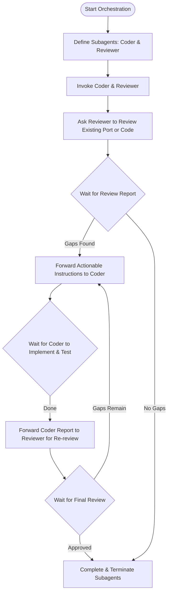

# C++ to Rust Porting Orchestration Workflow

This skill describes the standard workflow for orchestrating a Coder agent and a
Reviewer agent to perform C++ to Rust migrations in Zircon. This workflow
ensures that the migration is driven by code review, safety analysis, and
verification.



## Step-by-Step Orchestration Process

### Step 1: Define the Subagents

If the subagents are not already defined, define them with their respective
specialization prompts.

1.  **Define Coder Agent (`cpp-to-rust-coder`)**:
    * **Name**: `cpp-to-rust-coder`
    * **System Prompt**: Focuses on implementing the Rust port following Zircon
      patterns (defined in `zircon/skills/cpp-to-rust-coder/SKILL.md`).
2.  **Define Reviewer Agent (`cpp-to-rust-reviewer`)**:
    * **Name**: `cpp-to-rust-reviewer`
    * **System Prompt**: Focuses on reviewing the Rust port against the C++
      code, checking for API parity, memory safety (double-drops, raw pointers),
      and test coverage (defined in
      `zircon/skills/cpp-to-rust-reviewer/SKILL.md`).

### Step 2: Invoke the Subagents

Invoke both agents using the `invoke_subagent` tool. Use the `inherit` workspace
mode to ensure they share the same repository view.

```json
{
  "Subagents": [
    {
      "Role": "CppToRust Coder",
      "TypeName": "cpp-to-rust-coder",
      "Workspace": "inherit",
      "Prompt": "Please read `zircon/skills/cpp-to-rust-coder/SKILL.md` and prepare to port C++ code to Rust. Wait for further instructions."
    },
    {
      "Role": "CppToRust Reviewer",
      "TypeName": "cpp-to-rust-reviewer",
      "Workspace": "inherit",
      "Prompt": "Please read `zircon/skills/cpp-to-rust-reviewer/SKILL.md` and prepare to review the port. Wait for further instructions."
    }
  ]
}
```

Record the returned `conversationId` for both agents.

### Step 3: Initiate the Review

Ask the Reviewer to perform the initial review. Provide it with the paths to the
C++ implementation, C++ tests, Rust implementation, and Rust tests.

**Message to Reviewer:**
> Please review the Rust port of `<component>` located at `<rust_path>` against the original C++ implementation.
> You must follow `zircon/skills/cpp-to-rust-reviewer/SKILL.md`.
>
> Relevant files:
> - C++: `<cpp_paths>`
> - Rust: `<rust_paths>`
>
> Please generate a structured review report. The Coder agent conversation ID is `<coder_id>`.

### Step 4: Handle the Review Report

Once the Reviewer completes the review:
1.  Read the review report generated by the Reviewer.
2.  Copy the report to your own artifact directory for user visibility and
    record keeping.
3.  Extract the **Actionable Instructions** section.
4.  Send these instructions to the Coder agent.

**Message to Coder:**
> Here is the review report for `<component>` generated by the Reviewer. Please implement the changes described in the "Actionable Instructions" section.
>
> `<insert report content>`

### Step 5: Handle the Implementation Report

Once the Coder agent completes the implementation and verifies it (via `fx test`
and `fx format-code`):
1.  Read the implementation report from the Coder.
2.  Copy the report to your artifact directory.
3.  Forward the Coder's report to the Reviewer to request a re-review.

**Message to Reviewer:**
> The Coder agent has completed the improvements based on your review report.
> Here is the implementation report from the Coder: `<coder_report_link>`
>
> Please perform a re-review to verify if all identified gaps have been closed successfully and provide a final review report.

### Step 6: Finalize and Clean Up

Once the Reviewer provides a final report confirming that all gaps are closed
and the port is approved:
1.  Save the final review report to your artifact directory.
2.  Report the completion to the user, pointing to the final report and
    artifacts.
3.  Terminate both subagents using the `manage_subagents` tool with `Action:
    "kill"` to clean up resources.
