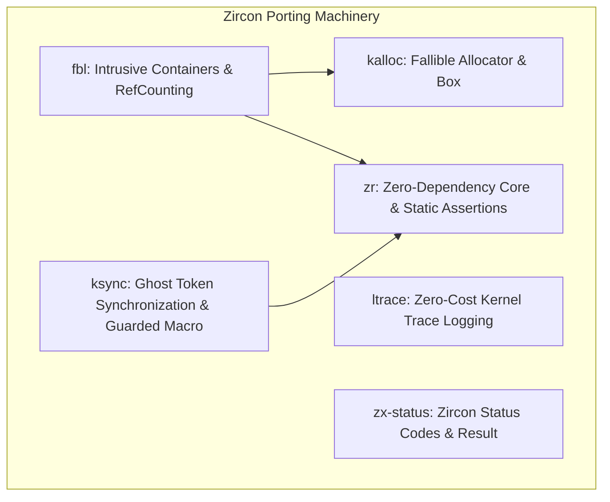

# Zircon C++ to Rust Porting Rubric & Guidelines

This skill documents the unified rubric, patterns, safety rules, and evaluation
criteria for porting Zircon kernel and library code from C++ to Rust, as well as
reviewing converted code.

It serves as the single source of truth for both **Coder agents** implementing
the port and **Reviewer agents** evaluating the port.

---

## 1. Core Principles

1.  **Direct Translation & API Parity**: Translate C++ code to Rust using
    equivalent data structures and algorithms. The Rust API must expose all
    public functions, methods, constructors, and configurations present in the
    C++ version.
2.  **Exact Memory Layout & Alignment Parity**: Rust structs shared across FFI
    or replacing C++ objects must match the memory layout, alignment, and size
    of corresponding C++ objects exactly. Verify with compile-time static
    assertions (`zr::static_assert!`).
3.  **Test & Fuzz Parity**: Rust test and fuzz coverage must equal or exceed C++
    coverage. Match every C++ unit test case with a Rust test case. If C++ code
    has fuzz tests, implement equivalent Rust fuzzers (`rustc_fuzzer` +
    `arbitrary`).
4.  **Fallible Allocation**: All allocations in kernel mode (`is_kernel`) must
    be explicit and fallible via `kalloc::Box`. Panics on Out-Of-Memory (OOM)
    are strictly unacceptable in kernel code.
5.  **Token-Based Concurrency & Locking Parity**: Locking strategies and
    concurrency protocols must match C++ code and integrate with Zircon's
    token-based synchronization framework (`ksync`).
6.  **Pointer Safety & Strict Provenance**: Prefer `NonNull<T>` and
    `Option<NonNull<T>>` over raw pointers (`*const T`/`*mut T`). Use
    `core::ptr::with_exposed_provenance` when converting integer addresses back
    to pointers.
7.  **Documentation & Comment Parity**: Port architectural notes, safety
    rationale, doc comments, and inline implementation comments. Clearly
    distinguish between outer documentation and inner inline comments:
    * **Outer documentation**: All public traits, structs, enums, methods, and
      functions (except for `#[syscall]` definitions) MUST have Rustdoc (`///`)
      comments. `unsafe` functions must include a `# Safety` section, and all
      `unsafe` blocks must have `// SAFETY:` explanations.
    * **Inner inline comments**: All inline comments (`// ...`) within C++
      source and header files (`.cc` and `.h`) documenting behavior MUST be
      preserved in the corresponding Rust code, updating identifiers that have
      changed names to make sense in Rust.
8.  **Ergonomic Design & DRY**: Apply idiomatic Rust practices (derive macros,
    `Deref`/`DerefMut`, `Default`, `Option`/`Result`, `?` operator) without
    breaking layout or safety requirements. Keep visibility as tight as possible
    (`pub(crate)` or file-private). Preserve named constants.
9.  **Cross-Language FFI Interoperability**: FFI shims must be minimal and
    declarative, with no business logic. C++ helper functions exposed to Rust
    must be prefixed with `cpp_` and declared in C++ header files. Rust
    functions exposed to C++ must be prefixed with `rust_`.
10.  **Allocation Tier & Stack Parity**: Respect the original C++ memory
     placement (heap, static, intrusive, or stack). Because kernel thread stacks
     are constrained, do not shift heap or static storage onto the stack.
     Intermediate working buffers must maintain the C++ allocation tier, with
     stack allocation reserved only for small scalar or primitive helpers.

---

## 2. The Zircon Rust Porting Machinery

Fuchsia provides custom in-tree crates designed for low-level kernel and library
porting:



* **`zr`**: Fundamental zero-dependency building blocks (`zr::static_assert!`,
  `zr::defer`, `zr::Deferred`, `Opaque<T>`, `OpaqueBytes<N>`, `pin_init_ffi!`).
* **`kalloc`**: Fallible memory allocation (`kalloc::Box`, `Allocator` trait).
* **`ksync`**: Token-based "Ghost Token" synchronization (`KMutex`, `BrwLockPi`,
  `KCell`, `LockToken`, `#[guarded]`).
* **`fbl`**: Intrusive containers (`DoublyLinkedList`, `SinglyLinkedList`,
  `WavlTree`), reference counting (`#[ref_counted]`, `RefPtr`), and FFI
  recycling (`Recyclable`). Non-intrusive containers (`Array`, `InlineArray`,
  `Vector`].
* **`ltrace`**: Module-level conditional debug tracing (`LOCAL_TRACE`,
  `ltracef!`, `ltrace_entry!`).
* **`zx-status`**: Canonical `zx_status::Status` error types for `Result<T,
  Status>`.

---

## 3. Detailed Guidelines & Technical Patterns

### 3.1. Memory Layout Matching & Verification
- Mark FFI-shared structs with `#[repr(C)]`.
- Always add compile-time static assertions for size and alignment in Rust using
  `zr::static_assert!`. Add matching `static_assert` assertions in C++ test
  files.
- For opaque or non-ported C++ fields, use `zr::Opaque<T>` or
  `zr::OpaqueBytes<SIZE>`.
- To enforce custom alignment on `OpaqueBytes`, wrap it in a newtype struct
  annotated with `#[repr(C, align(N))]`.

```rust
#[repr(C, align(8))]
pub struct CppStateStorage(pub zr::OpaqueBytes<64>);

#[repr(C)]
pub struct PortedStruct {
    pub cpp_state: CppStateStorage,
    pub rust_val: u32,
}

zr::static_assert!(core::mem::size_of::<PortedStruct>() == 72);
zr::static_assert!(core::mem::align_of::<PortedStruct>() == 8);
```

### 3.2. Fallible Allocation (`kalloc`)
- Kernel code must **never** use standard `alloc::boxed::Box` or collections
  that panic on OOM.
- Use `kalloc::Box::try_new(val)` for single values.
- Use `kalloc::Box::<[T]>::try_new_zeroed_slice(len)` for slices.
- Use `try_grow(&mut slice, new_len)` and `unsafe { try_shrink(&mut slice,
  new_len) }` for resizing slices.

```rust
let my_box = kalloc::Box::try_new(42u32)?;
let mut uninit_slice = kalloc::Box::<[u32]>::try_new_zeroed_slice(10)?;
let mut slice = unsafe { uninit_slice.assume_init() };
```

### 3.3. Pointer Safety, `NonNull`, & Strict Provenance
- Avoid raw pointers (`*const T` or `*mut T`) in public or internal Rust APIs.
- Use `NonNull<T>` for pointers that must never be null.
- Use `Option<NonNull<T>>` for optional pointers (takes advantage of Null
  Pointer Optimization so size equals a raw pointer).
- Avoid `Cell` for interior mutability of pointers if the object must be `Sync`.
  Instead, accept `NonNull<T>` and take `&mut self` on setter methods.
- Strict Provenance: When converting `usize` addresses (e.g. from VMAR mappings)
  back to pointers, use `core::ptr::with_exposed_provenance::<T>(addr)` or
  `with_exposed_provenance_mut` instead of raw `as *const T` / `as *mut T`
  casts.

```rust
pub fn get_slice(mapped_addr: usize, size: usize) -> &'static [u8] {
    if mapped_addr == 0 {
        &[]
    } else {
        // SAFETY: mapped_addr is valid memory mapped with `size` bytes.
        unsafe {
            let ptr = core::ptr::with_exposed_provenance::<u8>(mapped_addr);
            core::slice::from_raw_parts(ptr, size)
        }
    }
}
```

### 3.4. Token-Based Concurrency (`ksync`)
- Concurrency in Zircon separates lock state (`KMutex`, `BrwLockPi`) from data
  (`KCell<T, Class>`). Accessing data requires proving lock ownership via
  `LockToken<'a, Class>`.
- Use the `#[guarded]` procedural macro on structs containing locks and guarded
  data.
- The `#[guarded]` macro autogenerates a unique Lock Class (Zero-Sized Type).
  **Do not** add a generic `Class: LockClass` parameter to the parent struct
  unless explicitly required by callers.
- Stack-pin the structure and use `ksync::lock!` to acquire lock guards.
- For disjoint mutable borrows of multiple guarded fields, use generated
  projection helper methods (`fields()`, `fields_mut()`).
- Custom Raw Locks: If custom locking primitives (`RawLock`) are used, always
  define and use a lightweight RAII `LockGuard` helper so early returns (`?`)
  automatically unlock.
- Locks support different policies when acquiring, this is most notable of
  spinlocks that can save or not save IRQs when acquired. Ensure that the
  correctly matching policy is used in the Rust lock acquisition as the C++.

```rust
#[guarded]
pub struct NetworkDevice {
    #[mutex]
    mu: KMutex,

    #[guarded_by(mu)]
    pub tx_packets: u64,
    #[guarded_by(mu)]
    pub rx_packets: u64,
}

// Accessing guarded fields:
ksync::lock!(let mut guard = dev.lock_mu());
let fields = guard.as_mut().fields_mut();
*fields.tx_packets += 1;
*fields.rx_packets += 1;
```

### 3.5. Intrusive Containers & Reference Counting (`fbl`)
- Ref-Counted Objects: Annotate structs with `#[fbl::ref_counted]` (requires
  `#[repr(C)]`). This injects `ref_count` at offset 0. Use `fbl::RefPtr<T>` and
  `fbl::make_ref_counted!`.
- Cross-Language Lifecycles: Implement `Recyclable` (or
  `#[derive(Recyclable)]`). Provide an FFI callback (e.g. `rust_recycle_<type>`)
  on C++ side that invokes `Recyclable::recycle_ffi`.
- Intrusive Containers: Derive `DoublyLinkedListContainable`,
  `SinglyLinkedListContainable`, or `WavlTreeContainable`. Annotate node fields
  with `#[dll_node]`, `#[sll_node]`, or `#[wavl_node]`. Use `tag = ...` for
  multiple containers. Always prefer derive macros over manual trait
  implementations.

### 3.6. Safe Initialization in `PinInit`
- When initializing structs via `PinInit` (e.g. `pin_init!`), perform setup on
  `Move` fields *before* moving them into the struct using block expressions.
- Avoid using `unsafe` in `pin_init!` post-initialization blocks (`_: { ... }`)
  to bypass lock/cell wrappers.

```rust
pin_init!(Self {
    mutex <- KMutex::init(),
    bitmap: {
        let mut bitmap = RawBitmapGeneric::default();
        bitmap.reset(MAX_ID)?;
        bitmap
    }.into(),
}? Status)
```

### 3.7. Zircon Status & Error Handling
- Depend on `//sdk/rust/zx-status` (`zx_status::Status`).
- Do **not** re-define `zx_status_t` or `ZX_ERR_*` constants locally.
- Use `Result<T, Status>` as return type for fallible operations and leverage
  `?` for error propagation.

### 3.8. Testing & Fuzz Testing Parity
- **Kernel Mode (`zircon/kernel/`) vs Userspace**:
  - Kernel crates do **NOT** run standard `#[test]` / `#[cfg(test)]`. Use kernel
    in-tree `unittest-rs` (`#[cfg(ktest)]` + `#[unittest::suite]`) executed via
    `k ut`, or core integration tests in `zircon/system/utest/core/`.
  - Userspace crates use standard `#[test]` and `#[cfg(test)]` executed via `fx
    test`.
- **Assertion Mapping**: Use `expect_eq!`, `assert_eq!`, `expect_ok!`,
  `assert_ok!`, `expect_true!`, etc. from `unittest`.
- **Build integration**: In GN, add `//zircon/kernel/lib/unittest:unittest-rs`
  to the `test_deps` of the `kernel_rust_mod()` or `kernel_rust_crate()` target
  defining the kernel Rust test sources. Bear in mind that tests need to end up
  in the link and that nothing in the kernel crate directly references these
  symbols; so in the case of the source set that contains the tests only
  contains the tests, one must define them in a `kernel_rust_mod()` target
  instead of `kernel_rust_crate()` to prevent GC.
- **Kernel Test Suite Naming Convention**:
  - When naming kernel Rust test suites using `#[unittest::suite]`:
    1.  Prefer standard idiomatic module names like `mod tests { ... }` or
        descriptive module names (e.g. `mod ksync_tests { ... }`). Do not rename
        `mod tests` to awkward module names just to avoid `name = "..."`.
    2.  Use the default suite name matching the module name (`#[unittest::suite]
        mod <name>`) unless it collides with an existing C++ suite's name or is
        a generic `mod tests`.
    3.  Use `#[unittest::suite(name = "...")]` to explicitly specify the suite
        name for `mod tests` or when disambiguation is required.
    4.  If the suite name collides with an existing C++ suite's name, append
        `_rust` to the name of the suite to disambiguate (e.g. `cbuf_rust`,
        `timer_rust`, `mp_rust`, `user_copy_rust`).
    5.  Do not prefix with `rust_` (e.g. avoid `rust_cbuf`, `rust_timer`,
        `rust_mp`).
- **Fuzz Testing**: If C++ code has fuzz tests, implement equivalent Rust
  fuzzers in a separate crate using `rustc_fuzzer`, `fuzz`, and `arbitrary`. Add
  fuzzer components to `BUILD.gn`.

### 3.9. Local Trace Logging (`ltrace`), `dprintf` and `printf`
- Preserve all C++ `LOCAL_TRACE` / `LTRACE` statements.
- Depend on `//zircon/kernel/lib/debugltrace`.
- Define module-scoped `const LOCAL_TRACE: u32 = 0;` at the top of each file.
- Use `ltracef!`, `ltrace_entry!`, `ltrace_exit!`, `ltrace_entry_obj!`, etc.
  When `LOCAL_TRACE` is `0`, dead-branch elimination eliminates all CPU and
  string footprint in production builds.
- Preserve `dprintf` using the `dprintf!` macro from `//zircon/kernel/lib/debug`
- Use `kprint` and `kprintln!` from `//src/lib/kprint` to replace `printf`.

### 3.10. Code Organization, Ergonomics, & Visibility
- **File Structure Parity**: Organize Rust modules matching C++ header/source
  files. Re-export public types at root level (`pub use`) to preserve flat C++
  header APIs.
- **Tight Visibility**: Keep items private or `pub(crate)`. Functions, types, or
  helpers used only within a single file MUST NOT be marked `pub` or
  `pub(crate)`.
- **Idiomatic Traits**: Implement `Default` for types with natural empty states.
  Use `Deref` / `DerefMut` for slice-like or container-like types. Use
  `zerocopy` (`FromBytes`, `IntoBytes`) for safe byte casting instead of
  `unsafe` pointer casts. Use `num-traits` (`Unsigned`, `Bounded`,
  `FromPrimitive`) for generic numeric types.
- **Generic Const Expressions Workaround**: When porting templates with capacity
  $N$ plus null terminator, let Rust generic parameter $N$ represent total
  backing array size.

### 3.11. Check existing Rust conversions
- Before introducing FFI shims, or copying constants, check if there is already
  a Rust implementation. For any object, function, etc, you should
  1.  Go to the location of the C++ definition.
  2.  Walk up the directory structure to find a Rust module.
  3.  See if there is a similar Rust struct / method impl, taking into account
      common naming differences, e.g. for functions C++ tends to use
      UpperCamelCase where as Rust uses lower_snake_case.

### 3.12. Copyright Modernization & Preservation
- Keep existing copyright headers and dates if the converted file is not
  meaningfully divergent. Do not automatically modernize the year to the current
  year when porting code that is largely a direct translation or maintains the
  original architecture. Maintain the original copyright authors and dates from
  the C++ file.

### 3.13. FFI Interoperability
- Minimal Shims: FFI functions (`*_ffi.cc`/`*_ffi.rs`) should be purely
  declarative with zero logic.
- Consistent Naming:
  - C++ exported to Rust: `cpp_$namespace_$classname_$functionname`
  - Rust exported to C++: `rust_$modpath_$struct_$functionname`
- Prototype Declarations in C++ Headers: All C++ FFI helper functions defined in
  `.cc` files (`cpp_*`) MUST have prototype declarations in an included C++
  header file enclosed in `extern "C"` blocks to prevent GCC
  `-Werror=missing-declarations`.
- Prefer References in FFI Trampolines: FFI trampolines callable from C++ that
  receive non-null pointers to initialized objects should prefer taking
  `&<Type>` or `&mut <State>` directly in Rust signatures rather than raw
  pointers (`*const`/`*mut`).
- Always-Inline Annotations for Short FFI Routines: Definitions for short C++
  FFI helper routines provided to Rust callers (`cpp_*`, e.g. trivial forwarding
  shims or accessors) should include `<kernel/ffi.h>`, use the
  `FFI_ALWAYS_INLINE` macro, and include a TODO tied to
  `https://fxbug.dev/537458631` (e.g., `// TODO(https://fxbug.dev/537458631):
  Remove the annotations once cross-language inlining works.`). Only apply this
  to `cpp_*` routines called by Rust; never apply it to C++ class methods or
  routines calling Rust (`rust_*`).
- Uninitialized Storage in FFI Initializers: When passing uninitialized storage
  (e.g., from Rust `core::mem::MaybeUninit<T>`) to a C++ FFI routine to
  construct an object, the C++ function should include `<kernel/ffi.h>` and take
  `ffi::Uninitialized<T>*` instead of raw `T*`. Initialize the object in C++ via
  `handle_out->Initialize(...)`.

### 3.14. RAII Deferred Cleanup (`zr::defer`)
- **Translating `fit::defer`**: Translate C++ `fit::defer` /
  `fit::deferred_action` cleanup patterns into `zr::defer` / `zr::Deferred`.
- **Automatic Error Cleanup**: `zr::defer` executes a closure upon being
  dropped, guaranteeing cleanup routines execute reliably on all exit paths
  (especially early error returns via `?`).
- **Cancellation on Success**: When an operation completes successfully, call
  `cleanup.cancel()` on the deferred guard to disarm the cleanup action.
- **Do Not Manually Duplicate Cleanup**: Never manually duplicate cleanup calls
  before every `return Err(...)` return path; always use `zr::defer` to maintain
  RAII safety and parity with C++ `fit::defer`.

```rust
let disp = new_pmt_handle.dispatcher().clone();
let mut cleanup = zr::defer(move || {
    disp.unpin();
});

// All early error returns (?) automatically trigger cleanup upon drop.
fill_user_buffer()?;
flush_user_buffer()?;

let handle = new_pmt_handle.make_and_add_handle(rights)?;
// Success: disarm the cleanup guard.
cleanup.cancel();
*out_handle = handle;
Ok(())
```

### 3.15. In-Body Implementation & Inline Comment Parity
- **Linter Blind Spot**: Automated tools (`clippy`, rustdoc `missing_docs`) only
  enforce outer documentation on public items; they cannot detect missing
  in-body implementation comments.
- **Preserve Comments Documenting Behavior**: Preserve all inline comments (`//
  ...`) from C++ source and header files (`.cc` and `.h`) documenting behavior
  in the corresponding Rust code—it does not matter what behavior is being
  described; if it documents behavior, preserve it.
- **Adapt Identifiers for Rust**: Update ported comments so they make sense with
  the Rust port of the code. Identifiers that have changed names (e.g., methods
  in snake_case, field names without trailing underscores, struct/type names,
  lock guards, or state fields) MUST be updated to match the Rust code rather
  than referencing obsolete C++ names.
- **Side-by-Side Audit**: Coders and reviewers MUST conduct a side-by-side audit
  of C++ source and header files (`.cc` and `.h`) against the corresponding
  `.rs` files to ensure complete inline comment parity.

---

## 4. Common Pitfalls & Anti-Patterns Checklist

Reviewers and Coders must audit code against this checklist:

1.  [ ] **Runtime Overhead vs. Const Generics**: Features compiled out in C++
    via templates/macros are not hardcoded as runtime fields; `const` generics
    or `const` assertions are used.
2.  [ ] **Constructor Metric Pollution**: Pre-allocations in constructors do not
    pollute user-facing statistics counters.
3.  [ ] **Hardcoded Constants**: Named constants in C++ are preserved as `pub
    const` in Rust rather than literal numbers.
4.  [ ] **Lock Safety Comment Accuracy**: `// SAFETY:` comments on lock-free or
    generic lock options accurately reflect conditionally held locks.
5.  [ ] **Manual Trait Implementations**: `SinglyLinkedListContainable`,
    `DoublyLinkedListContainable`, and `Recyclable` use derive macros rather
    than manual implementations.
6.  [ ] **Raw Pointer Overuse**: Raw pointers (`*const T`/`*mut T`) are replaced
    with `NonNull<T>` or `Option<NonNull<T>>`.
7.  [ ] **Duplicated Status Constants**: `zx_status_t` or `ZX_ERR_*` constants
    are not redefined locally; `zx_status::Status` is used.
8.  [ ] **Monolithic Files**: Multi-file C++ components are split into matching
    Rust module files rather than placed in a single `lib.rs`.
9.  [ ] **Omitted Fuzz Testing Parity**: C++ fuzzers are checked and
    corresponding Rust fuzzers (`rustc_fuzzer` + `arbitrary`) are provided.
10.  [ ] **Strict Provenance Violations**: Raw integer-to-pointer casts (`as
     *const T`) are replaced with `core::ptr::with_exposed_provenance`.
11.  [ ] **Redundant LockClass Generic**: `#[guarded]` is used without adding
     unnecessary `Class: LockClass` generics to the parent struct.
12.  [ ] **Unsafe Post-Init Blocks**: `PinInit` post-initialization blocks do
     not use `unsafe` to bypass wrappers; block expressions are used during
     field initialization.
13.  [ ] **Ignoring Default & Derivable Traits**: Types with default states
     implement `Default`; standard traits (`Debug`, `Clone`, `PartialEq`) are
     derived.
14.  [ ] **Unsafe Byte Casting**: `zerocopy` (`FromBytes`, `IntoBytes`) is used
     instead of manual `unsafe` pointer casts or `transmute`.
15.  [ ] **Redundant Custom Numeric Traits**: `num-traits` is used instead of
     creating custom numeric traits for generic templates.
16.  [ ] **Unported Trace Statements**: C++ `LTRACE` statements are preserved
     using `ltrace` crate and `const LOCAL_TRACE: u32 = 0;`.
17.  [ ] **Over-broad Visibility**: Helpers and internal structs are private or
     `pub(crate)`, not `pub`.
18.  [ ] **Missing C++ FFI Header Declarations**: All `cpp_*` functions defined
     in `.cc` have matching `extern "C"` prototype declarations in C++ headers.
19.  [ ] **Kernel Test Harness Mismatch**: Kernel code (`zircon/kernel/`) does
     not use standard `#[test]` / `#[cfg(test)]`.
20.  [ ] **Missing Always-Inline on Short FFI Routines**: Short C++ FFI routines
     provided to Rust (`cpp_*`) include `<kernel/ffi.h>`, use
     `FFI_ALWAYS_INLINE`, and include a TODO for `https://fxbug.dev/537458631`.
     Not applied to C++ class methods or routines calling Rust (`rust_*`).
21.  [ ] **Raw Pointer to Uninitialized Storage in FFI Initializers**: C++ FFI
     initialization routines receiving uninitialized storage from Rust do not
     take raw `T*`; they take `ffi::Uninitialized<T>*` and initialize in-place
     via `Initialize(...)`.
22.  [ ] **Documentation and Inline Comment Parity**: Both outer documentation
     (Rustdoc `///`) and inner inline comments (`// ...`) within function and
     method bodies documenting behavior are ported over from C++ source and
     header files (.cc and .h) to Rust, with identifiers that have changed names
     updated to match the Rust port. Reviewers must perform a side-by-side diff
     of method bodies to verify.
23.  [ ] **Assertions**: Assertions are copied over and correctly use assert! or
     debug_assert! as matching the C++ use of ASSERT or DEBUG_ASSERT.
24.  [ ] **Canary assertions**: Canary assertions are copied over to Rust and
     are correctly used.
25.  [ ] **Unnecessary FFI methods**: FFI methods added, or code left in C++,
     despite there being an existing Rust implementation / port.
26.  [ ] **Kernel Test Suite Naming**: Kernel test suites set their suite name
     (via default module name or `#[unittest::suite(name = "...")]`) following
     conventions: keep `mod tests` idiomatic, append `_rust` if colliding with
     an existing C++ suite name (e.g. `cbuf_rust`), and avoid `rust_` prefixes.
27.  [ ] **Copyright Preservation**: Original copyright authors and dates are
     maintained if the ported file is not meaningfully divergent.
28.  [ ] **Allocation Tier & Stack Parity**: Data and working buffers that were
     heap-allocated or static in C++ are not shifted onto the kernel stack in
     Rust, with stack allocation reserved only for small scalar or primitive
     helpers.
29.  [ ] **Manual Deferred Cleanup**: C++ `fit::defer` cleanup guards are
     translated to `zr::defer` rather than manually duplicating cleanup logic
     before every early return.
30.  [ ] **LazyInit vs. Ad-hoc Statics**: Translation of bare C++ global
     variables should use the Rust port of `LazyInit` rather than ad-hoc
     `MaybeUninit`/`UnsafeCell`/`AtomicPtr` statics.  Note also when `LazyInit`
     implements `Deref` and avoid introducing redundant `get_foo()` wrappers in
     those cases.

---

## 5. Subagent Workflow & Role Guidelines

### 5.1. Guidelines for Coder Subagent (`cpp-to-rust-coder`)
1.  **Author In-Tree Files Directly**: You MUST create, update, and edit the
    actual source files in the Fuchsia checkout using `write_to_file` and
    `replace_file_content`. Writing code blocks in markdown reports, chat
    messages, or artifact scratchpads does NOT count as an implementation.
2.  **Initial Audit**: Read all relevant C++ headers, source files, and
    unit/fuzz test files.
3.  **Apply Rubric & Port In-Body Comments**: Implement the Rust port following
    the patterns in Section 3 and avoiding anti-patterns in Section 4. You MUST
    copy all in-body inline comments (`// ...`) from C++ source and header files
    (`.cc` and `.h`) documenting behavior into the corresponding `.rs` functions
    during implementation, updating identifiers that have changed names so the
    comments make sense in the Rust code.
4.  **Verify Build & Format**: Run `fx build` to confirm compilation, and run
    `fx test` (or `k ut`) to verify test execution. Run `fx format-code`.
5.  **Self-Check**: Audit your implementation against Section 4 (Common
    Pitfalls) before reporting back, including a side-by-side verification of
    inline implementation comments against C++ source and header files (`.cc`
    and `.h`) and verifying that changed identifier names have been updated.

### 5.2. Guidelines for Reviewer Subagent (`cpp-to-rust-reviewer`)
1.  **Audit Real In-Tree Files**: You MUST inspect the actual modified files in
    the repository and check `git diff`. Do NOT review an implementation plan or
    markdown report in lieu of real files. If the target files have not been
    created or modified in the workspace, reject the review immediately.
2.  **Analyze C++ & Rust Implementations**: Conduct a side-by-side audit of
    APIs, data structures, safety, locking, test coverage, and fuzzing.
3.  **Audit In-Body Inline Comment Parity**: Perform a side-by-side comparative
    audit of C++ source and header files (`.cc` and `.h`) against the
    corresponding `.rs` files to verify that all inline comments documenting
    behavior are preserved and that identifiers that have changed names are
    updated to match the Rust code. Public Rustdoc alone does NOT satisfy
    comment parity.
4.  **Scrutinize Unsafe**: Actively question every `unsafe` block. Insist on
    safe Rust alternatives if possible. Ensure `// SAFETY:` comments are
    complete and accurate.
5.  **Evaluate against Rubric**: Verify every item in Section 3 and Section 4.
6.  **Generate Structured Review Report**: Produce a report with the following
    format:

```markdown
# C++ to Rust Porting Review Report

## Executive Summary
[Brief assessment of port completeness, safety, and quality]

## Parity Comparison Tables

### API Parity
| C++ Method / Type | Rust Method / Type | Parity Status | Notes |
| :--- | :--- | :--- | :--- |

### Test Parity
| C++ Test Case | Rust Test Case | Parity Status | Notes |
| :--- | :--- | :--- | :--- |

### Fuzz Test Parity
| C++ Fuzzer | Rust Fuzzer | Parity Status | Notes |
| :--- | :--- | :--- | :--- |

## Detailed Gap Analysis
1. **Functional / API Gaps**: ...
2. **Safety & Correctness Gaps**: ...
3. **Test & Fuzz Gaps**: ...
4. **Ergonomics & Documentation Gaps**: ...

## Actionable Instructions
[Numbered, step-by-step instructions for the Coder agent to resolve each gap]
```
