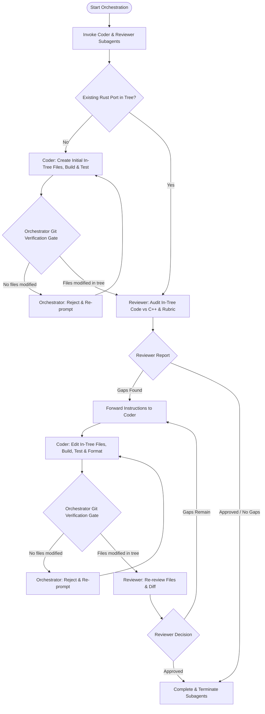

# C++ to Rust Porting Orchestration Workflow

This skill describes the standard workflow for orchestrating a Coder agent and a
Reviewer agent to perform C++ to Rust migrations in Zircon. This workflow
ensures that the migration is driven by code review, safety analysis, and
verification against the unified C++ to Rust rubric
(`zircon/skills/cpp-to-rust-rubric/SKILL.md`).

Editing actual in-tree repository files is an **integral, mandatory part** of
the core loop. The Coder subagent must directly author and edit repository
files, the Reviewer subagent must inspect actual files and git diffs, and the
Orchestrator must gate each iteration on verified git working tree changes.



## Step-by-Step Orchestration Process

### Step 1: Subagent Definitions & Role Boundaries

The orchestration uses two dedicated, pre-defined subagents:

1.  **Coder Subagent (`cpp-to-rust-coder`)**:
    * **Definition**: `.agents/agents/cpp-to-rust-coder.md`.
    * **Role**: Dedicated author and implementer. Responsible for creating and
      modifying actual repository files (`.rs`, `BUILD.gn`, FFI C++ files) using
      `write_to_file` and `replace_file_content`, running `fx build`, `fx test`,
      and `fx format-code`.
    * **Tools**: Equipped with write tools (`write_to_file`,
      `replace_file_content`, `run_command`) and access to `//zircon/skills`.

2.  **Reviewer Subagent (`cpp-to-rust-reviewer`)**:
    * **Definition**: `.agents/agents/cpp-to-rust-reviewer.md`.
    * **Role**: Dedicated code auditor. Responsible for inspecting real
      repository files in-tree and `git diff` against the original C++ code and
      the unified rubric (`zircon/skills/cpp-to-rust-rubric/SKILL.md`). Rejects
      any review where files were not modified in-tree.
    * **Tools**: Restricted to read-only tools (`view_file`, `grep_search`,
      `find_by_name`, `read_url_content`) and skills in `zircon/skills/`.

3.  **Main Orchestrator Agent**:
    * **Role**: Process coordinator and router. Manages subagent lifecycles,
      verifies git repository state via the **Git Verification Gate**, and
      passes messages between Coder and Reviewer.
    * **STRICT PROHIBITION**: The Orchestrator MUST NEVER author code, edit
      files, or perform code reviews directly. If coding work is needed, it must
      be delegated to the Coder. If review is needed, it must be delegated to
      the Reviewer.

### Step 2: Invoke the Subagents

Invoke both agents using `invoke_subagent` in `inherit` workspace mode so they
share the same repository view:

```json
{
  "Subagents": [
    {
      "Role": "CppToRust Coder",
      "TypeName": "cpp-to-rust-coder",
      "Workspace": "inherit",
      "Prompt": "Prepare to port Zircon C++ code to Rust in tree. Wait for task instructions."
    },
    {
      "Role": "CppToRust Reviewer",
      "TypeName": "cpp-to-rust-reviewer",
      "Workspace": "inherit",
      "Prompt": "Prepare to audit in-tree Rust code against C++ and rubric. Wait for instructions."
    }
  ]
}
```

Record the returned `conversationId` for both agents.

### Step 3: Determine the Starting Point

Before initiating the review, determine if an in-tree Rust implementation
already exists:

#### Option A: No Rust Port Exists Yet (Greenfield Port)
1.  Instruct the **Coder** to draft the initial in-tree files (`.rs`, FFI shims,
    and `BUILD.gn` target definitions):
    > Please implement the initial Rust port for `<component>` based on `<cpp_paths>`.
    > Create the in-tree files using `write_to_file`, update `BUILD.gn`, run `fx build`
    > and `fx test`, and format code with `fx format-code`.
2.  Apply the **Git Verification Gate** (Step 4).
3.  Once in-tree files are verified, proceed to Step 5 for the initial Reviewer
    audit.

#### Option B: Existing Rust Port in Tree
1.  Proceed directly to Step 5 to ask the **Reviewer** to audit the existing
    code.

### Step 4: The Mandatory Git Verification Gate

Whenever the Coder subagent completes a task or reports changes, the
Orchestrator **MUST** verify that actual repository files were modified:

1.  Run `git status -s` and `git diff --stat` via `run_command`.
2.  **Verification Check**:
    * **Failure (No files modified/created in tree)**: If `git status -s` is
      empty or does not reflect changes to the target files (e.g. Coder only
      wrote a markdown report or provided code blocks in chat):
        * The Orchestrator **MUST NOT** take over coding or apply the edits
          itself.
        * The Orchestrator **MUST** immediately message the Coder:
            > "Rejection: No repository files were modified in the workspace. You must
            > use `write_to_file` and `replace_file_content` to apply your code changes
            > directly to the in-tree files, and verify with `fx build` and `fx test`.
            > Do not provide code blocks or reports without modifying workspace files."
        * Wait for the Coder to apply the changes and repeat the Git
          Verification Gate.
    * **Success (Files modified in tree)**: Proceed to Step 5 to send the file
      paths and git diff summary to the Reviewer.

### Step 5: Review Phase

Send a message to the Reviewer subagent pointing to the actual in-tree files and
git diff:

**Message to Reviewer:**
> Please review the Rust port of `<component>` located at `<rust_paths>` against the
> original C++ implementation (`<cpp_paths>`).
>
> In-tree files modified:
> `<list of modified files from git status -s>`
>
> Please inspect the real files in tree, review against `zircon/skills/cpp-to-rust-rubric/SKILL.md`
> (and `zircon/skills/cpp-to-rust-dispatcher/SKILL.md` if applicable), and generate a
> structured review report with an "Actionable Instructions" section.

Once the Reviewer completes the review:
1.  Read the Reviewer's report.
2.  If the Reviewer found **Gaps or Deficiencies**:
    * Extract the **Actionable Instructions**.
    * Forward them to the Coder subagent (proceed to Step 6).
3.  If the Reviewer concludes **Approved / No Gaps**:
    * Proceed to Step 7 (Finalization).

### Step 6: Implementation & Iteration Loop

Forward the actionable feedback to the Coder subagent:

**Message to Coder:**
> Here is the review feedback for `<component>` from the Reviewer.
> Please update the in-tree repository files using `write_to_file` or `replace_file_content`
> to address all items in the Actionable Instructions.
> Ensure you run `fx build`, `fx test`, and `fx format-code`.
>
> `<insert Actionable Instructions from Reviewer>`

When the Coder responds:
1.  Run the **Git Verification Gate** (Step 4).
2.  Once verified, forward the updated files and diff to the Reviewer for
    re-review (Step 5).
3.  Repeat this loop until the Reviewer confirms that all gaps have been closed.

### Step 7: Finalize and Clean Up

Once the Reviewer provides final approval:
1.  Verify the workspace formatting with `fx format-code`.
2.  Verify the final build with `fx build` and tests with `fx test`.
3.  Report completion and summary of verified in-tree files to the user.
4.  Terminate both subagents using `manage_subagents` with `Action: "kill"`.

---

## Role Boundaries & Anti-Patterns to Avoid

### 1. Orchestrator Writes or Edits Source Code
* **Why It Breaks**: Violates role separation; bypasses Coder context and
  subagent design.
* **Correct Behavior**: Orchestrator must delegate all file editing to the Coder
  subagent.

### 2. Orchestrator Does Code Reviews
* **Why It Breaks**: Bypasses the Reviewer subagent and the formal C++ to Rust
  rubric.
* **Correct Behavior**: Orchestrator must delegate all reviews to the Reviewer
  subagent.

### 3. Coder Produces Reports Instead of Editing Files
* **Why It Breaks**: Leaves repository untouched; breaks build and verification
  pipelines.
* **Correct Behavior**: Coder must use `write_to_file` and
  `replace_file_content` directly on in-tree files.

### 4. Reviewer Reviews Markdown Reports Instead of Files
* **Why It Breaks**: Reviews unverified/hypothetical code rather than what is
  actually in the tree.
* **Correct Behavior**: Reviewer must inspect actual in-tree files via
  `view_file` and inspect `git diff`.

### 5. Orchestrator Takes Over When Coder Forgets to Edit Files
* **Why It Breaks**: Bypasses Coder and breaks workflow automation.
* **Correct Behavior**: Orchestrator rejects the Coder turn and instructs Coder
  to apply changes in-tree.

